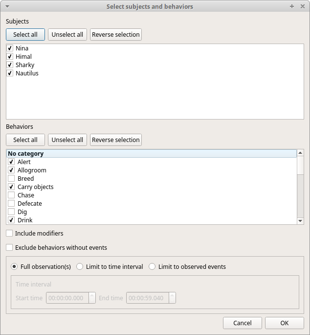
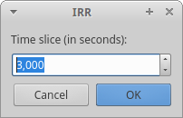

.. Analysis

Time budget
--------------------------------------------------------------------------------------------------------------------------------------------

The **Time budget** analysis can be done by behavior (including or not the modifiers) or by category of behaviors.
Choose the option from the **Analysis** menu.

The **Time budget** analysis can be done on one or more observations. If you select more than one observation you must then
choose for a global time budget analysis that will contain all selected observations or a time budget analysis for every single observation.

.. image:: time_budget_group_observations.png
   :alt: Group observations
   :width: 30%

Choose **Yes** to group all observations in one time budget analysis

The **Analysis** > **Time budget** menu option shows the time budget for the events of the selected observations.
Select the subjects and behaviors you want to include in the time budget analysis:

All behaviors can be selected or unselected by clicking on the Category (bold).

You can choose to include or not the behavior modifiers in the Time budget analysis and to exclude behaviors without coded events.

The Time budget analysis can be restricted to a part of the observation:

* Full observation(s): the analysis will be made on the full observation length.
* Limit to time interval: use the **Start time** and **End time** boxes to select starting time and ending time.
* Limit to observed events: the analysis will be made from the first observed event to the last observed event.

The results contain for each subject and behavior the **total nuber of occurrences**, the **total duration** (for the behaviors defined as state events),
The **duration mean** (for the behaviors defined as state events), the **standard deviation of duration**, the **inter-events intervals duration mean**,
th **standard deviation of the inter-events intervals duration** and the **percent of total duration of observation(s)**.
All duration times are expressed in seconds (s).

.. image:: time_budget.png
   :alt: Results of the time budget analysis
   :width: 100%

The time budget results can be saved in various formats for further analysis:
* Plain text files: TSV, CSV or HTML
* Spreadsheets: Open Document (ODS), Microsoft Excel (XLSX) and Legacy Microsoft (XLS)

.. note:: If a STATE behavior has an odd number of coded events, BORIS will report "UNPAIRED" instead of results"

Synthetic time budget
--------------------------------------------------------------------------------------------------------------------------------------------

The synthetic time budget is similar to time budget but with fewer parameters and a different organization of results.
Results of all selected observations are organized in columns on a single page.
Two parameters are provied for now: **number of occurrences** and **total duration** (for the behaviors defined as state events)

.. image:: synthetic_time_budget.png
   :alt: Results of the time budget analysis
   :width: 100%

All duration times are expressed in seconds (s).

The time budget results can be saved in various formats for further analysis:
* Plain text files: TSV, CSV or HTML
* Spreadsheets: Open Document (ODS), Microsoft Excel (XLSX) and Legacy Microsoft (XLS)

Plot events
--------------------------------------------------------------------------------------------------------------------------------------------

The events from a selected observation can be plotted along a time axis.

**Analysis** > **Plot events**

The subjects and behaviors you want to include in the plot can be selected:

You can choose to include or not the behavior modifiers (if any) and to exclude behaviors without coded events.

The color of behaviors can be customized. See `plot colors`_

The plot can be exported in various formats like bitmap (PNG, JPG, TIFF) or vectorial graphic
(SVG, PDF, EPS, PS). The SVG format can be further edited with the `Inkscape vector graphics editor <https://inkscape.org>`_.

.. note:: If a STATE behavior has an odd number of coded events, you will see this error message: "The STATE behavior XXX is not paired"

With this function you can select many observations to be plotted.
This function creates one plot by subject on one figure.

The time interval can be selected (See time budget)

The color of behaviors can be customized. See `plot colors`_

.. image:: plot_events_v2.png
   :alt: plot events v.2
   :width: 100%

Inter-rater reliability
------------------------

The Cohen's kappa coefficient can be calculated (**Analysis** > **Inter-rater reliability** > **Cohen's kappa**).

`Cohen's kappa on Wikipedia <https://en.wikipedia.org/wiki/Cohen%27s_kappa>`_

After selecting 2 observations and a time window (in seconds) for the analysis (the default value is 10 seconds)
the Cohen's kappa will be displayed in the results window.

