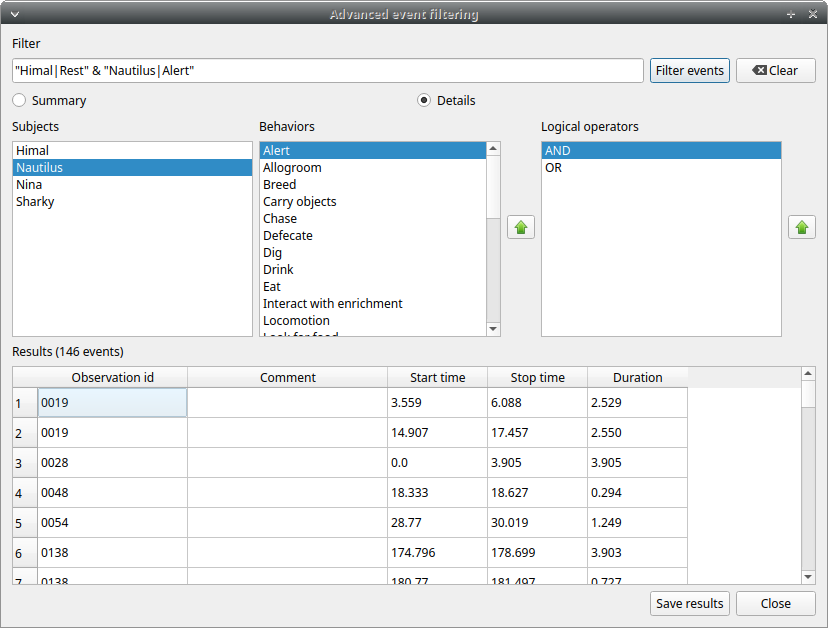

.. Analysis

Time budget
--------------------------------------------------------------------------------------------------------------------------------------------

The **Time budget** analysis can be done by behavior (including or not the modifiers) or by category of behaviors.
Choose the option from the **Analysis** menu.

The **Time budget** analysis can be done on one or more observations. If you select more than one observation you must then
choose for a global time budget analysis that will contain all selected observations or a time budget analysis for every single observation.

.. image:: images/time_budget_group_observations.png
   :alt: Group observations
   :width: 30%

Choose **Yes** to group all observations in one time budget analysis

The **Analysis** > **Time budget** menu option shows the time budget for the events of the selected observations.
Select the subjects and behaviors you want to include in the time budget analysis:

All behaviors can be selected or unselected by clicking on the Category (bold).

You can choose to include or not the behavior modifiers in the Time budget analysis and to exclude behaviors without coded events.

The Time budget analysis can be restricted to a part of the observation:

* Full observation(s): the analysis will be made on the full observation length.
* Limit to time interval: use the **Start time** and **End time** boxes to select starting time and ending time.
* Limit to observed events: the analysis will be made from the first observed event to the last observed event.

The last dialog window will allow you to subtract the duration of one or more behaviors from the total duration of the observation.
This can help you if you have defined a "out-of-sight" code in your ethogram for example:

.. image:: images/subtract_behavior.png
   :alt: subtract behavior from the total duration
   :width: 50%

The results contain for each subject and behavior the **total nuber of occurrences**, the **total duration**
(for the behaviors defined as state events),
The **duration mean** (for the behaviors defined as state events), the **standard deviation of duration**,
the **inter-events intervals duration mean**,
th **standard deviation of the inter-events intervals duration** and the **percent of total duration of observation(s)**.
All duration times are expressed in seconds (s).

The time budget results can be saved in various formats for further analysis:
* Plain text files: TSV, CSV or HTML
* Spreadsheets: Open Document (ODS), Microsoft Excel (XLSX) and Legacy Microsoft (XLS)

.. note:: If a STATE behavior has an odd number of coded events, BORIS will report "UNPAIRED" instead of results"

Synthetic time budget
--------------------------------------------------------------------------------------------------------------------------------------------

The synthetic time budget is similar to time budget but with fewer parameters and a different organization of results.
Results of all selected observations are organized in columns on a single page.
Two parameters are provided for now: **number of occurrences** and **total duration** (for the behaviors defined as state events)

All duration times are expressed in seconds (s).

The time budget results can be saved in various formats for further analysis:
* Plain text files: TSV, CSV or HTML
* Spreadsheets: Open Document (ODS), Microsoft Excel (XLSX) and Legacy Microsoft (XLS)

Plot events
--------------------------------------------------------------------------------------------------------------------------------------------

The coded events from many observations can be plotted along a time axis.

**Analysis** > **Plot events**

The subjects and behaviors you want to include in the plot can be selected in the following window:

You can choose to include or not the behavior modifiers (if any) and to exclude behaviors without coded events.

The time interval can be selected (See time budget)

The plot can be exported in various formats like bitmap (PNG, JPG, TIFF) or vectorial graphic
(SVG, PDF, EPS, PS). The SVG format can be further edited with the `Inkscape vector graphics editor <https://inkscape.org>`_.

.. note:: If a STATE behavior has an odd number of coded events, you will see this error message: "The STATE behavior XXX is not paired"

This function creates one plot by subject on one figure.

The color of behaviors can be customized. See `plot colors`_

.. image:: images/plot_events.png
   :alt: plot events
   :width: 100%

Inter-rater reliability
--------------------------------------------------------------------------------------------------------------------------------------------

The Cohen's kappa coefficient can be calculated (**Analysis** > **Inter-rater reliability** > **Cohen's kappa**).

`Cohen's kappa on Wikipedia <https://en.wikipedia.org/wiki/Cohen%27s_kappa>`_

After selecting 2 observations and a time window (in seconds) for the analysis (the default value is 10 seconds)
the Cohen's kappa will be displayed in the results window.

.. image:: images/irr1.png
   :alt: time window
   :width: 30%

Implementation of IRR Cohen's Kappa in BORIS
............................................................................................................................................

If a time window of n seconds is set the 2 selected observations will be checked every n seconds for agreement/disagreement
from the first event to the last event of the 2 observations .
In case of a point event the presence of a corresponding event in the other observation will be verified using a time window of n seconds
centered on the point event.

A IRR Cohen's Kappa analysis is available in the GSEQ program (`<http://www2.gsu.edu/~psyrab/gseq>`_).
For this the coded events can be exported as aggregated events in SDIS format. See `export aggregated events`_

Advanced event filtering
--------------------------------------------------------------------------------------------------------------------------------------------

.. warning:: This function is still experimental in v. 7.8.5

This function allows to filter events from one or more observations by selecting subjects, behaviors and logical operators.

To use the filter, select a subject, select a behavior and click on the button with the green arrow on the side of the behaviors list.
The tuple subject/behavior will be added in the **filter text edit**.
A complex filter query can be constructed by adding parenthesis and logical operator (**AND** & / **OR** | )
for combining various subjects and behaviors.

Example of a summarized output showing the occurences of Himal resting while Nautilus in alert:

Example of a detailed output showing the overlaping intervals while Himal rests and Nautilus is in alert:

The same subject can be used many times in the query with OR or AND (in case of non exclusive behaviors):

.. image:: images/advanced_filter_example0.png
   :alt: Advanced event filter with 4 conditions
   :width: 80%

An unlimited number of conditions can be used:

Parenthesis can be used to group logical conditions into block(s):

The results can be saved in a Tab Separted Values (TSV) file using the **Save results** button.
Other formats will be added in future.
