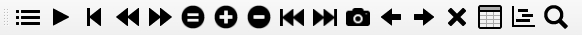
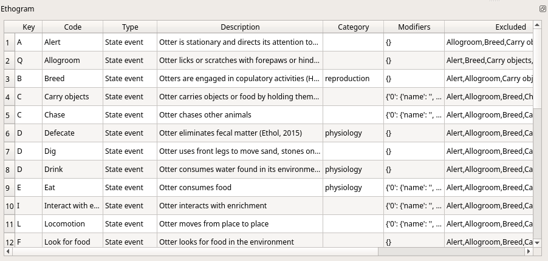
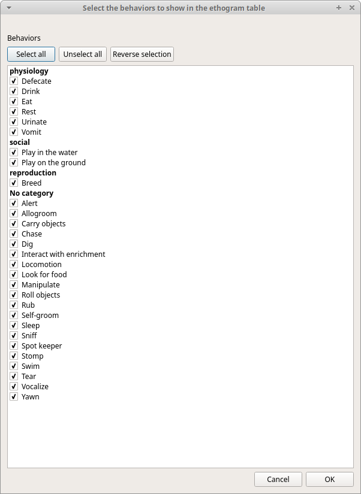
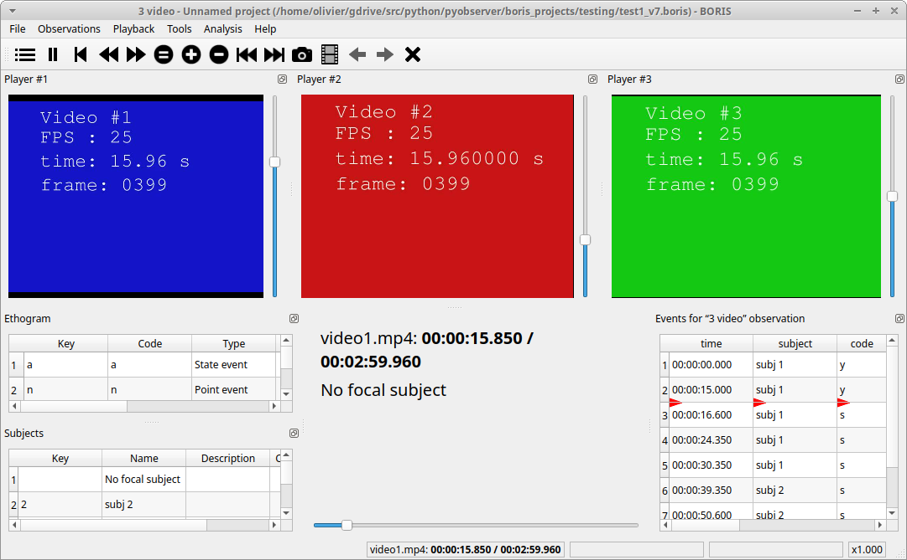

.. _media coding:

When looking at the BORIS main window, the window title bar shows the **Observation id** - **Project name** - **BORIS**.
The media (the first in the queue) will be loaded in the media player and paused.

Media based coding
--------------------------------------------------------------------------------------------------------------------------------------------

Media controls are available in the toolbar
............................................................................................................................................

Key to the symbols:

* **List of observations**

* **Play** (become **Pause** when media is played)

* **Rewind** reset your media at the beginning

* **Fast backward** jumps for n seconds backward in your media (See `general preferences`_ to set n)

* **Fast forward** jumps for n seconds forward in your media (See `general preferences`_ to set n)

* **Set the playback at speed 1x**

* **Increase the playback speed** (See `general preferences`_ to set the step value)

* **Decrease the playback speed** (See `general preferences`_ to set the step value)

* **Jump to the previous media file**

* **Jump to the next media file**

* **Take a snapshot** of current video or frame

* **Switch between VLC and frame-by-frame modes**

* **Move on frame back** (enabled in frame-by-frame mode)

* **Move one frame forward** (enabled in frame-by-frame mode)

* **Close current observation**

* **Plot events of current observation**

* **Find in events**

The media can be controlled by special keyboard keys:

* **Page Up** key: switch to the next media
* **Page Down** key: switch to the previous media
* **Up arrow** key: jump forward in the current media
* **Down arrow** key: jump backward in the current media
* **Esc**: switch between VLC and frame-by-frame mode
* **Home** key: Increase the playback speed (See `general preferences`_ to set the step value)
* **End** key: Decrease the playback speed (See `general preferences`_ to set the step value)
* **Backspace**: Set the playback at speed 1x

For frame-by-frame mode:

* **Left arrow** key: go to the previous frame
* **Right arrow** key: go to the next frame

Live observations
--------------------------------------------------------------------------------------------------------------------------------------------

During a live observation the media control toolbar is disabled.

Press the **Start live observation** button to start your observation.
If some events are already coded BORIS will ask you for deleting them.

A timer will be displayed. The events will be recorded in the events widget.

See the following screenshot.

**Ethogram** widget in the main window
--------------------------------------------------------------------------------------------------------------------------------------------

The **Ethogram** widget provide the user with the list of behaviors defined in the **Ethogram**.
It can be used to record an event by double clicking on the corresponding row.
The **Key** column indicates the keyboard key assigned to each behavior (if any).
Pressing a key will record the corresponding behavior (that will appear in the *Events* widget).

The behaviors shown in the ethogram widget can be filtered:

**Right-click** on ethogram widget > **Filter behaviors**

Check/Uncheck single behaviors or double-click on the behavioral category

**Subjects** widget in the main window
--------------------------------------------------------------------------------------------------------------------------------------------

.. image:: images/main_window_subjects.png
   :alt: Subjects list widget in main window
   :width: 80%

The **Subjects** widget provide the user with the list of subjects defined in the **Subject** tab in the **Project** window.
It can be used to add information about the focal subject on the recorded behaviors by double clicking on the corresponding row.
When a subject is selected his/her name appears above the media player. The **Key** column indicates the keyboard key assigned to each
subject (if any).

The subjects shown in the subjects widget can be filtered:

**Right-click** on subjects widget > **Filter subjects**

Check/Uncheck single subject

.. image:: images/filter_subjects.png
   :alt: Filter subjects in subjects widget
   :width: 40%

The **media player** widgets
--------------------------------------------------------------------------------------------------------------------------------------------

The media position can be set using the horizontal slide bar.
Each media player has its own audio volume control
(the vertical slide bar on the right side of the player).

The organization of the various widget can be customized:

.. image:: images/undocked_widgets.png
   :alt: undocked widgets
   :width: 1800px

The **Events** widget
--------------------------------------------------------------------------------------------------------------------------------------------

The **Events** widget shows all the recorded behaviors (events) with the following parameters
(organized in columns):

* **time**, the time at which the event occurred;
* **subject**, the focal subject (if any);
* **code**, the behavior code;
* **type**, in case of a state event indicates whether the time corresponds to the start or to the stop.
* **modifier**, indicates the modifier(s) that was(ere) selected (if any);
* **comment**, is an open field where the user can add notes.

A tracking cursor (red triangle) will show the current event. This cursor can be positioned above the current event,
see `tracking cursor position`_ option in Preferences window.

A double-click on a row will reposition the media player to the moment of the corresponding event.
See `Time offset for media reposition`_ in Preferences window to customize the time offset for media repositioning.

Record an event
--------------------------------------------------------------------------------------------------------------------------------------------

Once ready to begin your coding, you can start the media player using the **Play** button (or the **Space bar**).
The behaviors can be recorded using the keyboard with the predefined keys, by double-clicking the corresponding row in the **Ethogram** table
or by using the **Coding pad** (See `coding pad`_).

.. image:: images/ethogram_subjects_widgets.png
   :alt: Ethogram and subjects widgets
   :width: 60%

If the pressed key defines a single event, the corresponding event will be recorded in the **Events** table.
In the case you have specified the same key for two (or more) events (e.g. key A in the figure below),
BORIS will prompt you for the desired behavior.

In the case you have specified modifiers (one or more sets), BORIS will prompt you for the desired modifier(s)
if any (e.g. **ball** or **opponent** in the figure below).
You can select the correct one using the mouse or the keyboard ( **b** key or **o** key)

If no keys are defined for the modifier selection, you can type the first character of the modifier
and use the **Up arrow** and **Down arrow** keyboard keys to select the correct modifier.

In the case your behavior type is a **Point event with coding map** or a **State event with coding map**,
BORIS will show the **Coding map** window and will allow selecting the desired area(s).
In case you click a part of the map in which two (or more) areas overlap, the corresponding codes will be recorded.

A recorded event can be edited (once selected) using the **Observations** > **Edit event** menu option. The resulting *Edit event parameters*
allows modifying every parameter (e.g. time, subject, code, modifiers, and comment).

The **Observations** > **Add event** menu option allows adding a new event by specifying its time and the other parameters.

The Events widget context menu
............................................................................................................................................

Some functions are available in the Events widget context menu. Righ-click on the Events widget.

Add event
~~~~~~~~~~~~~~~~~~~~~~~~~~~~~~~~~~~~~~~~~~~~~~~~~~~~~~~~~~~~~~~~~~~~~~~~~~~~~~~~~~~~~~~~~~~~~~~~~~~~~~~~~~~~~~~~~~~~~~~~~~~~~~~~~~~~~~~~~~~~

This option allows adding a new event by specifying its time and the other parameters.

Edit selected event(s)
~~~~~~~~~~~~~~~~~~~~~~~~~~~~~~~~~~~~~~~~~~~~~~~~~~~~~~~~~~~~~~~~~~~~~~~~~~~~~~~~~~~~~~~~~~~~~~~~~~~~~~~~~~~~~~~~~~~~~~~~~~~~~~~~~~~~~~~~~~~~

This option allows to edit the selected event(s). When many events are selected you have to choose the field to edit between **Subject**,
**Behavior** and **Comment**. In this case the new value will apply to all selected events.

.. image:: images/edit_many_events.png
   :alt: Edit many events
   :width: 60%

Edit time of selected event(s)
~~~~~~~~~~~~~~~~~~~~~~~~~~~~~~~~~~~~~~~~~~~~~~~~~~~~~~~~~~~~~~~~~~~~~~~~~~~~~~~~~~~~~~~~~~~~~~~~~~~~~~~~~~~~~~~~~~~~~~~~~~~~~~~~~~~~~~~~~~~~

This option allows to add or subtract a time value (in seconds) to all selected events. For subtracting a value use a negative value.

.. image:: images/edit_time_events.png
   :alt: Edit time of selected events
   :width: 60%

Copy events
~~~~~~~~~~~~~~~~~~~~~~~~~~~~~~~~~~~~~~~~~~~~~~~~~~~~~~~~~~~~~~~~~~~~~~~~~~~~~~~~~~~~~~~~~~~~~~~~~~~~~~~~~~~~~~~~~~~~~~~~~~~~~~~~~~~~~~~~~~~~

This option allows to copy the selected events in the clipboard.
The clipboard will contain the values of the selected events (except the **type** field) separated by a <TAB> character.

Example of clipboard content::

    0.0	Himal	Tear	Branches
    0.0	Nautilus	Tear	Branches
    30.199	Himal	Tear	Branches
    30.2	Himal	Locomotion	Walk
    32.4	Himal	Locomotion	Walk
    32.4	Nautilus	Tear	Branches

Paste events
~~~~~~~~~~~~~~~~~~~~~~~~~~~~~~~~~~~~~~~~~~~~~~~~~~~~~~~~~~~~~~~~~~~~~~~~~~~~~~~~~~~~~~~~~~~~~~~~~~~~~~~~~~~~~~~~~~~~~~~~~~~~~~~~~~~~~~~~~~~~

This option allows to paste the clipboard content into the events widget.
The clipboard must respect the format described in the previous section: 5 columns separated by <TAB> character.

Find in events
~~~~~~~~~~~~~~~~~~~~~~~~~~~~~~~~~~~~~~~~~~~~~~~~~~~~~~~~~~~~~~~~~~~~~~~~~~~~~~~~~~~~~~~~~~~~~~~~~~~~~~~~~~~~~~~~~~~~~~~~~~~~~~~~~~~~~~~~~~~~

This option allows to search for a string in the various field of events.
Select the fields to be searched. The find/replace operation can be restricted to the selected events.

Find/Replace in events
~~~~~~~~~~~~~~~~~~~~~~~~~~~~~~~~~~~~~~~~~~~~~~~~~~~~~~~~~~~~~~~~~~~~~~~~~~~~~~~~~~~~~~~~~~~~~~~~~~~~~~~~~~~~~~~~~~~~~~~~~~~~~~~~~~~~~~~~~~~~

This option allows to search for a string and replace it by a new value in the various field of events.
Select the fields to be searched. The find operation can be restricted to the selected events.

.. image:: images/find_replace_in_events.png
   :alt: Find / replace in events
   :width: 60%

Filter events
~~~~~~~~~~~~~~~~~~~~~~~~~~~~~~~~~~~~~~~~~~~~~~~~~~~~~~~~~~~~~~~~~~~~~~~~~~~~~~~~~~~~~~~~~~~~~~~~~~~~~~~~~~~~~~~~~~~~~~~~~~~~~~~~~~~~~~~~~~~~

This option allows to filter the events by field value.

Show all events
~~~~~~~~~~~~~~~~~~~~~~~~~~~~~~~~~~~~~~~~~~~~~~~~~~~~~~~~~~~~~~~~~~~~~~~~~~~~~~~~~~~~~~~~~~~~~~~~~~~~~~~~~~~~~~~~~~~~~~~~~~~~~~~~~~~~~~~~~~~~

This option reverts the previous one and allows to visualize all coded events

Check state events
~~~~~~~~~~~~~~~~~~~~~~~~~~~~~~~~~~~~~~~~~~~~~~~~~~~~~~~~~~~~~~~~~~~~~~~~~~~~~~~~~~~~~~~~~~~~~~~~~~~~~~~~~~~~~~~~~~~~~~~~~~~~~~~~~~~~~~~~~~~~

This option allows to check if the **state events** are **PAIRED**, if they have a **START** and a **STOP** occurences.

Delete selected events
~~~~~~~~~~~~~~~~~~~~~~~~~~~~~~~~~~~~~~~~~~~~~~~~~~~~~~~~~~~~~~~~~~~~~~~~~~~~~~~~~~~~~~~~~~~~~~~~~~~~~~~~~~~~~~~~~~~~~~~~~~~~~~~~~~~~~~~~~~~~

This option allows to delete the selected events. This operation is irreversible!

Delete all events
~~~~~~~~~~~~~~~~~~~~~~~~~~~~~~~~~~~~~~~~~~~~~~~~~~~~~~~~~~~~~~~~~~~~~~~~~~~~~~~~~~~~~~~~~~~~~~~~~~~~~~~~~~~~~~~~~~~~~~~~~~~~~~~~~~~~~~~~~~~~

This option allows to delete all then events in the current observation. This operation is irreversible!

Fix unpaired state events
--------------------------------------------------------------------------------------------------------------------------------------------

You can use the "Fix unpaired events" function to fix the **state events** without a STOP event.

**Observations** > **Fix unpaired events** (keyboard shortcut: CTRL+U)

The program will ask for a time at which insert the STOP events for all unpaired **state events**

This function can be run on a set of selected observations (when no observation is open). In this case the STOP events will be inserted at
the end of observation.

Explore project
--------------------------------------------------------------------------------------------------------------------------------------------

You can search information in various fields in all observations in the current project (Observations > Explore project).

The searchable fields are: **subject**, **behavior**, **modifier** and **comment**.

If more than one field is searched a logic AND will apply.

.. image:: images/explore_project.png
   :alt: Explore project

The events that were found are listed in a table. By double-clicking on the row the corresponding observation will be opened
and the visualization will be scrolled to the row corresponding to the event.

.. image:: images/explore_project_results.png
   :alt: Explore project

Frame-by-frame mode
--------------------------------------------------------------------------------------------------------------------------------------------

You can switch between the media player and the frame-by-frame mode using the dedicated button in the toolbar:

In frame-by-frame mode the video will stop playing and the user will visualize the video frame by frame.

.. warning:: Please note that MTS video files should be re-encoded to be used in frame-by-frame mode. Otherwise the extracted frames are not reliable.

You can move between frames by using the arrow keys in the toolbar (on the right) or by using keyboard special keys:

For the both modes (media player and frame-by-frame mode)
............................................................................................................................................

* **Page Up** key: switch to the next media
* **Page Down** key: switch to the previous media
* **Up arrow** key: jump forward in the current media
* **Down arrow** key: jump backward in the current media
* **Esc**: switch between VLC and frame-by-frame mode

Only for the frame-by-frame mode
............................................................................................................................................

* **Left arrow** key: go to the previous frame
* **Right arrow** key: go to the next frame

If you have a numeric keypad you can use the following keys in alternative:

* The key **/** will allow you to view the previous frame
* The key *\** will allow you to view the next frame

To return in the media player mode press again the frame-by-frame button in the toolbar.

The frame can be resized before visualization. See the `frame resizing`_ option.

The frame viewer can be detached from the main window (See File > Preferences).
In case on 2 simultaneous players the frame viewers will be automatically detached from the main window.

For every second of the media file the frames are extracted by BORIS with the embedded ffmpeg program and are saved
in the `FFmpeg cache directory`_ specified in the **Preferences** window.

