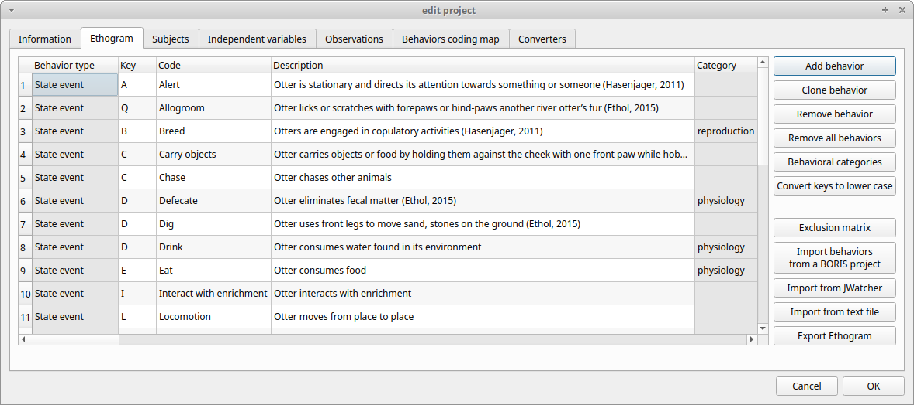
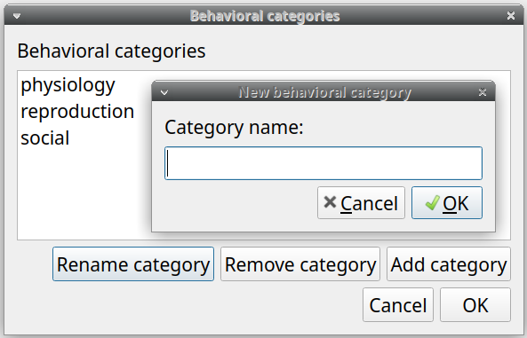
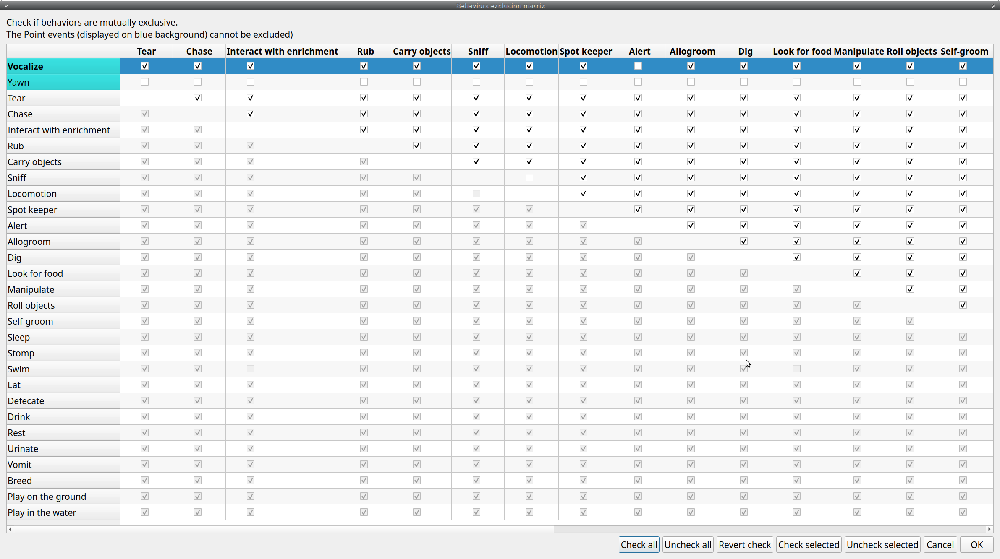
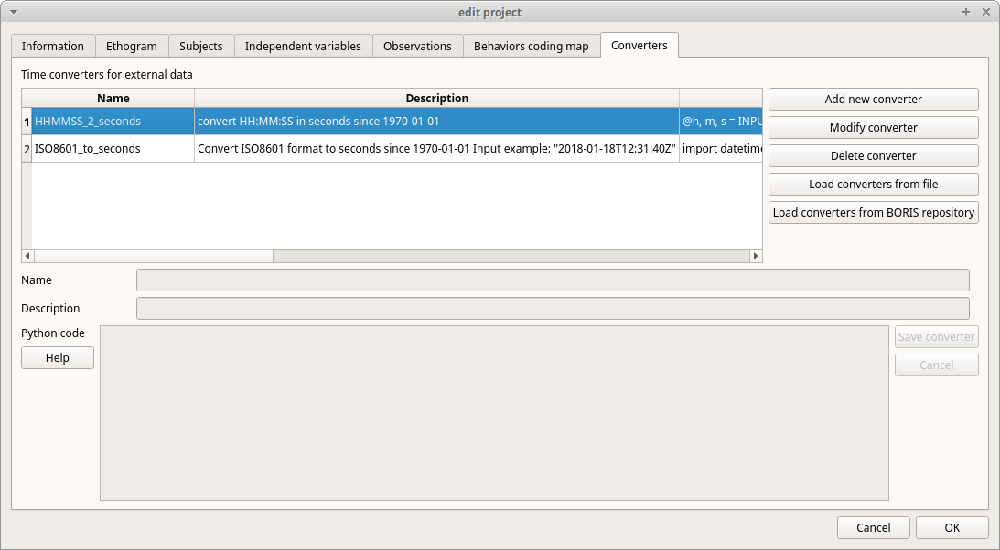

.. create a new project with BORIS

The BORIS project file is the container for all information related to the project.
It contains the **ethogram**, the **independent variables**, the **subjects definition**, the **behaviors coding maps**, the **converters**
and all **observations** data.
The save menu option (**File** > **Save project** or **Save project as ...**) will save the project in a path in your local file system.
You can also activate the  `automatic backup`_ feature (see **Preferences**).

.. note:: It is EXTREMELY important to do regular backups of your project files to prevent the lost of data. Software can be reinstalled but
    your data could quite possibly be lost for ever.

BORIS allows creating an unlimited number of projects but only one project can be opened at a time.

A video tutorial about creating a project is available at https://www.youtube.com/watch?v=I97Dny5hFOE

To create a new project, under the menu **File** , select **New project**.
You can determine your project name by writing in the **Project name** field in the **Information** tab. Once the project will be saved,
the **Project file path** will show the full path to your project file.
**Date** will automatically set on the current date and time, but you can alternatively set this info on your media date and time,
or whatever you prefer. **Description** can host all the relevant information about your project, can be also left empty.
**Time format** can be alternatively set to **seconds** or to **hh:mm:ss.mss**. This choice can be changed at anytime
under **File** > **Preferences** (for MAC users, **BORIS** > **Preferences**) > **Default project time format**.

.. image:: images/new_project.png
   :alt: New project
   :width: 100%

Set an ethogram
--------------------------------------------------------------------------------------------------------------------------------------------

See `<https://en.wikipedia.org/wiki/Ethogram>`_ for ethogram definition.

Switching to the **Ethogram** tab, you can alternatively:

* set your ethogram from scratch;
* import an existing ethogram from another BORIS project;
* import an ethogram from a JWatcher global definition file (.gdf).
* `import an ethogram from a plain text file`_

Set your ethogram from scratch
............................................................................................................................................

Clicking on the **Add behavior** button you can add a new row in the **Ethogram** table and behavior type will be automatically set
to **Point event**.

The cells with gray background can not be directly edited. You must double-click on them and then select a value.

Behavior types
~~~~~~~~~~~~~~~~~~~~~~~~~~~~~~~~~~~~~~~~~~~~~~~~~~~~~~~~~~~~~~~~~~~~~~~~~~~~~~~~~~~~~~~~~~~~~~~~~~~~~~~~~~~~~~~~~~~~~~~~~~~~~~~~~~~~~~~~~~~~

2 types of behaviors can be defined. Double-click on the cell and select the type of behavior:

- **Point event** behavior when the behavior has **no duration**. The behavior will be coded by pressing the defined keyboard key (see below) or by clicking to the corresponding row in the Ethogram table.

- **State event** behavior when the behavior has a **duration**. The behavior start and stop will be coded by pressing the defined keyboard key (see below) or by clicking to the corresponding row in the Ethogram table. These behaviors **must** have a start event and a stop event.

You can switch between **State event** and **Point event** at your convenience with a double-click on the **Behavior type** cell.
You can also add a **Coding map** to either a **State event** (**State event with coding map**) or a **Point event** (**Point event with
coding map**;
see the "Coding map" section for details).

An existing behavior can be duplicated using the **Clone behavior** button. Its code have then to be changed. On a selected behavior,
click on the **Remove behavior** button to remove. The **Remove all behaviors** button will clear the **Ethogram** table.
Both the above-mentioned operations must be confirmed when prompted.

Behavioral codes (**Code** column) can be sorted alphabetically by checking the **Alphabetical order** checkbox. Alternatively they can be
sorted manually by using the **Move up** and **Move down** buttons.

Categories of behaviors
~~~~~~~~~~~~~~~~~~~~~~~~~~~~~~~~~~~~~~~~~~~~~~~~~~~~~~~~~~~~~~~~~~~~~~~~~~~~~~~~~~~~~~~~~~~~~~~~~~~~~~~~~~~~~~~~~~~~~~~~~~~~~~~~~~~~~~~~~~~~

Defining categories of behaviors can be usefull for the analysis of coded events (for example the time budget analysis).
Click the **Behavioral categories** button and add a the categories of behaviors. Behaviors can then be included or not in a defined category.

Set keys and codes
~~~~~~~~~~~~~~~~~~~~~~~~~~~~~~~~~~~~~~~~~~~~~~~~~~~~~~~~~~~~~~~~~~~~~~~~~~~~~~~~~~~~~~~~~~~~~~~~~~~~~~~~~~~~~~~~~~~~~~~~~~~~~~~~~~~~~~~~~~~~

For each behavior you have to set a keyboard key (**Key** column) that will be then used to code the behavioral events.
You can choose whether you want to set a unique key for each behavior or use the same key for more than one behavior.
In the case you set the same key for more than a behavior, BORIS will pause your coding and ask which of the behavior
you want to record. From version 7 the keys are **case-sensitive**.

If your project was created with a previous version of BORIS (< v.7) you can use the **Convert keys to lower case** to convert all keys to
lower case otherwise you will have to code your observation using upper case key.

.. important:: If you open a project file created with a version older than v.7 BORIS will ask you to convert the upper case behavior and
    subject keys to lower case.

.. important:: **Do not use the / and * keys! They are reserved for the frame-by-frame mode.**

In the **Code** column, you have to add a unique code for each behavior. Duplicated codes are not accepted and
BORIS will warn in red about duplicates on the bottom left of the *Ethogram* tab. The code can be an alphanumeric
string (which must not include the pipe character **|** ).

The **Category** column allow you to include the behavior to a predefined category.

The **Description** of your behavior is optional. The **Description** column can be useful to add information
about a specific behavior, its characteristics (e.g. to standardise observation between different users) or to
refer to external information (e.g. reference to a previous ethogram).

The following three columns (**Modifiers**, **Exclusion**, **Coding map**) cannot be edited from the **Ethogram** table.

Set the modifiers
~~~~~~~~~~~~~~~~~~~~~~~~~~~~~~~~~~~~~~~~~~~~~~~~~~~~~~~~~~~~~~~~~~~~~~~~~~~~~~~~~~~~~~~~~~~~~~~~~~~~~~~~~~~~~~~~~~~~~~~~~~~~~~~~~~~~~~~~~~~~

Modifiers can be used to add attributes to a behavior. A single behavior can have two or more modifiers attached
(e.g. "play" may have "solitary" or "social" as modifiers). The use of modifiers can be convenient to significantly
reduce the number of keys and simplify the behavioral coding.

3 types of modifiers are available: **Single selection**, **Multiple selection** and **Numeric**.
**Single selection** modifiers allows the observer to select only one modifier in the list.
**Multiple selection** allows to select more modifiers from the list.
**Numeric** allows to input a numeric data.

In BORIS modifiers can also be added in different modifier
sets [e.g. "play, social" may have a modifier set (#1) for "brothers" and another (#2) for "sisters"]. In the case of
using sets of modifiers, you can select one/more modifier for each set.

To add modifiers to a behavior, you need to double-click the **Modifiers** cell corresponding to the behavior you want to add the modifiers to.
The following window will show up:

.. image:: images/modifiers_empty.png
    :width: 60%
    :alt: modifiers configuration

Click the **Add a set of modifiers** button:

.. image:: images/modifiers_1.png
    :width: 60%
    :alt: modifiers configuration

Set a name for the new modifiers set by typing it in the **Set name** edit box. Setting a modifiers' set name is not mandatory.

Select the modifier type using the **Modifier type** combo box. You can choose between **Single selection**, **Multiple selection**
and **Numeric**

* the **Single selection** type will allow you to select only **one** modifier for the current behavior.

* the **Multiple selection** type will allow you to select one or more modifiers for the current behavior.

* the **Numeric** type will allow you to input a number. For example a distance of interaction.

Within a set of modifiers, you can add a modifier by writing the modifier in the **Modifier** edit box.
You can choose a shortcut (one character - case sensitive) to this modifier (optional). Then press the **right-arrow** button to add the
new modifiers to the set.

.. image:: images/modifiers_2.png
    :width: 60%
    :alt: modifiers configuration

To modify a modifier, select it and press the **left-arrow** button, edit the modifier and press the **right-arrow** button.

A modifier can be removed by pressing the **Remove modifier** button.

After adding all modifiers the window will appear like this:

.. image:: images/modifiers_single_selection.png
    :width: 80%
    :alt: modifiers configuration

In case of **Single selection** or **Multiple selection** all defined subjects can be added as modifiers using
the **Add subjects as modifiers** button. This can help in case of coding the interactions between subjects for example.

The modifier position into the modifiers' set can be manually set using the **Move modifier up** and **Move modifier down** buttons.

You can add and/or remove sets using the buttons **Add set of modifiers** and **Remove set of modifiers**.

The position of a modifiers' set can be customized  (using the **Move set left** and **Move set right** buttons)

Modifiers can not contain the following characters: **(|),`~!**

Example of a **multiple selection** modifiers set:

.. image:: images/modifiers_multiple_selection.png
   :width: 1200px
   :alt: modifiers configuration

Many values can be selected together.

Example of 2 sets of modifiers:

.. image:: images/modifiers_2sets.png
   :width: 1200px
   :alt: modifiers configuration

Click **OK** to save modifiers in the **Ethogram** table.

Set the exclusion matrix
~~~~~~~~~~~~~~~~~~~~~~~~~~~~~~~~~~~~~~~~~~~~~~~~~~~~~~~~~~~~~~~~~~~~~~~~~~~~~~~~~~~~~~~~~~~~~~~~~~~~~~~~~~~~~~~~~~~~~~~~~~~~~~~~~~~~~~~~~~~~

The occurrence of an event (State or Point) can exclude the occurrence of a state event.
This can be set using the **Behaviors exclusion matrix** window, which can be
opened clicking on the **Exclusion matrix** button.
BORIS will ask for including **Point events** or not and a new **Exclusion matrix** window will open.

Exclusive behavior may be selected by checking on the corresponding checkbox in the automatically-generated
matrix. We suggest to work on the **Exclusion matrix** when all the behaviors have been added to your ethogram.

All behaviors can be excluded by a particular behavior by selecting the corresponding entire row (click on the row header of the behavior)
and by clicking on the **Check selected** button. You can also uncheck all behaviors by selecting the **Uncheck selected** button.

Example of an **exclusion matrix**:

For example in the previous figure, the **Alert** behavior will exclude the following behaviors: **Allogroom**, **Breed**,
**Carry objects**, **Chase** ...

During the observation, the excluding event will stop all the current excluded state events one millisecond before the occurence of the event.

Import an ethogram from an existing project
............................................................................................................................................

Behaviors within an ethogram can be imported from an existing BORIS project (.boris) using the **Import behaviours from a BORIS project** button.
BORIS will ask to select a BORIS project file and whether imported behaviors should replace or be appended to the **Ethogram** table.
Imported behaviors will retain all the previously defined behavior parameters (namely Behavior type, Key, Code, Description, Modifiers and
Exclusion information).

Import an ethogram from a JWatcher global definition file (.gdf)
............................................................................................................................................

Behaviors can be imported from a JWatcher global definition file (.gdf) using the **Import from JWatcher** button.
BORIS will ask to select a JWatcher file (.gdf) and whether imported behaviors should replace or be appended to the **Ethogram** table.
Behavior type and exclusion information for the behaviours imported from JWatcher have to be redefined.

.. _import an ethogram from a plain text file:

Import an ethogram from a plain text file
............................................................................................................................................

Behaviors can be imported from a plain text file using the **Import from text file** button.
The fields must be separated by TAB, comma (,) or semicolomn (;). All rows must contain the same number of fields.

The fields will be interpreted as:

* field #1: Behavior type **State event** or **Point event** (mandatory)
* field #2: Key (case insensitive)
* field #3: Behavior code (must be unique)
* field #4: behavior category (empty if no category)
* field #5: description (optional)

All fields after the 5th will be ignored.

BORIS will ask to select a plain text file (by default: \*.txt \*.csv \*.tsv) and whether imported behaviors should replace or be appended
to the **Ethogram** table.
The missing information for the behaviours imported from text file have to be redefined.

Import an ethogram from Google Sheet, Microsoft-Excel or LibreOffice Calc (via clipboard)
............................................................................................................................................

The ethogram can be imported from a spreadsheet.
The spreadsheet must contain one behavior by row and have to be organized as above:

* 1st column: Behavior type: **State event** or **Point event** (mandatory)
* 2nd column: Key (one character - Optional)
* 3rd column: Behavior code (mandatory - must be unique)
* 4th column: Behavior category (optional)
* 5th column: Description of behavior (optional)

Export the ethogram
............................................................................................................................................

The entire ethogram can be exported in various formats (TSV, CSV, XLS, ODS, HTML).
See **File** > **Edit project** > **Ethogram tab** > **Export ethogram**

Define the subjects
--------------------------------------------------------------------------------------------------------------------------------------------

.. image:: images/subjects_configuration.png
   :width: 1200px
   :alt: Subjects definition

BORIS allow coding behaviors for different subjects within a single observation.
The **Subject** table allows specifying subjects using a **Key** (e.g. the **k** on your keyboard), **Subject name** (e.g. "Kanzi"),
**Description** (e.g. male, born October 28 - 1980). In this case, pressing **n** will set "Nina" as the focal subject
of the behavioural coding. Pressing **n** again will deselect "Nina" and set to "no focal subject".
The definition of one or more subjects is not mandatory. Addition, removal and sorting of the subjects follows the same
logic of the *Ethogram* table (see **Set your ethogram from scratch** for info). The subjects can also be imported from an
existing BORIS project using the **Import Subjects from a BORIS project**.

From version 7 the keys are **case-sensitive**.

If your project was created with a previous version of BORIS (< v.7) you can use the **Convert keys to lower case** to convert all keys to
lower case otherwise you will have to code your observation using upper case key.

.. important:: If you open a project file created with a version older than v.7 BORIS will ask you to convert the upper case behavior and
    subject keys to lower case.

.. _independent variables:

Define the Independent variables
--------------------------------------------------------------------------------------------------------------------------------------------

BORIS allows adding information about the observation using **Independent variables**.
This can be used to specify factors that may influence the behaviors (e.g. group
composition, temperature, weather conditions) but will not change during a single
observation within a project. Each independent variable can be defined by a **Label** (e.g. weather), a
**Description** (e.g. weather conditions), a **Type** (*text*, *numeric*, *value from set* or *timestamp*).

The values of a set are defined in the **Set of values** column separating the available values with a comma (**,**).
Please note that the first value of the set will be selected by default. It should be useful to define a NA value as first value of every set.

The values for the independent variables will be asked when creating a new observation.
Addition, removal and sorting of the independent variables follows the same logic of the **Ethogram** table
(see **Set your ethogram from scratch** for info).
The independent variables can also be imported from an existing BORIS project using the **Import Variables from a BORIS project**.

Example of independent variable defined as "set of values"

The predefined value must be contained in the set of value.

Observations' tab
--------------------------------------------------------------------------------------------------------------------------------------------

The **Observations** table in BORIS shows information about all the previous observations within a project.
A selected "Observation" can be removed using the "Remove observation" button (you will be prompted for confirmation).
This operation cannot be undone and deleted observations cannot be recovered once the project is saved.
The **Observations** table shows four columns **id** **Date** **Description** **Media**.

.. _converters tab:

Converters' tab
--------------------------------------------------------------------------------------------------------------------------------------------

Converters are used for plotting external data when the timestamp values are not expressed in seconds.
Converters can be written by the user, loaded from file or loaded from the repository of the BORIS web site
(http://www.boris.unito.it/static/converters.json).

.. image:: images/converter_tab_empty.png
   :alt: Converters tab
   :width: 100%

Load converters from BORIS web site
............................................................................................................................................

Click **Load converters from BORIS repository** and select the converters to be added to your project.

.. image:: images/converter_selection_from_repository.png
   :alt: Converters selection from repository
   :width: 40%

Writing a converter
............................................................................................................................................

See `Converters for external data values`_

The converters loaded in your project can be then selected for converting timestamp (or other values) in external data file
(See `converters`_)

