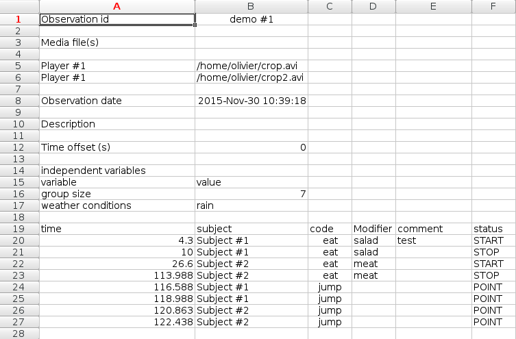
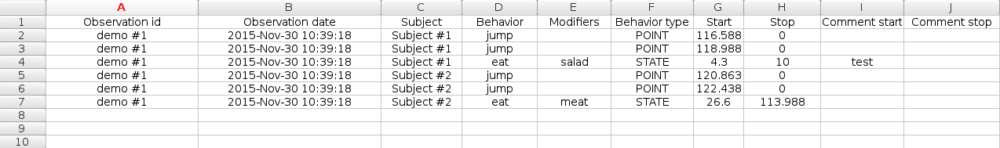

.. export_events

The coded events can be exported in various formats:

Export events
--------------------------------------------------------------------------------------------------------------------------------------------

**Observations** > **Export events**

This function will export the events of selected observations in TSV, CSV, ODS, XLSX, XLS or HTML formats.
If many observations are selected BORIS will ask for a directory to save the various files.
For the XLS and XLSX formats the events can be exported on various worsheet in a single workbook.
These formats are suitable for further analysis.

.. warning:: Please note that for some formats (XLS - Excel 97) the name of the sheet will be based on a modified **observation id**
             in order to not contain forbidden characters (:  \  /  ?  *  [  or  ]) and shortened to 31 characters.

.. _export aggregated events:

Export aggregated events
--------------------------------------------------------------------------------------------------------------------------------------------

**Observations** > **Export aggregated events**

This function will export the events of the selected observations in the following formats:

* **tabular format** (TSV, CSV, XLSX, XLS, ODS, HTML)
* **SQL** format for populating a SQL database
* **SDIS** format for analysis with the GSEQ program available at  `<http://www2.gsu.edu/~psyrab/gseq>`_

If many observations are selected you can choose to group all results in one file. If you do not want to group results BORIS
will ask for a directory to save the various files.

The **State events** are paired and the duration is available.

An arbitrary time interval can be selected (check the **Limit to time interval** option).
In this case the ongoing events will be started at start time and stopped at end time in the export file.

Example of tabular export

Example of SQL export::

    CREATE TABLE events (id INTEGER PRIMARY KEY ASC, observation TEXT,
                         date DATE, subject TEXT, behavior TEXT,
                         modifiers TEXT, event_type TEXT, start FLOAT,
                         stop FLOAT, comment_start TEXT,
                         comment_stop TEXT);

    INSERT INTO events (observation, date, subject, behavior, modifiers,
     event_type, start, stop, comment_start, comment_stop ) VALUES
    ("demo #1","2015-11-30 10:39:18","Subj #1","jump","","POINT",116.588,0,"",""),
    ("demo #1","2015-11-30 10:39:18","Subj #1","jump","","POINT",118.988,0,"",""),
    ("demo #1","2015-11-30 10:39:18","Subj #1","eat","salad","STATE",4.3,10.0,"vvv",""),
    ("demo #1","2015-11-30 10:39:18","Subj #2","jump","","POINT",120.863,0,"",""),
    ("demo #1","2015-11-30 10:39:18","Subj #2","jump","","POINT",122.438,0,"",""),
    ("demo #1","2015-11-30 10:39:18","Subj #2","eat","meat","STATE",26.6,113.988,"","");

.. warning:: Please note that for some formats (XLS - Excel 97) the name of the sheet will be based a modified **observation id**
             in order to not contain forbidden characters (:  \  /  ?  *  [  or  ]) and shortened to 31 characters.

Export events for analysis with JWatcher
--------------------------------------------------------------------------------------------------------------------------------------------

`JWatcher <http://www.jwatcher.ucla.edu>`_  is a powerful tool for the quantitative analysis of behavior.

The events coded with BORIS can be exported to be analyzed with JWatcher.

Click **Observations** > **Export events** > **for analysis with JWatcher** to export the coded events.

BORIS will ask for selecting a directory. After this, for each combination of selected observation and selected subject the following files
will be created:

* the Focal Data File (.dat)

* the Focal Analysis Master File (.faf)

* the Focal Master File (.fmf)

These files can be used to analyze your observations with JWatcher.

Export events as behavioral strings
--------------------------------------------------------------------------------------------------------------------------------------------

Behavioral strings can be used with the **Behatrix** program:
`Behatrix (formerly BSA) <http://www.boris.unito.it/pages/behatrix>`_

Example::

    # observation id: demo#1
    # observation description:
    # Media file name: video1.mp4, video2.mp4

    Subject #1:
    eat|jump|eat|jump

    Subject #2:
    eat|rest|jump|eat|jump

Export events as `Praat <http://www.fon.hum.uva.nl/praat/>`_ `TextGrid <http://www.fon.hum.uva.nl/praat/manual/TextGrid.html>`_
--------------------------------------------------------------------------------------------------------------------------------------------

Example::

    File type = "ooTextFile"
    Object class = "TextGrid"

    xmin = 4.3
    xmax = 113.988
    tiers? <exists>
    size = 2
    item []:
        item [1]:
            class = "IntervalTier"
            name = "Subject #1"
            xmin = 4.3
            xmax = 10.0
            intervals: size = 1
            intervals [1]:
                xmin = 4.3
                xmax = 10.0
                text = "eat"
        item [2]:
            class = "IntervalTier"
            name = "Subject #2"
            xmin = 26.6
            xmax = 113.988
            intervals: size = 1
            intervals [1]:
                xmin = 26.6
                xmax = 113.988
                text = "eat"

Extract sequences from media files corresponding to coded events
--------------------------------------------------------------------------------------------------------------------------------------------

Sequences of media file corresponding to coded events can be extracted from media files:

1) Click on **Observations** > **Extract events from media files** option.
2) Choose the observation(s).
3) Select the events to be extracted.
4) Select a destination directory that will contain the extracted sequences.
5) Select a time offset (in seconds, the default value is 0).

The time offset will be substracted from the starting time of event and added to the stopping time. All the extracted sequences will be saved
in the selected directory followind the file name format:

{observation id}_{player}_{subject}_{behavior}_{start time}-{stop time}

Extract frames corresponding to coded events
--------------------------------------------------------------------------------------------------------------------------------------------

The frames corresponding to coded events can be extracted and saved as images.

1) Click on **Observations** > **Extract frames from media files** option.
2) Choose the observation(s).
3) Select the events to be extracted.
4) Select a destination directory that will contain the extracted sequences.
5) Select a time offset (in seconds, the default value is 0).

Export transitions matrix
--------------------------------------------------------------------------------------------------------------------------------------------

3 transitions matrix outputs are available: The matrix of frequencies of transitions, the matrix of frequencies of transition after each behavior
and the matrix of number of transitions.

Matrix of frequencies of transitions
............................................................................................................................................

This matrix contains the frequencies of total transitions.
The sum of all frequencies must be 1.

Example of frequencies of transitions matrix::

               eat   sleep     walk
    eat        0.0   0.286    0.143
    sleep    0.143     0.0    0.143
    walk     0.286     0.0      0.0

In this matrix you can see that the **eat** behavior precedes the **sleep** behavior with a frequency of **0.286** of the total number of
transitions.

Matrix of frequencies of transitions after behavior
............................................................................................................................................

This matrix contains the frequencies of transitions after each behavior.
The sum of each row must be 1.

Example::

            eat    sleep     walk
    eat     0.0    0.667    0.333
    sleep   0.5	     0.0      0.5
    walk    1.0      0.0      0.0

In this example you can see that **sleep** follows **eat** with a frequency of **0.667** and **walk** follows with a frequency of **0.333**.

Matrix of number of transitions
............................................................................................................................................

This matrix contains the number of transitions after each behavior.

Example::

            eat   sleep   walk
    eat       0       2      1
    sleep     1       0      1
    walk      2       0      0
