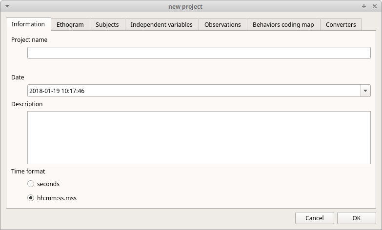
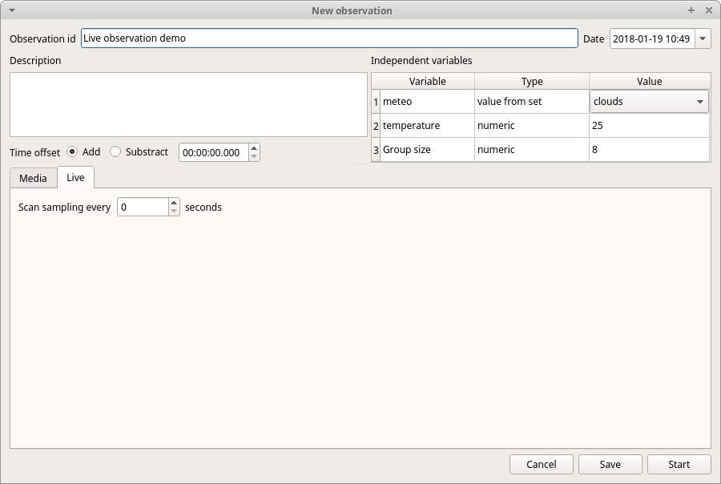

***********************************************************************
Behavioral Observation Research Interactive Software (BORIS) user guide
***********************************************************************

.. image:: logo_boris_500px.png
   :scale: 300%

**version 2.97**

BORIS web site: `www.boris.unito.it <http://www.boris.unito.it>`_

`BORIS GitHub repository <https://github.com/olivierfriard/BORIS>`_

`BORIS twitter feed <https://twitter.com/BORIS_behav_obs>`_

`BORIS discussion group <https://groups.google.com/forum/?hl=en#!forum/boris-behav-obs>`_

`BORIS Facebook page <https://www.facebook.com/BORIS-behav-obs-318697441616743/>`_

`BORIS Google+ <https://plus.google.com/u/0/107744013100136901033>`_

.. contents::
   :depth: 2

Legal
=====

Copyright 2012-2016 Olivier Friard - Marco Gamba

**BORIS** is free software; you can redistribute it and/or modify
it under the terms of the GNU General Public License as published by
the Free Software Foundation; either version 2, or any later version.

**BORIS** is distributed in the hope that it will be useful,
but WITHOUT ANY WARRANTY; without even the implied warranty of
MERCHANTABILITY or FITNESS FOR A PARTICULAR PURPOSE.  See the
`GNU General Public License <http://www.gnu.org/copyleft/gpl.html>`_ for more details.

Install BORIS
=============

BORIS can be installed following instructions on the BORIS site at `download page <http://www.boris.unito.it/?page=download>`_

Unless you use a full bundle version (available only for Microsoft-Windows) BORIS requires a **recent** version (>=2) of
the `VLC Media Player <http://www.videolan.org/vlc>`_    from the VideoLAN Organization.

*VLC is a free and open source cross-platform multimedia player and framework that plays most multimedia files as well as DVD, Audio CD, VCD, and various streaming protocols.*

From version 2.8 the open source `FFmpeg multimedia framework <https://www.ffmpeg.org>`_ is included with BORIS.

If you want to try BORIS without installing it you can download the `VirtualBox virtual appliance <http://www.boris.unito.it/?page=download>`_ from the BORIS site.
In this case you must first install `VirtualBox <https://www.virtualbox.org/>`_

Launch BORIS
============

Start BORIS by clicking on its icon. For launching BORIS from sources see the BORIS web site.
When launching BORIS for the first time it may take some time to show up. Please be patient!

.. warning:: On Mac OS X 10.9, launching can be stopped according to the **Security & Privacy** settings of your computer.
   They can be changed opening **System Preferences...** > **Security & Privacy** > **General** and
   selecting the option **Anywhere** in the frame **Allow apps downloaded from**. Alternatively you can repeat the
   operation right-clicking on the BORIS icon and then clicking **Open** in the following two dialog boxes.

.. warning:: On Microsoft-Windows, launching can be stopped by a **Security warning**: *The publisher can not be verified. Are you sure you want to run this software?*  Click the **Run** button to launch BORIS.

At the first launch, BORIS will ask you to allow the automatically check for new version. Internet access is required for this feature.
If you choose **Yes** BORIS will check for new version about every 15 days.
This option can be changed on the **Preferences** window (See `general preferences`_)

Create a new project with BORIS
===============================

The BORIS project file is the container for all information related to the project. It contains the ethogram, the independent variables, the subjects and all observations data.
The save menu option (File -> Save project) will save all this information. You can also activate the **automatic backup** feature (see **Preferences**).
BORIS allows creating an unlimited number of projects but only one project can be opened at a time.

To create a new project, under the menu **File** , select **New project**.
You can determine your project name by writing in the **Project name** field in the **Information** tab. Once the project will be saved,
the **Project file path** will show the full path to your project file.
**Date** will automatically set on the current date and time, but you can alternatively set this info on your media date and time,
or whatever you prefer. **Description** can host all the relevant information about your project, can be also left empty.
**Time format** can be alternatively set to **seconds** or to **hh:mm:ss.mss**. This choice can be changed at anytime
under **File** > **Preferences** (for MAC users, **BORIS** > **Preferences**) > **Default project time format**.

Set an ethogram
---------------

Switching to the **Ethogram** tab, you can alternatively:

* set your ethogram from scratch;
* import an existing ethogram from another BORIS project;
* import an ethogram from a JWatcher global definition file (.gdf).

.. image:: ethogram.png
   :scale: 60%
   :alt: Ethogram configuration

Set your ethogram from scratch
..............................

Clicking on the **Add behavior** button you can add a new row in the *Ethogram* table and behavior type will be automatically set to **Point event**.
You can switch between **State event** and *Point event* at your convenience from the **Behavior type** column. You can also add a **Coding map** to
either a **State event** (**State event with coding map**) or a **Point event** (**Point event with coding map**; see the "Coding map" section for details).

An existing behavior can be duplicated using the **Clone behavior** button. Its code have then to be changed. On a selected behavior, click on
the **Remove behavior** button to remove. The **Remove all behaviors** button will clear the **Ethogram** table. Both the above-mentioned operations
must be confirmed when prompted.

Behavioral codes (**Code** column) can be sorted alphabetically by checking the **Alphabetical order** checkbox. Alternatively they can be sorted
manually by using the **Move up** and **Move down** buttons.

Set keys and codes
~~~~~~~~~~~~~~~~~~

For each behavior you have to set a keyboard key (**Key** column) that will be then used to code the behavioral events.
You can choose whether you want to set a unique key for each behavior or use the same key for more than one behavior.
In the case you set the same key for more than a behavior, BORIS will pause your coding and ask which of the behavior
you want to record. The keys are case-insensitive.

.. important:: Do not use the / and * keys! They are reserved for the frame-by-frame mode.

In the **Code** column, you have to add a unique code for each behavior. Duplicated codes are not accepted and
BORIS will warn in red about duplicates on the bottom left of the *Ethogram* tab. The code can be an alphanumeric
string (which must not include the pipe character **|** ).

The **Description** of your behavior is optional. The **Description** column can be useful to add information
about a specific behavior, its characteristics (e.g. to standardise observation between different users) or to
refer to external information (e.g. reference to a previous ethogram).

The following three columns (**Modifiers**, **Exclusion**, **Coding map**) cannot be edited from the **Ethogram** table.

Set the modifiers
~~~~~~~~~~~~~~~~~

Modifiers can be used to add attributes to a behavior. A single behavior can have two or more modifiers attached
(e.g. "play" may have "solitary" or "social" as modifiers). The use of modifiers can be convenient to significantly
reduce the number of keys and simplify the behavioral coding. In BORIS modifiers can also be added in different modifier
sets [e.g. "play, social" may have a modifier set (#1) for "brothers" and another (#2) for "sisters"]. In the case of
using sets of modifiers, you can attach one modifier for each set.

To add modifiers to a behavior, you need to double-click the **Modifiers** cell corresponding to the behavior you want to add the modifiers to.

.. image:: modifiers-1.6.png
   :width: 1200px
   :alt: modifiers configuration

When the **Modifiers** window is open you can add and/or remove sets using the buttons **Add set of modifiers** and **Remove set of modifiers**.
Within a set of modifiers, you can add and remove modifiers using the **Modifier** field and clicking on the **right-arrow** button (to add) and
the **Remove modifier** button (to remove). The selected modifier can be edited using the left-arrow button. The **Key code** box can be
used to set a key for the modifier (optionnal).

The modifier position into the modifiers' set can be manually set using the **Move modifier up** and **Move modifier down** buttons.

The position of a modifiers' set can be customized  (using the **Move set left** and **Move set right** buttons)

Modifiers can not contain the following characters: **(**, **)** and **|** (pipe character).

Click **OK** to save modifiers in the **Ethogram** table.

Set the exclusion matrix
~~~~~~~~~~~~~~~~~~~~~~~~

The occurrence of an event (State or Point) can exclude the occurrence of a state event.
This can be set using the **Behaviors exclusion matrix** window, which can be
opened clicking on the **Exclusion matrix** button.
BORIS will ask for including **Point events** or not and a new **Exclusion matrix** window will open.

Exclusive behavior may be selected by checking on the corresponding cell in the automatically-generated
matrix. We suggest to work on the **Exclusion matrix** when all the behaviors have been added to your ethogram.

For example, for the following ethogram:

.. image:: exclusion_matrix0.png
   :width: 80%
   :alt: Ethogram window

The **Exclusion matrix** could be:

.. image:: exclusion_matrix.png
   :width: 40%
   :alt: Exclusion matrix window

* the behavior **a** (Point event) will exclude the behavior **c** (State event) but not **d** (State event)
* the behavior **b** (Point event) will exclude the behavior **d** but not **c**
* the behavior **d** (State event) will exclude the behavior **c**

During the observation, the excluding event will stop all the current excluded state events one millisecond before the occurence of the event.

Import an ethogram from an existing project
...........................................

Behaviors within an ethogram can be imported from an existing BORIS project (.boris) using the **Import behaviours from a BORIS project** button.
BORIS will ask to select a BORIS project file and whether imported behaviors should replace or be appended to the **Ethogram** table.
Imported behaviors will retain all the previously defined behavior parameters (namely Behavior type, Key, Code, Description, Modifiers and Exclusion information).

Import an ethogram from a JWatcher global definition file (.gdf)
.................................................................

Behaviors can be imported from a JWatcher global definition file (.gdf) using the **Import from JWatcher** button.
BORIS will ask to select a JWatcher file (.gdf) and whether imported behaviors should replace or be appended to the **Ethogram** table.
Behavior type and exclusion information for the behaviours imported from JWatcher have to be redefined.

Import an ethogram from a plain text file
..........................................

Behaviors can be imported from a plain text file using the **Import from text file** button.
The fields must be separated by TAB, comma (,) or semicolomn (;). All plain text file rows must contain the same number of fields.

The fields and will be interpreted as:

* field #1: event type (point or state)
* field #2: key (case insensitive)
* field #3: code (must be unique)
* field #4: description (optional)

All fields after the 4th will be ignored.

BORIS will ask to select a plain text file (by default: \*.txt \*.csv \*.tsv) and whether imported behaviors should replace or be appended to the **Ethogram** table.
The missing information for the behaviours imported from text file have to be redefined.

Define the subjects
-------------------

.. image:: subjects.png
   :width: 1200px
   :alt: Subjects definition

BORIS allow coding behaviors for different subjects within a single observation.
The **Subject** table allows specifying subjects using a **Key** (e.g. the "K" on your keyboard), **Subject name** (e.g. "Kanzi"),
**Description** (e.g. male, born October 28 - 1980). In this case, pressing "K" will set "Kanzi" as the focal subject
of the behavioural coding. Pressing "K" again will deselect "Kanzi" and set to "no focal subject".
The definition of one or more subjects is not mandatory. Addition, removal and sorting of the subjects follows the same
logic of the *Ethogram* table (see **Set your ethogram from scratch** for info). The subjects can also be imported from an
existing BORIS project using the **Import Subjects from a BORIS project**.

.. _independent variables:

Define the Independent variables
--------------------------------

.. image:: independent_variables.png
   :alt: Independent variables
   :width: 100%

BORIS allows adding information about the observation using **Independent variables**.
This can be used to specify factors that may influence the behaviors (e.g. group
composition, temperature, weather conditions) but will not change during a single
observation within a project. Each *Independent variable* can be defined by **Label** (e.g. weather),
**Description** (e.g. weather conditions), **Type** (e.g. **text** for weather condition "sunny", **numeric** for temperatures).
A value for each **Independent variable** will be requested when creating a new observation.
Addition, removal and sorting of the independent variables follows the same logic of the **Ethogram** table
(see **Set your ethogram from scratch** for info).
The independent variables can also be imported from an existing BORIS project using the **Import Variables from a BORIS project**.

Observations' tab
-----------------

The **Observations** table in BORIS shows information about all the previous observations within a project.
A selected "Observation" can be removed using the "Remove observation" button (you will be prompted for confirmation).
This operation cannot be undone and deleted observations cannot be recovered once the project is saved.
The **Observations** table shows four columns **id** **Date** **Description** **Media**.

Open an existing project with BORIS
===================================

To open an existing BORIS project, under the menu **File** , select **Open project**.
A BORIS project file is a container for all information related to a set of observations as the ethogram,
the independent variables, and the subjects. BORIS allows creating an unlimited number of projects but
only one project can be opened at a time.

Observations list
=================

The **Observations** > **Observations list** will show you all the observations contained in the current BORIS project.

.. image:: observations_list.png
   :alt: Observations list
   :width: 100%

The observations list can be filtered selecting a field in the drop-list box.

In the following example observations are filtered: only observations containing the **Bobo** subject are shown:

.. image:: observations_list_filtered.png
   :alt: Observations list
   :width: 100%

Delete an observation
=====================

An observation can be deleted from the project using the following procedure:
**File** > **Edit project** > **Observation's tab** > **Select observation to remove** > **Remove observation** button

Please note that the deletion is irreversible.

Create a new observation
========================

To create a new observation you must first `Create a new project with BORIS`_
or `Open an existing project with BORIS`_.

Clicking on **Observations** > **New observation** will show the **New observation** window.

.. image:: new_observation.png
   :alt: New observation window
   :width: 100%

This window allow adding various observation data:

* a mandatory **Observation id** (must be unique across all observations);
* **Date**, which will be automatically set on the current date and time, but you can alternatively set this info on your media date and time, or whatever you prefer.
* **Description**, which can host all the relevant information about your observation, but can be also left empty.
* **Independent variables** (e.g. to specify factors that may influence the behaviors but will not change during the observation within a project). See the  `independent variables`_ section for details.
* **Time offset**. BORIS allow specifying a time offset that can be added or subtracted from the media timecode.

You must then indicate if you want to make an observation based on pre-recorded media (audio / video) or a live observation.

Live observation
----------------

During the live observation BORIS will show you a timer that will be used for recording time for coded events.

Choose the **Live tab** to make a live observation.

In the above tab you can select a time for **Scan sampling** observation. In this case the timer will stop at every time offset you indicated and all the coded events will have the same time value.

Media based observation
-----------------------

Choose the **Media tab** to make an obervation based on media.

.. image:: new_observation_playlist.png
   :alt: Playlist
   :width: 60%

In the **Media tab** there are two playlists. In the **Media file paths** playlist you can add one or more media files using the **Add media** button.
Information about the selected media file will be extracted and displayed in the media list: media file path, media duration (in seconds), number of frames by second (FPS), video stream, audio stream  .

If you have to add various media files, you can use the **Add all media from directory** button, in this case all the media files found in the selected directory will be added in the playlist.

The **Remove media** button can be used to remove the selected media files.

All the media types reported at http://www.videolan.org/vlc/features.html can be played in BORIS.
The media queued in the *Media file paths* will be played sequentially.
This means that an event occurring at time t\ :sub:`x`\  in the media file queued as second (e.g. second_video.mp4)
in the playlist will be scored as happening at time t\ :sub:`1`\  + t\ :sub:`x`\  (where t\ :sub:`1`\  is the duration of the first media file, e.g. first_video.mp4).

Spectrogram visualization
.........................

BORIS allow you to visualize the sound spectrogram during the media observation.
Activate the *Visualize spectrogram* check box. BORIS will ask you to generate the spectrograms for all media files loaded in the first player.

.. image:: spectro1.png
   :alt: spectrogram generation
   :width: 60%

The spectrogram visualization will be synchonized to the media position during the observation.

.. image:: spectro2.png
   :alt: spectrogram visualization

Close current behavior between videos
.....................................

If this option is selected BORIS will close all ongoing State events between successive media files.

This option can be usefull if you have to code various short media files enqueued in the first player (for example the output of a Camera trap).

Simultaneous play
.................

BORIS also allows simultaneous playback of two media recorded independently
(e.g. videos recorded from different points in a room; or a video and an audio recording of the same observation).
The videos to be played simultaneously can be loaded in the **Media file paths for second player** playlist.
In this case only one video per playlist is accepted.
If the two media are not synchronised you can specify a time offset for the second player.

Click OK to start coding. The **Observation** window will be closed and you'll be transferred to the main **BORIS** window.

Coding your media
=================

When looking at the BORIS main window, the window title bar shows the **Observation id** - **Project name** - **BORIS**.
The media (the first in the queue) will be loaded in the media player and paused.

Media controls are available in the toolbar
-------------------------------------------

.. image:: toolbar.png
   :alt: Media control toolbar
   :width: 80%

Key to the symbols:

* **Play**

* **Pause** (the SPACE bar can be used)

* **Rewind** reset your media at the beginning

* **Fast backward** jumps for n seconds backward in your media (See `general preferences`_ to set n)

* **Fast forward** jumps for n seconds forward in your media (See `general preferences`_ to set n)

* **Set the playback at speed 1x**

* **Increase playback speed** (See `general preferences`_ to set the step value)

* **Decrease playback speed** (See `general preferences`_ to set the step value)

* **Jump to the previous media file**

* **Jump to the next media file**

* **Take a snapshot** of current video or frame

* **Switch between VLC and frame-by-frame modes**

In frame-by-frame mode:

* **Move on frame back**

* **Move one frame forward**

The media can be controlled by special keyboard keys:

* **Page Up** key: switch to the next media
* **Page Down** key: switch to the previous media
* **Up arrow** key: jump forward in the current media
* **Down arrow** key: jump backward in the current media
* **ESC**: switch between VLC and frame-by-frame mode

**Ethogram** widget in the main window
----------------------------------------

.. image:: main_window_ethogram.png
   :alt: Ethogram widget in main window
   :width: 80%

The **Ethogram** widget provide the user with the list of behaviors defined in the **Ethogram**.
It can be used to record an event by double clicking on the corresponding row.
The **Key** column indicates the keyboard key assigned to each behavior (if any).
Pressing a key will record the corresponding behavior (that will appear in the *Events* widget).

**Subjects** widget in the main window
---------------------------------------

.. image:: main_window_subjects.png
   :alt: Subjects list widget in main window
   :width: 60%

The **Subjects** widget provide the user with the list of subjects defined in the **Subject** tab in the **Project** window.
It can be used to add information about the focal subject on the recorded behaviors by double clicking on the corresponding row.
When a subject is selected his/her name appears above the media player. The **Key** column indicates the keyboard key assigned to each subject (if any).

**Media player** widget in the main window
-------------------------------------------

.. image:: main_window_videoplayer.png
   :alt: Media player in main window
   :width: 1200px

The **Media player** widget has two controls: the media position (horizontal slide bar) and the audio volume (vertical slide bar)
provide the user with the list of subjects defined in the **Subject** tab in the **Project** window.
The horizontal slide bar can be used to navigate the media file.

**Events** widget in the main window
-------------------------------------

.. image:: main_window_events.png
   :alt: Events list in main window
   :width: 60%

The **Events** widget shows all the recorded behaviors with the following parameters (columns):

* **time**, the time at which the event occurred;
* **subject**, the focal subject (if any);
* **code**, the behavior code;
* **type**, in case of a state event indicates whether the time corresponds to the start or to the stop.
* **modifier**, indicates the modifier(s) that was(ere) selected (if any);
* **comment**, is an open field where the user can add notes.

A tracking cursor (red triangle) will show the current event. This cursor can be positioned above the current event,
see `tracking cursor position`_ option in Preferences window.

A double-click on a row will reposition the media player to the moment of the corresponding event.
See `Time offset for media reposition`_ in Preferences window to customize the time offset for media repositioning.

Record an event
---------------

Once ready to begin your coding, you can start the media player using the **Play** button (or the Space bar).
The behaviors can be recorded using the keyboard with the predefined keys (or by double-clicking the corresponding row in the **Ethogram** table).

.. image:: ethogram_subjects_widgets.png
   :alt: Ethogram and subjects widgets
   :width: 60%

If the pressed key defines a single event, the corresponding event will be recorded in the **Events** table.
In the case you have specified the same key for two (or more) events (e.g. key A in the figure below),
BORIS will prompt you for the desired behavior.

.. image:: ask_for_code.png
   :alt: Ask for modifiers
   :width: 40%

In the case you have specified modifiers (one or more sets), BORIS will prompt you for the desired modifier(s) if any (e.g. **ball** or **opponent** in the figure below).
You can select the correct one using the mouse or the keyboard ( **b** key or **o** key)

.. image:: ask_for_modifiers.png
   :alt: Ask for modifiers
   :width: 40%

In the case your behavior type is a *Point event with coding map* or a *State event with coding map*, BORIS will show the *Coding map* window and will allow selecting the desired area(s). In case you click a part of the map in which two (or more) areas overlap, the corresponding codes will be recorded.

A recorded event can be edited (once selected) using the *Observations* > *Edit event* menu option. The resulting *Edit event parameters* allows modifying every parameter (e.g. time, subject, code, modifiers, and comment).

The *Observations* > *Add event* menu option allows adding a new event by specifying its time and the other parameters.

Frame-by-frame mode
--------------------

You can switch between play and frame-by-frame modes using the dedicated button in the toolbar:

.. image:: toolbar_frame-by-frame.png
   :alt: frame-by-frame_button
   :width: 60%

In frame-by-frame mode the video will stop playing and the user will visualize the video frame by frame.

You can move between frames by using the arrow keys in the toolbar (on the right) or by using keyboard special keys:

**For the both modes** (VLC and frame-by-frame):

* **Page Up** key: switch to the next media
* **Page Down** key: switch to the previous media
* **Up arrow** key: jump forward in the current media
* **Down arrow** key: jump backward in the current media
* **ESC**: switch between VLC and frame-by-frame mode

**Only for the frame-by-frame mode**:

* **Left arrow** key: go to the previous frame
* **Right arrow** key: go to the next frame

If you have a numeric keypad you can use the following keys in alternative:

* The key **/** will allow you to view the previous frame
* The key *\** will allow you to view the next frame

To return in the VLC mode press again the frame-by-frame button in the toolbar.

Exporting events data
=====================

The coded events can be exported in various format (**Observations** > **Export ?**):

Export events
-------------

This function will export the events of selected observations in TSV, XLS or ODS formats. These formats are suitable for further analysis.

.. image:: export_events.png
   :alt: example of exported events in TSV format
   :width: 60%

Export aggregated events
------------------------

This function will export the events of the selected observations in TSV, CSV, XLS, ODS or SQL formats.
The **State events** are paired and duration is available.
The SQL format is suitable to populate an SQL database.

The export format is selected with the extension of the file name.

.. image:: export_aggregated_events.png
   :alt: example of aggregated and exported events in TSV format
   :width: 80%

Example of SQL export::

    CREATE TABLE events (id INTEGER PRIMARY KEY ASC, observation TEXT,
                         date DATE, subject TEXT, behavior TEXT,
                         modifiers TEXT, event_type TEXT, start FLOAT,
                         stop FLOAT, comment_start TEXT,
                         comment_stop TEXT);

    INSERT INTO events (observation, date, subject, behavior, modifiers,
     event_type, start, stop, comment_start, comment_stop ) VALUES
    ("demo #1","2015-11-30 10:39:18","Subj #1","jump","","POINT",116.588,0,"",""),
    ("demo #1","2015-11-30 10:39:18","Subj #1","jump","","POINT",118.988,0,"",""),
    ("demo #1","2015-11-30 10:39:18","Subj #1","eat","salad","STATE",4.3,10.0,"vvv",""),
    ("demo #1","2015-11-30 10:39:18","Subj #2","jump","","POINT",120.863,0,"",""),
    ("demo #1","2015-11-30 10:39:18","Subj #2","jump","","POINT",122.438,0,"",""),
    ("demo #1","2015-11-30 10:39:18","Subj #2","eat","meat","STATE",26.6,113.988,"","");

* **Export events as behavioral strings**

Example::

    # observation id: demo#1
    # observation description:
    # Media file name: crop.avi, crop2.avi

    Subject #1:
    eat|eat|jump|jump

    Subject #2:
    eat|eat|jump|jump

* Export events as `Praat <http://www.fon.hum.uva.nl/praat/>`_ `TextGrid <http://www.fon.hum.uva.nl/praat/manual/TextGrid.html>`_

Example::

    File type = "ooTextFile"
    Object class = "TextGrid"

    xmin = 4.3
    xmax = 113.988
    tiers? <exists>
    size = 2
    item []:
        item [1]:
            class = "IntervalTier"
            name = "Subject #1"
            xmin = 4.3
            xmax = 10.0
            intervals: size = 1
            intervals [1]:
                xmin = 4.3
                xmax = 10.0
                text = "eat"
        item [2]:
            class = "IntervalTier"
            name = "Subject #2"
            xmin = 26.6
            xmax = 113.988
            intervals: size = 1
            intervals [1]:
                xmin = 26.6
                xmax = 113.988
                text = "eat"

Tools
=====

Geometric measurements
----------------------

Geometric measurements can be made in frame-by-frame mode. Distances, areas and angles can be measured.
Click on **Tools** > **Geometric measurements** to activate the measurements. The **Measurements window** will be shown:

.. image:: measurements_window.png
   :alt: measurements window
   :width: 60%

Setting the scale
.................

For distance and area measurements you can set a scale in order to have results of measurements in a real unit (like centimeters, meters etc).
1) measure a reference object (that have a known size) on the frame (with the distance tool. See next chapter for details) and set the pixel distance in the **Pixel** text box.
2) Set the real size of the reference object in the **Reference** text box (must be a number without unit).

Distance measurements
......................

Select the **Distance** radio button. Click the left mouse button on the frame bitmap to set the start of the segment that will be measured.
A blue circle with a cross will be drawn.
Click the right mouse button to set the end. A red circle with a cross will be drawn.
The distance between the two selected points will be available in the text area of the **Measurements window**.

.. image:: distance_measurement_screenshot.png
   :alt: distance measurement screenshot
   :width: 90%

Area measurements
.................

Select the **Area** radio button. Click the left mouse button on the frame bitmap to set the area vertices.
Blue circles with a cross will be drawn.
Click the right mouse button to close the area.
The area of the drawn polygon will be available in the text area of the **Measurements window**.

Angle measurements
..................

Select the **Angle** radio button. Click the left mouse button on the frame bitmap to set the angle vertex.
A red circle with a cross will be drawn.
Click the right mouse button to set the two segments. Blue circles with a cross will be drawn.
The angle between the two drawn segments will be available in the text area of the **Measurements window**.

Extract media file sequences
----------------------------

Sequences of media file corresponding to coded behaviors can be extracted from media file.
1) Click on **Observations** > **Extract events from media files** option. 2) Choose the observation(s). 3) Select the events to be extracted.
4) Select a destination directory that will contain the extracted media sequences. 5) Select a time offset (in seconds, the default value is 0).
The time offset will be substracted from the starting time of event and added to the stopping time. All the extracted sequences will be saved
in the selected directory followind the file name format:

{observation id}_{player}_{subject}_{behavior}_{start time}-{stop time}

Coding maps
===========

A coding map is a bitmap image with user-defined clickable areas.
BORIS allows creating a coding map using the **Map creator** tool (**Tools** > **Map creator**).
Clickable areas may correspond to specific modifiers that can be meaningful for the behavioral coding.
Facial expression is the case we thought to when developing this function.

Creating a coding map
---------------------

Loading a bitmap for a coding map
.................................

To create a new coding map, launch the **Map creator** tool (**Tools** > **Map creator**).
The BORIS main window will be replaced by the **Map creator** window. Click on **Map creator** > **New Map** and
enter a name for the new map in the edit box. You have to load a bitmap image (JPEG or PNG) using the **Load bitmap** button.
The loaded image will be displayed.

.. image:: coding_map.png
   :alt: Coding map
   :width: 70%

If the size of your bitmap image is bigger than 512 x 512 pixels BORIS will resize it to
512 x 512 keeping the aspect ratio and store the resized version in the coding map file.

Adding areas to a coding map
............................

To create clickable areas on a coding map, you have to click on the **New area** button and enter
an **Area code** in the edit box. The new area can now be defined by clicking on the image.
The drawing tool allows defining a irregular polygon (a plane shape with straight sides, which
does not have all sides equal and all angles equal) by clicking to determine subsequent vertices.
It can be convex or concave. Straight sides must not cross each other. Once selected an area can be
deleted using the **Delete area** button. When an area is closed and its name has been defined in
the **Area code** field, it can be saved by using the **Save area** button.
The areas can partially overlap each other. See the **Using a Coding map** section for more details.
Once all areas are added the entire map can be saved using the **Save map** option menu
(**Map creator** > **Save map**). The map is now saved in its own file (.boris_map) which is NOT part of the BORIS project.
A map can be edited at anytime by opening the map file from the **Open map** menu option (**Map creator** > **Open map**).

Adding a coding map to your project
....................................

Creating a Coding map is not automatically adding the map to your project.
The Coding map have to be added to your project by selecting the corresponding **Behavior type**
(**Point event with coding map**, **State event with coding map**). BORIS will ask to select the
file name containing the coding map (.boris_map) and load the coding map in the project.
The coding map name will appear in the **Coding map** column and will be saved in the BORIS project file.

NOTE: If you later modify your coding map you must reload the new version in your BORIS project.

Analysis
========

Time budget
------------

The **Analyze** > **Time budget** menu option shows the time budget for the events of one or more observations.
You must first select the subjects and behaviors you want to include in the time budget analysis:

.. image:: time_budget_parameters.png
   :alt: Time budget
   :width: 40%

You can choose to select or not the behavior modifiers (if any) and to exclude behaviors without coded events.

.. image:: time_budget.png
   :alt: Time budget
   :width: 100%

The percent of total time will be calculated (if available). The total time is intended as the total media length.

The time budget results can be saved in various formats for further analysis: TSV, CSV for plain text file or Microsoft Excel (XLS),
Open Document Spreadsheet (ODS).

.. note:: If a STATE behavior has an odd number of coded events, BORIS will report "UNPAIRED" instead of results"

Plot events
-----------

The **Analyze** > **Plot events** menu option plots the events from one observation by subject and behaviours along a time axis.

You must first select the subjects and behaviors you want to include in the plot:

.. image:: time_budget_parameters.png
   :alt: Time budget
   :width: 40%

You can choose to select or not the behavior modifiers (if any) and to exclude behaviors without coded events.

.. image:: plot_events.png
   :alt: plot
   :width: 100%

The plot can be exported in various formats like bitmap (PNG, JPG, TIFF) or vectorial graphic
(SVG, PDF, EPS, PS). The SVG format can be further edited with the `Inkscape vector graphics editor <https://inkscape.org>`_.

.. note:: If a STATE behavior has an odd number of coded events, BORIS will give you this error message: "The STATE behavior XXX is not paired"

Preferences
===========

You can customize BORIS using the Preferences window (**File** > **Preferences**)

.. _general preferences:

General preferences
-------------------

.. image:: preferences1.png
   :alt: Preferences first tab
   :width: 80%

**Default project time format**
    This option allows the user to choose the format for displaying time in the project. Please note that time is internally always saved in seconds with a precision of 3 decimal digits

**Fast forward/backward speed (seconds)**
    This option allows the user to customize the amount of time for "jumping" forward or backward in media.

.. _Time offset for media reposition:

**Time offset for media reposition (seconds)**
    This value indicates the time offset for repositioning the media after double-click on a row event of the *Events* table.
    'for example -4 seconds indicates that after a double-click the media will be repositioned 4 seconds before the recorded event.'

**Playback speed step value**
    This value indicate how much the speed will be increased or decreased after pressing the *change playback speed* buttons.

**Automatic backup every (minutes)**
   if set BORIS will save your project automatically every n minutes. 0 indicate no automatic backup.

**Play sound when a key is pressed**
    Activate a sound signal after every keypress event

**Embed media player**
    This option allows the user to detach from the main window or embed the media player in the main window.
    On Mac OS X the media player can not be detached from main window.

**Alert if focal subject is not set**
    If this option is activated BORIS will show an alert box if no focal subject is selected

.. _tracking cursor position:

**Tracking cursor above current event**
    Check this box to position the tracking cursor above the current event in events list table.

**Check for new version**
    Check for new version on BORIS web site every 15 days (internet access required)

FFmpeg framework
----------------

.. image:: preferences2.png
   :alt: Preferences FFmpeg framework tab
   :width: 60%

The path for the ffmpeg executable program is displayed. From version 2.8 FFmpeg is included with BORIS.

**FFmpeg cache directory**
    This indicates the directory that will be used as image cache for frame-by-frame mode and spectrogram visualization.
    If you do not specify a path, BORIS will use the default temporary directory of your system.

**FFmpeg cache directory max size**
    Indicate a size limit (in Mb) for the image caching. 0 indicates no limit

Various
=======

Citing BORIS
------------

If you have used BORIS for publications, please cite::

    Olivier Friard and Marco Gamba
    BORIS: a free, versatile open-source event-logging software for video/audio coding
    and live observations.
    Methods in Ecology and Evolution. 2016.
    DOI: 10.1111/2041-210X.12584

Bug reports and features request
--------------------------------

Please send bug reports and features request by e-mail (see web site http://www.boris.unito.it)
 or by using the BORIS GitHub repository (https://github.com/olivierfriard/BORIS).

In case of bug report please verify that you are using the last version of BORIS and indicate your operating system, its version and the CPU architecture (32/64 bits).
You may also include the BORIS project that gave you an error. Any information you will provide will not be disclosed to any third party.

Docking
-------

All elements, including the media player can be undocked from the main window and positioned where you prefer
(e.g. they can be on the same desktop over one or two screens).

.. image:: open_observation_dw.png
   :alt: Undocked widgets

Acknowledgement
===============

The authors would like to acknowledge Sergio Castellano, Valentina Matteucci and Laura Ozella for their precious help.
