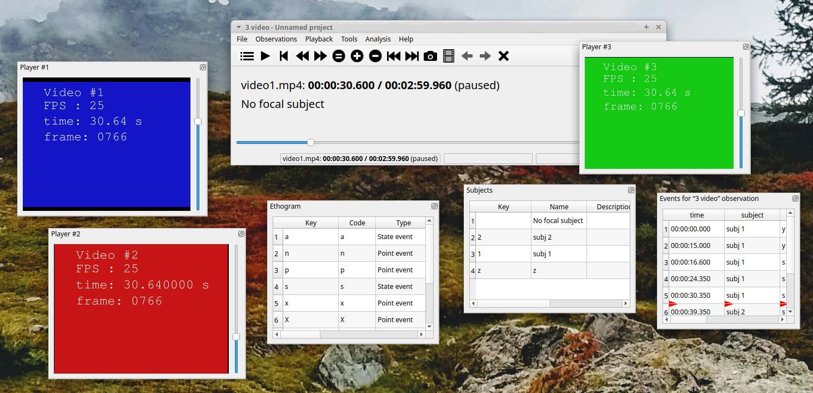

************************************************************************************************************************
Behavioral Observation Research Interactive Software (BORIS) user guide
************************************************************************************************************************

.. sections levels: = - . ~ _

BORIS is an easy-to-use event logging software for video/audio coding and live observations.
BORIS is a free and open-source software available for GNU/Linux, Windows.

This user guide apply to the **version 8.7** of BORIS.

Since the version 8 BORIS is based on the MPV media player (see https://mpv.io) and allow the recording of events much more precisely.
See http://www.boris.unito.it/pages/boris_v8.html for all the improvements of v. 8.

`www.boris.unito.it <http://www.boris.unito.it>`_

.. contents::
   :depth: 2

Follow BORIS
========================================================================================================================

BORIS web site: `www.boris.unito.it <http://www.boris.unito.it>`_

`BORIS GitHub repository <https://github.com/olivierfriard/BORIS>`_

`BORIS twitter feed <https://twitter.com/BORIS_behav_obs>`_

`BORIS YouTube channel <https://www.youtube.com/channel/UCo-Jyvzawwp0bRMEor4aLVQ>`_

Legal
========================================================================================================================

Copyright 2012-2022 Olivier Friard - Marco Gamba

**BORIS** is free software; you can redistribute it and/or modify
it under the terms of the GNU General Public License as published by
the Free Software Foundation; either version 3, or any later version.

**BORIS** is distributed in the hope that it will be useful,
but WITHOUT ANY WARRANTY; without even the implied warranty of
MERCHANTABILITY or FITNESS FOR A PARTICULAR PURPOSE.  See the
`GNU General Public License <http://www.gnu.org/copyleft/gpl.html>`_ for more details.

Install BORIS
========================================================================================================================

.. include:: install_launch.rst

Create a new project with BORIS
========================================================================================================================

.. include:: create_new_project.rst

Open an existing project with BORIS
========================================================================================================================

.. important:: **Due to changes in the project format all the projects created with v. 7+ will not be suitable for
               previous version of BORIS. The v. 7 will open projects created with previous version and convert them.
               A copy of your old project will be kept.**

.. important:: If you open a project file created with a version older than v.7 BORIS will convert your project file and
               keep an original version of your project file. BORIS will ask you to convert the upper case behavior and
               subject keys to lower case.

To open an existing BORIS project, select the menu **File** > **Open project**.
A BORIS project file is a container for all information related to a set of observations as the ethogram,
the independent variables, and the subjects. BORIS allows creating an unlimited number of projects but
only one project can be opened at a time.

Import a project
========================================================================================================================

You can import a project from a **Noldus The Observer XT Coding Scheme Exchange** file (.otx or .otb extensions).
The Observer XT software allows you to save a project as a template (see the reference manual). This template can be
imported into BORIS and then saved as a BORIS project (File > Import a project from ... > Noldus The Observer XT template)

The following information will be imported from the template file:

* Ethogram (coding scheme)
* Modifiers
* Behavioral categories
* Subjects
* Independent variables

The Observer is a registered trademark of Noldus Information Technology b.v.
See the `Noldus web site for details <https://www.noldus.com/human-behavior-research/products/the-observer-xt>`_

Observations
========================================================================================================================

.. include:: observations.rst

Coding your media
========================================================================================================================

.. include:: coding.rst

Exporting events data
========================================================================================================================

.. include:: export_events.rst

Playback menu
========================================================================================================================

.. include:: playback_menu.rst

Tools
========================================================================================================================

.. include:: tools.rst

Coding map
========================================================================================================================

.. include:: coding_map.rst

Analysis
========================================================================================================================

.. include:: analysis.rst

Preferences
========================================================================================================================

.. include:: preferences.rst

Various
========================================================================================================================

.. _Removing path of media files:

Removing path of media files
------------------------------------------------------------------------------------------------------------------------

Using BORIS you can choose to store the full path of the media files into the file project (for example: ``/home/user/Video/video_n1.mp4`` or
``c:\Users\user\Documents\video1.avi``).

If you want to move your project on a different computer or if you want to move your media files you may want to do not store the full
path. For this you can choose to add media files without the full path (See **Add media files** section). You can also remove the full path
of your media files from the all observations of the current project (**File** > **Remove path from media files**. Please note that this
operation is irreversible. After remotion the full path of your media will be lost and will not be recoverable.

**If you choose to do not store the full path of media files the media files must located in the same directory than your BORIS project file.**

Citing BORIS
------------------------------------------------------------------------------------------------------------------------

If you have used BORIS for publications, please cite::

    Olivier Friard and Marco Gamba. (2016) BORIS: a free, versatile open-source
    event-logging software for video/audio coding and live observations.
    Methods in Ecology and Evolution, 7(11), 1324-1330
    DOI: 10.1111/2041-210X.12584

Docking
------------------------------------------------------------------------------------------------------------------------

All elements, including all the media players can be undocked from the main window and positioned where you prefer
(e.g. they can be on the same desktop over one or many screens).

The position of the various widgets is saved in the `configuration file`_ at the end of the work session.

Click the icon present at the top-right corner of the widget (for MacOS the icon is located at the left-top corner) will
undock the widgets that can be repositioned on another docking area or moved out of the main window.
A double-click on the top bar of the widget will reposition it on the main window.

For Linux:

.. image:: images/dock_undock1.png
   :alt: dock/undock
   :width: 100%

For Microsoft-Windows:

.. image:: images/dock_undock1_win.png
   :alt: dock/undock
   :width: 100%

For MacOS:

.. image:: images/dock_undock1_mac.png
   :alt: dock/undock
   :width: 100%

If you fill uncomfortable with the dockwidgets you can block them on the main window by checking the **Lock dockwidgets** option
(see **Tools** > **Lock dockwidgets**). All the dockwidgets will be docked on the main window and locked on it except the player dockwidgets.

.. _configuration file:

Configuration files
------------------------------------------------------------------------------------------------------------------------

BORIS saves the configuration (user preferences, windows position, widgets position) in a configuration file. This file
is named **.boris** and it is saved on the home directory of the current user::

    for Linux:
    /home/USERNAME/.boris

    for Microsoft-Windows:
    C:\Users\USERNAME\.boris

    for MacOS:
    /Users/USERNAME/.boris

If you have some trouble using BORIS try to close the program, delete this file and relaunch BORIS.

The **recent projects list** is saved on the **.boris_recent_projects** file in the home directory of the current user.

Bug reports and features request
------------------------------------------------------------------------------------------------------------------------

Please report any bug you will find in the latest BORIS version using the GitHub repository.

Prior to report a bug please:

* Check the Frequent Asked Question (FAQ) section
* Check if the issue was not already reported (GitHub repository)
* Delete the configuration file and try again (see `configuration file`_).

Remember to indicate:

* your operating system
* the version of your operating system
* the computer you are using (model, RAM ...)
* the version of BORIS you are using
* Information on the mediafile you are coding (if any) See Tools > Media file information

Give all the information that will allow to reproduce the bug: a detailed procedure, a screen recording, etc.

In case of crash please send me the file boris_error.log generated in your home directory just after the crash (before relaunching BORIS)::

   Linux:
   /home/YOUR_PROFILE_NAME/boris_error.log

   Microsoft-Windows:
   c:\Users\YOUR_PROFILE_NAME\boris_error.log

If the bug is fixed remember to close the issue.

If you find BORIS useful you can give a star to the BORIS GitHub repository.

Acknowledgement
========================================================================================================================

The authors would like to acknowledge Valentina Matteucci and all others users that report bugs and/or request features for
their precious help.

Valid keys for triggering behavior
========================================================================================================================

BORIS makes difference between lower case and upper case characters

* keys from a to z
* keys from A to Z
* keys from 0 to 9
* function keys from F1 to F12
* à é è ù ì ç
* ! " £ $ % & / ( ) = ? ^ [ ] { } @ | § ° #
