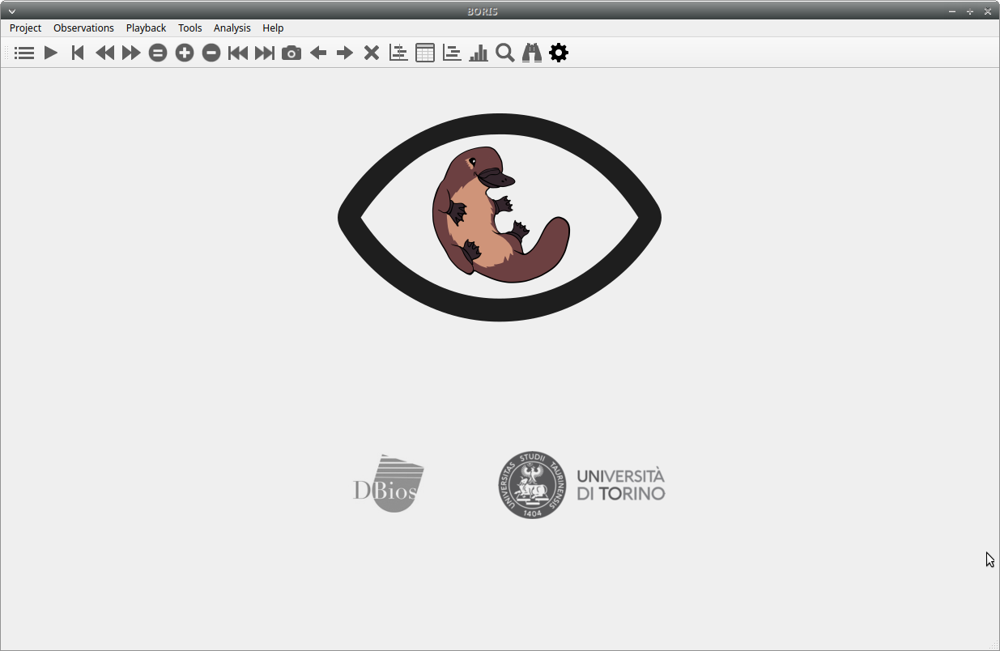
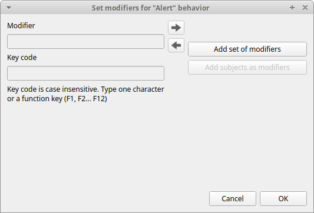
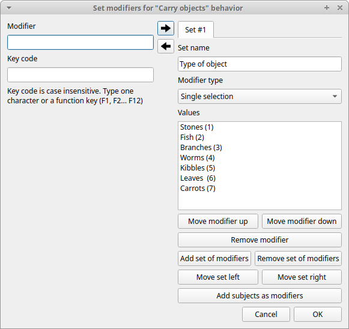
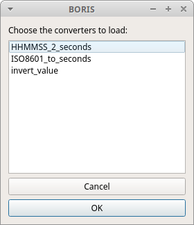

********************************************************************************************************************************************
Behavioral Observation Research Interactive Software (BORIS) user guide
********************************************************************************************************************************************

.. image:: images/new_logo.500px.png
   :width: 80%

**BORIS is an easy-to-use event logging software for video/audio coding and live observations.
BORIS is a free and open-source software available for GNU/Linux, Windows and Mac OS.**

**version 7.4.3**

`www.boris.unito.it <http://www.boris.unito.it>`_

.. contents::
   :depth: 2

Follow BORIS
============================================================================================================================================

BORIS web site: `www.boris.unito.it <http://www.boris.unito.it>`_

`BORIS GitHub repository <https://github.com/olivierfriard/BORIS>`_

`BORIS twitter feed <https://twitter.com/BORIS_behav_obs>`_

`BORIS YouTube channel <https://www.youtube.com/channel/UCo-Jyvzawwp0bRMEor4aLVQ>`_

Legal
============================================================================================================================================

Copyright 2012-2018 Olivier Friard - Marco Gamba

**BORIS** is free software; you can redistribute it and/or modify
it under the terms of the GNU General Public License as published by
the Free Software Foundation; either version 2, or any later version.

**BORIS** is distributed in the hope that it will be useful,
but WITHOUT ANY WARRANTY; without even the implied warranty of
MERCHANTABILITY or FITNESS FOR A PARTICULAR PURPOSE.  See the
`GNU General Public License <http://www.gnu.org/copyleft/gpl.html>`_ for more details.

Install BORIS
============================================================================================================================================

BORIS can be installed following instructions on the BORIS site at `download page <http://www.boris.unito.it/?page=download>`_

Linux
--------------------------------------------------------------------------------------------------------------------------------------------

BORIS is available only for 64-bit systems.

The `VLC media player <https://www.videolan.org/vlc/>`_ must be installed on your system.

You can also run BORIS from sources.
See the `Linux download page <http://www.boris.unito.it/pages/download_linux>`_ for details about the dependencies to install.

Microsoft-Windows
--------------------------------------------------------------------------------------------------------------------------------------------

BORIS is available for Windows in 32-bit and 64-bit versions. Check your OS before downloading.

Two versions are available: **BORIS Setup** and **BORIS Portable**

The **BORIS Setup** will install BORIS on your system (the default install path is located in your home directory,
you do not need administration rights to install BORIS).

The **BORIS Portable** will NOT install BORIS on your system but will run from a directory (find and launch boris.exe).
Use this version if you want to test a new version of BORIS for example.

..
    BORIS debugging version
    .......................

    Use this version if you want to report bug. In this case you should include screenshots or copy of the terminal output.
    This version will NOT install BORIS in your system.

Mac OS
--------------------------------------------------------------------------------------------------------------------------------------------

BORIS is available for Mac OS only in 64-bit version (from >= 10.8)

VirtualBox virtual appliance
----------------------------

If you want to try BORIS without installing it you can download the `VirtualBox virtual appliance <http://www.boris.unito.it/?page=download>`_
from the BORIS site.
In this case you must first install the `VirtualBox <https://www.virtualbox.org/>`_ virtualizer from Oracle (released under GPL 2).

Launch BORIS
============================================================================================================================================

Start BORIS by clicking on its icon. For launching BORIS from sources see the BORIS web site.
When launching BORIS for the first time it may take some time to show up. Please be patient!

The main window of BORIS will show up. The toolbar with media player commands is disabled for now.

.. warning:: On **Mac OS** 10.9 and above, launching can be stopped according to the `Security & Privacy` settings of your computer.
    They can be changed opening `System Preferences...` > `Security & Privacy` > `General` and selecting the option `Anywhere` in the
    frame `Allow apps downloaded from`. Alternatively you can repeat the operation right-clicking on the BORIS icon and then clicking
    `Open` in the following two dialog boxes.

.. warning:: On **Microsoft-Windows**, launching can be stopped by a `Security warning: The publisher can not be verified. Are you sure you
    want to run this software?` Click the `Run` button to launch BORIS.

At the first launch, BORIS will ask you to allow the automatically check for new version. Internet access is required for this feature.
If you choose **Yes** BORIS will check for new version about every 15 days.
This option can be changed on the **Preferences** window (See `general preferences`_)

You can launch BORIS from command line by specifying the project file to open as the first argument.

Create a new project with BORIS
============================================================================================================================================

The BORIS project file is the container for all information related to the project.
It contains the **ethogram**, the **independent variables**, the **subjects definition**, the **behaviors coding maps**, the **converters**
and all **observations** data.
The save menu option (**File** > **Save project** or **Save project as ...**) will save the project in a path in your local file system.
You can also activate the  `automatic backup`_ feature (see **Preferences**).

.. note:: It is VERY important to do regular backups of your project files to prevent the lost of data. Software can be reinstalled but
    your data could quite possibly be lost for ever.

BORIS allows creating an unlimited number of projects but only one project can be opened at a time.

A video tutorial about creating a project is available at https://www.youtube.com/watch?v=I97Dny5hFOE

To create a new project, under the menu **File** , select **New project**.
You can determine your project name by writing in the **Project name** field in the **Information** tab. Once the project will be saved,
the **Project file path** will show the full path to your project file.
**Date** will automatically set on the current date and time, but you can alternatively set this info on your media date and time,
or whatever you prefer. **Description** can host all the relevant information about your project, can be also left empty.
**Time format** can be alternatively set to **seconds** or to **hh:mm:ss.mss**. This choice can be changed at anytime
under **File** > **Preferences** (for MAC users, **BORIS** > **Preferences**) > **Default project time format**.

.. image:: images/new_project.png
   :alt: New project
   :width: 100%

Set an ethogram
--------------------------------------------------------------------------------------------------------------------------------------------

See `<https://en.wikipedia.org/wiki/Ethogram>`_ for ethogram definition.

Switching to the **Ethogram** tab, you can alternatively:

* set your ethogram from scratch;
* import an existing ethogram from another BORIS project;
* import an ethogram from a JWatcher global definition file (.gdf).
* `import an ethogram from a plain text file`_

.. image:: images/project2_ethogram.png
   :alt: Ethogram configuration
   :width: 100%

Set your ethogram from scratch
............................................................................................................................................

Clicking on the **Add behavior** button you can add a new row in the **Ethogram** table and behavior type will be automatically set
to **Point event**.

The cells with gray background can not be directly edited. You must double-click on them and then select a value.

Behavior types
~~~~~~~~~~~~~~~~~~~~~~~~~~~~~~~~~~~~~~~~~~~~~~~~~~~~~~~~~~~~~~~~~~~~~~~~~~~~~~~~~~~~~~~~~~~~~~~~~~~~~~~~~~~~~~~~~~~~~~~~~~~~~~~~~~~~~~~~~~~~

2 types of behaviors can be defined. Double-click on the cell and select the type of behavior:

- **Point event** behavior when the behavior has **no duration**. The behavior will be coded by pressing the defined keyboard key (see below) or by clicking to the corresponding row in the Ethogram table.

- **State event** behavior when the behavior has a **duration**. The behavior start and stop will be coded by pressing the defined keyboard key (see below) or by clicking to the corresponding row in the Ethogram table. These behaviors **must** have a start event and a stop event.

You can switch between **State event** and **Point event** at your convenience with a double-click on the **Behavior type** cell.
You can also add a **Coding map** to either a **State event** (**State event with coding map**) or a **Point event** (**Point event with
coding map**;
see the "Coding map" section for details).

An existing behavior can be duplicated using the **Clone behavior** button. Its code have then to be changed. On a selected behavior,
click on the **Remove behavior** button to remove. The **Remove all behaviors** button will clear the **Ethogram** table.
Both the above-mentioned operations must be confirmed when prompted.

Behavioral codes (**Code** column) can be sorted alphabetically by checking the **Alphabetical order** checkbox. Alternatively they can be
sorted manually by using the **Move up** and **Move down** buttons.

Categories of behaviors
~~~~~~~~~~~~~~~~~~~~~~~~~~~~~~~~~~~~~~~~~~~~~~~~~~~~~~~~~~~~~~~~~~~~~~~~~~~~~~~~~~~~~~~~~~~~~~~~~~~~~~~~~~~~~~~~~~~~~~~~~~~~~~~~~~~~~~~~~~~~

Defining categories of behaviors can be usefull for the analysis of coded events (for example the time budget analysis).
Click the **Behavioral categories** button and add a the categories of behaviors. Behaviors can then be included or not in a defined category.

.. image:: behavioral_categories.png
   :scale: 60%
   :alt: Categories of behaviors

Set keys and codes
~~~~~~~~~~~~~~~~~~~~~~~~~~~~~~~~~~~~~~~~~~~~~~~~~~~~~~~~~~~~~~~~~~~~~~~~~~~~~~~~~~~~~~~~~~~~~~~~~~~~~~~~~~~~~~~~~~~~~~~~~~~~~~~~~~~~~~~~~~~~

For each behavior you have to set a keyboard key (**Key** column) that will be then used to code the behavioral events.
You can choose whether you want to set a unique key for each behavior or use the same key for more than one behavior.
In the case you set the same key for more than a behavior, BORIS will pause your coding and ask which of the behavior
you want to record. From version 7 the keys are **case-sensitive**.

If your project was created with a previous version of BORIS (< v.7) you can use the **Convert keys to lower case** to convert all keys to
lower case otherwise you will have to code your observation using upper case key.

.. important:: If you open a project file created with a version older than v.7 BORIS will ask you to convert the upper case behavior and
    subject keys to lower case.

.. important:: **Do not use the / and * keys! They are reserved for the frame-by-frame mode.**

In the **Code** column, you have to add a unique code for each behavior. Duplicated codes are not accepted and
BORIS will warn in red about duplicates on the bottom left of the *Ethogram* tab. The code can be an alphanumeric
string (which must not include the pipe character **|** ).

The **Category** column allow you to include the behavior to a predefined category.

The **Description** of your behavior is optional. The **Description** column can be useful to add information
about a specific behavior, its characteristics (e.g. to standardise observation between different users) or to
refer to external information (e.g. reference to a previous ethogram).

The following three columns (**Modifiers**, **Exclusion**, **Coding map**) cannot be edited from the **Ethogram** table.

Set the modifiers
~~~~~~~~~~~~~~~~~~~~~~~~~~~~~~~~~~~~~~~~~~~~~~~~~~~~~~~~~~~~~~~~~~~~~~~~~~~~~~~~~~~~~~~~~~~~~~~~~~~~~~~~~~~~~~~~~~~~~~~~~~~~~~~~~~~~~~~~~~~~

Modifiers can be used to add attributes to a behavior. A single behavior can have two or more modifiers attached
(e.g. "play" may have "solitary" or "social" as modifiers). The use of modifiers can be convenient to significantly
reduce the number of keys and simplify the behavioral coding.

3 types of modifiers are available: **Single selection**, **Multiple selection** and **Numeric**.
**Single selection** modifiers allows the observer to select only one modifier in the list.
**Multiple selection** allows to select more modifiers from the list.
**Numeric** allows to input a numeric data.

In BORIS modifiers can also be added in different modifier
sets [e.g. "play, social" may have a modifier set (#1) for "brothers" and another (#2) for "sisters"]. In the case of
using sets of modifiers, you can select one/more modifier for each set.

To add modifiers to a behavior, you need to double-click the **Modifiers** cell corresponding to the behavior you want to add the modifiers to.
The following window will show up:

Click the **Add a set of modifiers** button:

.. image:: images/modifiers_1.png
    :width: 60%
    :alt: modifiers configuration

Set a name for the new modifiers set by typing it in the **Set name** edit box. Setting a modifiers' set name is not mandatory.

Select the modifier type using the **Modifier type** combo box. You can choose between **Single selection**, **Multiple selection**
and **Numeric**

* the **Single selection** type will allow you to select only **one** modifier for the current behavior.

* the **Multiple selection** type will allow you to select one or more modifiers for the current behavior.

* the **Numeric** type will allow you to input a number. For example a distance of interaction.

Within a set of modifiers, you can add a modifier by writing the modifier in the **Modifier** edit box.
You can choose a shortcut (one character - case sensitive) to this modifier (optional). Then press the **right-arrow** button to add the
new modifiers to the set.

.. image:: images/modifiers_2.png
    :width: 60%
    :alt: modifiers configuration

To modify a modifier, select it and press the **left-arrow** button, edit the modifier and press the **right-arrow** button.

A modifier can be removed by pressing the **Remove modifier** button.

After adding all modifiers the window will appear like this:

In case of **Single selection** or **Multiple selection** all defined subjects can be added as modifiers using
the **Add subjects as modifiers** button. This can help in case of coding the interactions between subjects for example.

The modifier position into the modifiers' set can be manually set using the **Move modifier up** and **Move modifier down** buttons.

You can add and/or remove sets using the buttons **Add set of modifiers** and **Remove set of modifiers**.

The position of a modifiers' set can be customized  (using the **Move set left** and **Move set right** buttons)

Modifiers can not contain the following characters: **(|),`~!**

Example of a **multiple selection** modifiers set:

.. image:: modifiers_multiple_selection.png
   :width: 1200px
   :alt: modifiers configuration

Many values can be selected together.

Example of 2 sets of modifiers:

.. image:: modifiers_2sets.png
   :width: 1200px
   :alt: modifiers configuration

.. image:: modifiers_2sets_2.png
   :width: 1200px
   :alt: modifiers configuration

Click **OK** to save modifiers in the **Ethogram** table.

Set the exclusion matrix
~~~~~~~~~~~~~~~~~~~~~~~~~~~~~~~~~~~~~~~~~~~~~~~~~~~~~~~~~~~~~~~~~~~~~~~~~~~~~~~~~~~~~~~~~~~~~~~~~~~~~~~~~~~~~~~~~~~~~~~~~~~~~~~~~~~~~~~~~~~~

The occurrence of an event (State or Point) can exclude the occurrence of a state event.
This can be set using the **Behaviors exclusion matrix** window, which can be
opened clicking on the **Exclusion matrix** button.
BORIS will ask for including **Point events** or not and a new **Exclusion matrix** window will open.

Exclusive behavior may be selected by checking on the corresponding checkbox in the automatically-generated
matrix. We suggest to work on the **Exclusion matrix** when all the behaviors have been added to your ethogram.

All behaviors can be excluded by a particular behavior by selecting the corresponding entire row (click on the row header of the behavior)
and by clicking on the **Check selected** button. You can also uncheck all behaviors by selecting the **Uncheck selected** button.

Example of an **exclusion matrix**:

.. image:: images/exclusion_matrix.png
   :width: 100%
   :alt: Exclusion matrix tool

For example in the previous figure, the **Alert** behavior will exclude the following behaviors: **Allogroom**, **Breed**,
**Carry objects**, **Chase** ...

During the observation, the excluding event will stop all the current excluded state events one millisecond before the occurence of the event.

Import an ethogram from an existing project
............................................................................................................................................

Behaviors within an ethogram can be imported from an existing BORIS project (.boris) using the **Import behaviours from a BORIS project** button.
BORIS will ask to select a BORIS project file and whether imported behaviors should replace or be appended to the **Ethogram** table.
Imported behaviors will retain all the previously defined behavior parameters (namely Behavior type, Key, Code, Description, Modifiers and
Exclusion information).

Import an ethogram from a JWatcher global definition file (.gdf)
............................................................................................................................................

Behaviors can be imported from a JWatcher global definition file (.gdf) using the **Import from JWatcher** button.
BORIS will ask to select a JWatcher file (.gdf) and whether imported behaviors should replace or be appended to the **Ethogram** table.
Behavior type and exclusion information for the behaviours imported from JWatcher have to be redefined.

.. _import an ethogram from a plain text file:

Import an ethogram from a plain text file
............................................................................................................................................

Behaviors can be imported from a plain text file using the **Import from text file** button.
The fields must be separated by TAB, comma (,) or semicolomn (;). All rows must contain the same number of fields.

The fields will be interpreted as:

* field #1: event type (point or state)
* field #2: key (case insensitive)
* field #3: code (must be unique)
* field #4: behavior category (empty if no category)
* field #5: description (optional)

All fields after the 5th will be ignored.

BORIS will ask to select a plain text file (by default: \*.txt \*.csv \*.tsv) and whether imported behaviors should replace or be appended
to the **Ethogram** table.
The missing information for the behaviours imported from text file have to be redefined.

Export the ethogram
............................................................................................................................................

The entire ethogram can be exported in various formats (TSV, CSV, XLS, ODS, HTML).
See **File** > **Edit project** > **Ethogram tab** > **Export ethogram**

Define the subjects
--------------------------------------------------------------------------------------------------------------------------------------------

.. image:: subjects_configuration.png
   :width: 1200px
   :alt: Subjects definition

BORIS allow coding behaviors for different subjects within a single observation.
The **Subject** table allows specifying subjects using a **Key** (e.g. the **k** on your keyboard), **Subject name** (e.g. "Kanzi"),
**Description** (e.g. male, born October 28 - 1980). In this case, pressing **n** will set "Nina" as the focal subject
of the behavioural coding. Pressing **n** again will deselect "Nina" and set to "no focal subject".
The definition of one or more subjects is not mandatory. Addition, removal and sorting of the subjects follows the same
logic of the *Ethogram* table (see **Set your ethogram from scratch** for info). The subjects can also be imported from an
existing BORIS project using the **Import Subjects from a BORIS project**.

From version 7 the keys are **case-sensitive**.

If your project was created with a previous version of BORIS (< v.7) you can use the **Convert keys to lower case** to convert all keys to
lower case otherwise you will have to code your observation using upper case key.

.. important:: If you open a project file created with a version older than v.7 BORIS will ask you to convert the upper case behavior and
    subject keys to lower case.

.. _independent variables:

Define the Independent variables
--------------------------------------------------------------------------------------------------------------------------------------------

.. image:: independent_variables1.png
   :alt: Independent variables
   :width: 100%

BORIS allows adding information about the observation using **Independent variables**.
This can be used to specify factors that may influence the behaviors (e.g. group
composition, temperature, weather conditions) but will not change during a single
observation within a project. Each independent variable can be defined by a **Label** (e.g. weather), a
**Description** (e.g. weather conditions), a **Type** (*text*, *numeric*, *value from set* or *timestamp*).

The values of a set are defined in the **Set of values** column separating the available values with a comma (**,**).
Please note that the first value of the set will be selected by default. It should be useful to define a NA value as first value of every set.

The values for the independent variables will be asked when creating a new observation.
Addition, removal and sorting of the independent variables follows the same logic of the **Ethogram** table
(see **Set your ethogram from scratch** for info).
The independent variables can also be imported from an existing BORIS project using the **Import Variables from a BORIS project**.

Example of independent variable defined as "set of values"

.. image:: independent_variables2.png
   :alt: Independent variables
   :width: 100%

The predefined value must be contained in the set of value.

Observations' tab
--------------------------------------------------------------------------------------------------------------------------------------------

The **Observations** table in BORIS shows information about all the previous observations within a project.
A selected "Observation" can be removed using the "Remove observation" button (you will be prompted for confirmation).
This operation cannot be undone and deleted observations cannot be recovered once the project is saved.
The **Observations** table shows four columns **id** **Date** **Description** **Media**.

.. _converters tab:

Converters' tab
--------------------------------------------------------------------------------------------------------------------------------------------

Converters are used for plotting external data when the timestamp values are not expressed in seconds.
Converters can be written by the user, loaded from file or loaded from the repository of the BORIS web site
(http://www.boris.unito.it/static/converters.json).

.. image:: converter_tab_empty.png
   :alt: Converters tab
   :width: 100%

Load converters from BORIS web site
............................................................................................................................................

Click **Load converters from BORIS repository** and select the converters to be added to your project.

.. image:: converter_tab.png
   :alt: Converters tab
   :width: 100%

Writing a converter
............................................................................................................................................

See `Converters for external data values`_

The converters loaded in your project can be then selected for converting timestamp (or other values) in external data file
(See `converters`_)

Open an existing project with BORIS
============================================================================================================================================

.. important:: **Due to changes in the project format all the projects created with v. 7+ will not be suitable for previous version of BORIS.
    The v. 7 will open projects created with previous version and convert them. A copy of your old project will be kept.**

.. important:: If you open a project file created with a version older than v.7 BORIS will convert your project file and keep an original
    version of your project file. BORIS will ask you to convert the upper case behavior and subject keys to lower case.

To open an existing BORIS project, selct the menu **File** > **Open project**.
A BORIS project file is a container for all information related to a set of observations as the ethogram,
the independent variables, and the subjects. BORIS allows creating an unlimited number of projects but
only one project can be opened at a time.

Import a project
============================================================================================================================================

You can import a project from a **Noldus The Observer XT Coding Scheme Exchange** file (.otx or .otb extensions).
The Observer XT software allows you to save a project as a template (see the reference manual). This template can be imported into BORIS
and then saved as a BORIS project (File > Import a project from ... > Noldus The Observer XT template)

The following information will be imported from the template file:

* Ethogram (coding scheme)
* Modifiers
* Behavioral categories
* Subjects
* Independent variables

The Observer is a registered trademark of Noldus Information Technology b.v.
See the `Noldus web site for details <https://www.noldus.com/human-behavior-research/products/the-observer-xt>`_

Observations
============================================================================================================================================

.. include:: observations.rst

Coding your media
============================================================================================================================================

.. include:: coding.rst

Exporting events data
============================================================================================================================================

The coded events can be exported in various formats:

Export events
--------------------------------------------------------------------------------------------------------------------------------------------

**Observations** > **Export events**

This function will export the events of selected observations in TSV, CSV, ODS, XLSX, XLS or HTML formats.
If many observations are selected BORIS will ask for a directory to save the various files.
These formats are suitable for further analysis.

.. image:: export_events.png
   :alt: example of exported events in TSV format
   :width: 60%

.. warning:: Please note that for some formats (XLS - Excel 97) the name of the sheet will be based a modified **observation id**
             in order to not contain forbidden characters (:  \  /  ?  *  [  or  ]) and shortened to 31 characters.

Export aggregated events
--------------------------------------------------------------------------------------------------------------------------------------------

**Observations** > **Export aggregated events**

This function will export the events of the selected observations in the following formats:

* **tabular format** (TSV, CSV, XLSX, XLS, ODS, HTML)
* **SQL** format for populating a SQL database
* **SDIS** format for analysis with the GSEQ program available at  `<http://www2.gsu.edu/~psyrab/gseq>`_

If many observations are selected you can choose to group all results in one file. If you do not want to group results BORIS
will ask for a directory to save  the various files.

The **State events** are paired and the duration is available.

Example of tabular export

.. image:: export_aggregated_events.png
   :alt: example of aggregated and exported events in TSV format
   :width: 80%

Example of SQL export::

    CREATE TABLE events (id INTEGER PRIMARY KEY ASC, observation TEXT,
                         date DATE, subject TEXT, behavior TEXT,
                         modifiers TEXT, event_type TEXT, start FLOAT,
                         stop FLOAT, comment_start TEXT,
                         comment_stop TEXT);

    INSERT INTO events (observation, date, subject, behavior, modifiers,
     event_type, start, stop, comment_start, comment_stop ) VALUES
    ("demo #1","2015-11-30 10:39:18","Subj #1","jump","","POINT",116.588,0,"",""),
    ("demo #1","2015-11-30 10:39:18","Subj #1","jump","","POINT",118.988,0,"",""),
    ("demo #1","2015-11-30 10:39:18","Subj #1","eat","salad","STATE",4.3,10.0,"vvv",""),
    ("demo #1","2015-11-30 10:39:18","Subj #2","jump","","POINT",120.863,0,"",""),
    ("demo #1","2015-11-30 10:39:18","Subj #2","jump","","POINT",122.438,0,"",""),
    ("demo #1","2015-11-30 10:39:18","Subj #2","eat","meat","STATE",26.6,113.988,"","");

.. warning:: Please note that for some formats (XLS - Excel 97) the name of the sheet will be based a modified **observation id**
             in order to not contain forbidden characters (:  \  /  ?  *  [  or  ]) and shortened to 31 characters.

Export events for analysis with JWatcher
--------------------------------------------------------------------------------------------------------------------------------------------

`JWatcher <http://www.jwatcher.ucla.edu>`_  is a powerful tool for the quantitative analysis of behavior.

The events coded with BORIS can be exported to be analyzed with JWatcher.

Click **Observations** > **Export events** > **for analysis with JWatcher** to export the coded events.

BORIS will ask for selecting a directory. After this, for each combination of selected observation and selected subject the following files
will be created:

* the Focal Data File (.dat)

* the Focal Analysis Master File (.faf)

* the Focal Master File (.fmf)

These files can be used to analyze your observations with JWatcher.

Export events as behavioral strings
--------------------------------------------------------------------------------------------------------------------------------------------

Behavioral strings can be used with the **Behatrix** program:
`Behatrix (formerly BSA) <http://www.boris.unito.it/pages/behatrix>`_

Example::

    # observation id: demo#1
    # observation description:
    # Media file name: video1.mp4, video2.mp4

    Subject #1:
    eat|jump|eat|jump

    Subject #2:
    eat|rest|jump|eat|jump

Export events as `Praat <http://www.fon.hum.uva.nl/praat/>`_ `TextGrid <http://www.fon.hum.uva.nl/praat/manual/TextGrid.html>`_
--------------------------------------------------------------------------------------------------------------------------------------------

Example::

    File type = "ooTextFile"
    Object class = "TextGrid"

    xmin = 4.3
    xmax = 113.988
    tiers? <exists>
    size = 2
    item []:
        item [1]:
            class = "IntervalTier"
            name = "Subject #1"
            xmin = 4.3
            xmax = 10.0
            intervals: size = 1
            intervals [1]:
                xmin = 4.3
                xmax = 10.0
                text = "eat"
        item [2]:
            class = "IntervalTier"
            name = "Subject #2"
            xmin = 26.6
            xmax = 113.988
            intervals: size = 1
            intervals [1]:
                xmin = 26.6
                xmax = 113.988
                text = "eat"

Extract sequences from media files
--------------------------------------------------------------------------------------------------------------------------------------------

Sequences of media file corresponding to coded events can be extracted from media files:

1) Click on **Observations** > **Extract events from media files** option.
2) Choose the observation(s).
3) Select the events to be extracted.
4) Select a destination directory that will contain the extracted sequences.
5) Select a time offset (in seconds, the default value is 0).

The time offset will be substracted from the starting time of event and added to the stopping time. All the extracted sequences will be saved
in the selected directory followind the file name format:

{observation id}_{player}_{subject}_{behavior}_{start time}-{stop time}

Export transitions matrix
--------------------------------------------------------------------------------------------------------------------------------------------

3 transitions matrix outputs are available: The matrix of frequencies of transitions, the matrix of frequencies of transition after each behavior
and the matrix of number of transitions.

Matrix of frequencies of transitions
............................................................................................................................................

This matrix contains the frequencies of total transitions.
The sum of all frequencies must be 1.

Example of frequencies of transitions matrix::

               eat   sleep     walk
    eat        0.0   0.286    0.143
    sleep    0.143     0.0    0.143
    walk     0.286     0.0      0.0

In this matrix you can see that the **eat** behavior precedes the **sleep** behavior with a frequency of **0.286** of the total number of
transitions.

Matrix of frequencies of transitions after behavior
............................................................................................................................................

This matrix contains the frequencies of transitions after each behavior.
The sum of each row must be 1.

Example::

            eat    sleep     walk
    eat     0.0    0.667    0.333
    sleep   0.5	     0.0      0.5
    walk    1.0      0.0      0.0

In this example you can see that **sleep** follows **eat** with a frequency of **0.667** and **walk** follows with a frequency of **0.333**.

Matrix of number of transitions
............................................................................................................................................

This matrix contains the number of transitions after each behavior.

Example::

            eat   sleep   walk
    eat       0       2      1
    sleep     1       0      1
    walk      2       0      0

Playback menu
============================================================================================================================================

Jump
--------------------------------------------------------------------------------------------------------------------------------------------

Jump forward
............................................................................................................................................

Allow to jump forward in the current media file. See **File** > **Preferences**  for setting the jump value.

Jump backward
............................................................................................................................................

Allow to jump backward in the current media file. See **File** > **Preferences**  for setting the jump value.

Jump to specific time
............................................................................................................................................

Allow to go to a specific time in the current media file.

Zoom
--------------------------------------------------------------------------------------------------------------------------------------------

Allow to zoom into the current video file. The available zoom values are: 1:2, 1:4, 2:1 and 1:1.
**Fit to window** adapts the zoom value to the current window size. In case of simultaneous playing
you can set different values of zoom in player #1 and player #2.

The Zoom option is not available in frame-by-frame mode.

.. warning:: **The Zoom function is not working on Mac**

Tools
============================================================================================================================================

.. include:: tools.rst

Coding map
============================================================================================================================================

.. include:: coding_map.rst

Analysis
============================================================================================================================================

.. include:: analysis.rst

Preferences
============================================================================================================================================

.. include:: preferences.rst

Various
============================================================================================================================================

.. _Removing path of media files:

Removing path of media files
--------------------------------------------------------------------------------------------------------------------------------------------

Using BORIS you can choose to store the full path of the media files into the file project (for example: ``/home/user/Video/video_n1.mp4`` or
``c:\Users\user\Documents\video1.avi``).

If you want to move your project on a different computer or if you want to move your media files you may want to do not store the full
path. For this you can choose to add media files without the full path (See **Add media files** section). You can also remove the full path
of your media files from the all observations of the current project (**File** > **Remove path from media files**. Please note that this
operation is irreversible. After remotion the full path of your media will be lost and will not be recoverable.

**If you choose to do not store the full path of media files the media files must located in the same directory than your BORIS project file.**

Citing BORIS
--------------------------------------------------------------------------------------------------------------------------------------------

If you have used BORIS for publications, please cite::

    Olivier Friard and Marco Gamba. (2016) BORIS: a free, versatile open-source
    event-logging software for video/audio coding and live observations.
    Methods in Ecology and Evolution, 7(11), 1324-1330
    DOI: 10.1111/2041-210X.12584

Docking
--------------------------------------------------------------------------------------------------------------------------------------------

All elements, including all the media players can be undocked from the main window and positioned where you prefer
(e.g. they can be on the same desktop over one or two screens).

The position of the various widgets is saved in the `configuration file`_ at the end of the work session.

.. image:: images/undocked_widgets.png
   :alt: Undocked widgets

Click the icon present at the top-right corner of the widget (for MacOS the icon is located at the left-top corner) will undock the widgets
that can be repositioned on another docking area or moved out of the main window.
A double-click on the top bar of the widget will reposition it on the main window.

For Linux:

For Microsoft-Windows:

.. image:: images/dock_undock1_win.png
   :alt: dock/undock
   :width: 100%

For MacOS:

.. image:: images/dock_undock1_mac.png
   :alt: dock/undock
   :width: 100%

.. _configuration file:

Configuration files
--------------------------------------------------------------------------------------------------------------------------------------------

BORIS saves the configuration (user preferences, windows position, widgets position) in a configuration file. This file is named **.boris**
and it is saved on the home directory of the current user:

* /home/USERNAME/.boris for Linux

* C:\\Users\\USERNAME\\.boris for Microsoft Windows

* /Users/USERNAME/.boris for MacOS

If you have some trouble using BORIS try to close the program, delete this file and relaunch BORIS.

The **recent projects list** is saved on the **.boris_recent_projects** file in the home directory of the current user.

Bug reports and features request
--------------------------------------------------------------------------------------------------------------------------------------------

Please send bug reports and features request using the BORIS GitHub repository (https://github.com/olivierfriard/BORIS)
or by e-mail in english, french or italian (see web site http://www.boris.unito.it/pages/about.html).

In case of bug report please verify that you are using the last version of BORIS and indicate your operating system, its version and the
CPU architecture (32/64 bits).
You may also include the BORIS project that gave you an error. Any information you will provide will not be disclosed to any third party.

Acknowledgement
============================================================================================================================================

The authors would like to acknowledge Sergio Castellano, Valentina Matteucci and Laura Ozella for their precious help.

Valid keys for triggering behavior
============================================================================================================================================

BORIS makes difference between lower case and upper case characters

* keys from a to z
* keys from A to Z
* keys from 0 to 9
* function keys from F1 to F12
* à é è ù ì ç
* ! " £ $ % & / ( ) = ? ^ [ ] @ | § ° #
