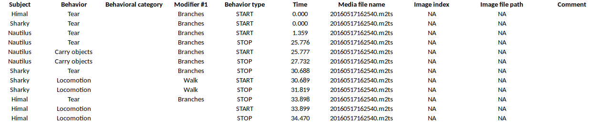

# Export events

The coded events can be exported in various formats.

## Export events in tabular format

**Observations** > **Export events** > **Tabular events**

This function exports the events of selected observations in one or many files.
Various formats are available:

- Plain text in tabular format
    - **Tab Separated Values** (TSV)
    - **Comma Separated Values** (CSV)
    - **Hyper Text Markup language** (HTML)

- Spreadsheet files
    - **OpenDocument** (ODS)
    - **Microsoft Excel** (XLSX, XLS)
    
-  **Pandas dataframe** (to be loaded in Python with the [pickle
    module](https://docs.python.org/3/library/pickle.html))

-   **R dataframe** (to be loaded in R with [readRDS
    function](https://rdrr.io/r/base/readRDS.html))

If many observations are selected BORIS will ask for a directory to save
the various files. For the spreadsheet format (XLSX and ODS) the events can be
exported on various worksheet in a single workbook. All these formats are
suitable for further analysis.

Select the subjects, the behaviors and the time interval.

Set the time interval to the **Observed events**

Select a **User defined** time interval.

Example of output of tabular events

## Export aggregated events

**Observations** > **Export events** **Aggregated events**

This function will export the events corresponding to the selected
subjects and the selected behaviors of the selected observations.

Various formats are available:

- Plain text in tabular format
    - **Tab Separated Values** (TSV)
    - **Comma Separated Values** (CSV)
    - **Hyper Text Markup language** (HTML)

- Spreadsheet files
    - **OpenDocument** (ODS)
    - **Microsoft Excel** (XLSX, XLS)

-  **SQL format** for populating a SQL database

-   **SDIS format** for analysis with the GSEQ program available at
    <http://www2.gsu.edu/~psyrab/gseq>

-  **Pandas dataframe** (to be loaded in Python with the [pickle
    module](https://docs.python.org/3/library/pickle.html))

-   **R dataframe** (to be loaded in R with [readRDS
    function](https://rdrr.io/r/base/readRDS.html))

If two or more observations are selected you can choose to group all
results in one file. If you do not want to group results BORIS will ask
for a directory to save the various files (the observation id will be
used as file name).

The **State events** are paired and in this case the event duration is
available.

An arbitrary time interval can be selected (check the **Limit to time
interval** option). In this case the ongoing events will be started at
start time and stopped at end time in the export file.

The following fields are available in the output:

-   Observation id
-   Observation date and time
-   Observation description
-   Observation type (Media file / Live / Pictures)
-   Source (for media file and pictures)
-   Total duration (in seconds, the duration of observation in base of
    the selected time interval)
-   Media duration(s) (in seconds, for media file observation)
-   FPS (frame/s, for video file, number of images per second)
-   Independent variables (one column by variable9)
-   Subject name
-   Observation duration by subject
-   Behavior
-   Behavioral category (if any)
-   Modifier(s) of behavior (one column by madifier)
-   Behavior type (STATE / POINT)
-   Start (seconds)
-   Stop (seconds)
-   Duration (seconds, duration of the event for STATE events)
-   Media file name (for media file observation, media in which the
    event occurs)
-   Image index start (for observations from pictures, index of the
    image where the event starts)
-   Image index stop (for observations from pictures, index of the image
    where the event stops)
-   Image file path start (for observations from pictures, path of the
    image where the event stops)
-   Image file path stop (for observations from pictures, path of the
    image where the event stops)
-   Comment start
-   Comment stop

Example of table export of aggregated events (TSV, CSV, XLSX, ODS, HTML)

{width="100.0%"}

{width="100.0%"}

Example of SQL export of aggregated events:

    CREATE TABLE aggregated_events (id INTEGER PRIMARY KEY ASC, observation TEXT, subject TEXT, behavior TEXT, type TEXT, modifiers TEXT, start FLOAT, stop FLOAT, 
    comment TEXT, comment_stop TEXT, image_index_start INTEGER,image_index_stop INTEGER,image_path_start TEXT,image_path_stop TEXT);
    INSERT INTO "aggregated_events" VALUES(1,'0001_a','Himal','Tear','STATE','Branches',0.0,30.199,'','','NA','NA',NULL,NULL);
    INSERT INTO "aggregated_events" VALUES(2,'0001_a','Himal','Locomotion','STATE','Walk',30.2,32.4,'','','NA','NA',NULL,NULL);
    INSERT INTO "aggregated_events" VALUES(3,'0001_a','Nautilus','Tear','STATE','Branches',0.0,32.4,'','','NA','NA',NULL,NULL);
    INSERT INTO "aggregated_events" VALUES(4,'0001_b','Himal','Tear','STATE','Branches',0.0,30.199,'','','NA','NA',NULL,NULL);
    INSERT INTO "aggregated_events" VALUES(5,'0001_b','Himal','Locomotion','STATE','Walk',30.2,32.4,'','','NA','NA',NULL,NULL);
    INSERT INTO "aggregated_events" VALUES(6,'0001_b','Nautilus','Tear','STATE','Branches',0.0,31.4,'','','NA','NA',NULL,NULL);
    INSERT INTO "aggregated_events" VALUES(7,'0002','Himal','Tear','STATE','Branches',0.0,33.898,'','','NA','NA',NULL,NULL);
    INSERT INTO "aggregated_events" VALUES(8,'0002','Himal','Locomotion','STATE','',33.899,34.47,'','','NA','NA',NULL,NULL);
    INSERT INTO "aggregated_events" VALUES(9,'0002','Sharky','Tear','STATE','Branches',0.0,30.688,'','','NA','NA',NULL,NULL);
    INSERT INTO "aggregated_events" VALUES(10,'0002','Sharky','Locomotion','STATE','Walk',30.689,31.819,'','','NA','NA',NULL,NULL);
    INSERT INTO "aggregated_events" VALUES(11,'0002','Nautilus','Tear','STATE','Branches',1.359,25.776,'','','NA','NA',NULL,NULL);
    INSERT INTO "aggregated_events" VALUES(12,'0002','Nautilus','Carry objects','STATE','Branches',25.777,27.732,'','','NA','NA',NULL,NULL);
    INSERT INTO "aggregated_events" VALUES(13,'0003','Nina','Locomotion','STATE','Walk',21.626,22.5,'','','NA','NA',NULL,NULL);
    INSERT INTO "aggregated_events" VALUES(14,'0003','Nina','Manipulate','STATE','',0.0,21.625,'','','NA','NA',NULL,NULL);

## Export events as behavioral sequences

**Observations** \> **Export events** **as behavioral sequences**

Behavioral strings can be used with the **Behatrix** program:
[Behatrix](http://www.boris.unito.it/pages/behatrix)

Example:

    # observation id: demo#1
    # observation description:
    # Media file name: video1.mp4, video2.mp4

    Subject #1:
    eat|jump|eat|jump

    Subject #2:
    eat|rest|jump|eat|jump

## Export events as [Praat](http://www.fon.hum.uva.nl/praat/) [TextGrid](http://www.fon.hum.uva.nl/praat/manual/TextGrid.html)

**Observations** \> **Export events** **as Praat TextGrid**

Example:

    File type = "ooTextFile"
    Object class = "TextGrid"

    xmin = 4.3
    xmax = 113.988
    tiers? <exists>
    size = 2
    item []:
        item [1]:
            class = "IntervalTier"
            name = "Subject #1"
            xmin = 4.3
            xmax = 10.0
            intervals: size = 1
            intervals [1]:
                xmin = 4.3
                xmax = 10.0
                text = "eat"
        item [2]:
            class = "IntervalTier"
            name = "Subject #2"
            xmin = 26.6
            xmax = 113.988
            intervals: size = 1
            intervals [1]:
                xmin = 26.6
                xmax = 113.988
                text = "eat"

## Export events for analysis with [JWatcher](http://www.jwatcher.ucla.edu)

**Observations** \> **Export events** **for analysis with JWatcher**

[JWatcher](http://www.jwatcher.ucla.edu) is a powerful tool for the
quantitative analysis of behavior.

The events coded with BORIS can be exported to be analyzed with
JWatcher.

Click **Observations** \> **Export events** \> **for analysis with
JWatcher** to export the coded events.

BORIS will ask for selecting a directory. After this, for each
combination of selected observation and selected subject the following
files will be created:

-   the Focal Data File (.dat)
-   the Focal Analysis Master File (.faf)
-   the Focal Master File (.fmf)

These files can be used to analyze your observations with JWatcher.

## Export events as Behaviors Binary Table

**Observations** \> **Export events** **as Behaviors Binary Table**

A time interval will be asked to the user (in seconds). The observation
will be checked every n seconds and the presence (1, absence: 0) of the
selected behaviors will be exported in a table for each selected
subjects.

Example for a time interval of 1 second:

    time    Alert     Drink    Locomotion   Swim
    0.0     0         1        0            0
    1.0     0         1        0            0
    2.0     0         1        0            0
    3.0     0         1        0            0
    4.0     0         1        0            0
    5.0     0         1        0            0
    6.0     0         1        0            0
    7.0     0         1        0            0
    8.0     0         1        0            0
    9.0     1         0        0            0
    10.0    1         0        0            0
    11.0    0         0        1            0
    12.0    1         0        0            0
    13.0    1         0        0            0
    14.0    1         0        0            0
    15.0    1         0        0            0
    16.0    1         0        0            0
    17.0    1         0        0            0
    18.0    0         0        1            0
    19.0    0         0        1            0
    20.0    0         0        1            0
    21.0    0         0        1            0
    22.0    1         0        0            0
    23.0    0         0        0            0
    24.0    0         0        0            0
    25.0    0         0        0            0
    26.0    0         0        0            0
    27.0    0         0        0            0
    28.0    0         0        0            0
    29.0    0         0        0            0
    30.0    0         0        0            0
    31.0    0         0        0            0
    32.0    0         0        0            0
    33.0    0         0        0            1
    34.0    0         0        0            1
    35.0    0         0        0            1
    36.0    0         0        0            1
    37.0    0         0        0            1
    38.0    0         0        0            1
    39.0    0         0        0            1
    40.0    0         0        0            1
    41.0    0         0        0            1
    42.0    0         0        0            1
    43.0    0         0        0            1
    44.0    0         0        0            1
    45.0    0         0        0            1
    46.0    0         0        0            1
    47.0    0         0        0            1
    48.0    0         0        0            1
    49.0    0         0        0            1

## Extract sub-sequences from media files corresponding to coded events

Sequences of media file corresponding to coded events can be extracted
from media files:

1.  Click on **Observations** \> **Extract events from media files**  option.

2.  Choose the observation(s).

3.  Select the events to be extracted.

4.  Select a destination directory that will contain the extracted
    sequences.

5.  Select a time offset (in seconds, the default value is 0).

The time offset will be substracted from the starting time of event and
added to the stopping time. All the extracted sequences will be saved in
the selected directory followind the file name format:

{observation id}\_{player}\_{subject}\_{behavior}\_{start time}-{stop
time}

## Extract frames corresponding to coded events

The frames corresponding to coded events can be extracted and saved as
images.

1.  Click on **Observations** \> **Extract frames from media files**
    option.

2.  Choose the observation(s).

3.  Select the events to be extracted.

4.  Select a destination directory that will contain the extracted
    sequences.

5.  Select a time offset (in seconds, the default value is 0).

## Export transitions matrix

3 transitions matrix outputs are available: The matrix of frequencies of
transitions, the matrix of frequencies of transition after each behavior
and the matrix of number of transitions.

### Matrix of frequencies of transitions

This matrix contains the frequencies of total transitions. The sum of
all frequencies must be 1.

Example of frequencies of transitions matrix:

    eat   sleep     walk
    eat        0.0   0.286    0.143
    sleep    0.143     0.0    0.143
    walk     0.286     0.0      0.0

In this matrix you can see that the **eat** behavior precedes the
**sleep** behavior with a frequency of **0.286** of the total number of
transitions.

### Matrix of frequencies of transitions after behavior

This matrix contains the frequencies of transitions after each behavior.
The sum of each row must be 1.

Example:

    eat    sleep     walk
    eat     0.0    0.667    0.333
    sleep   0.5      0.0      0.5
    walk    1.0      0.0      0.0

In this example you can see that **sleep** follows **eat** with a
frequency of **0.667** and **walk** follows with a frequency of
**0.333**.

### Matrix of number of transitions

This matrix contains the number of transitions after each behavior.

Example:

    eat   sleep   walk
    eat       0       2      1
    sleep     1       0      1
    walk      2       0      0
