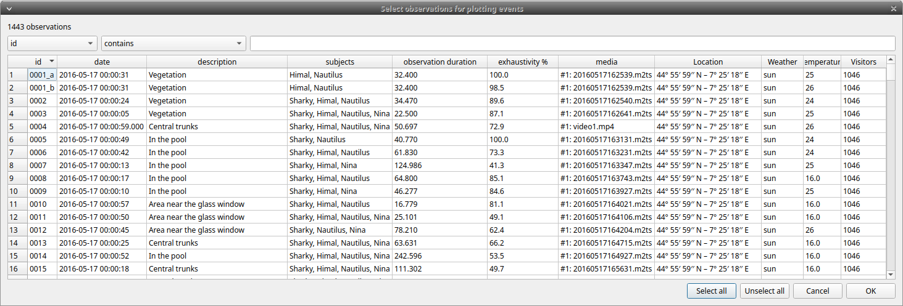
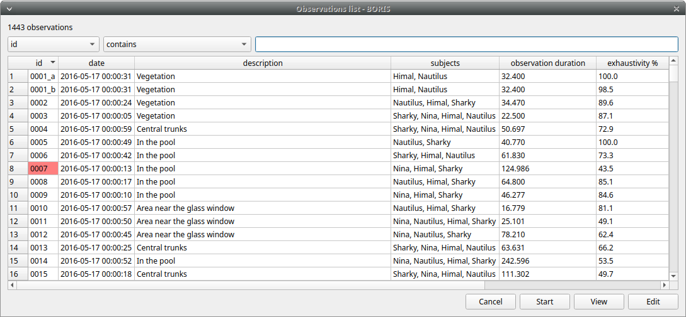
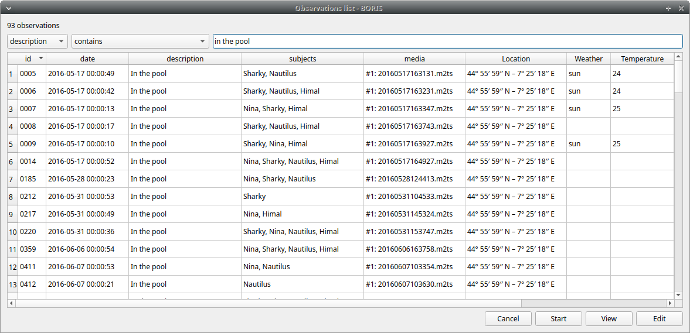
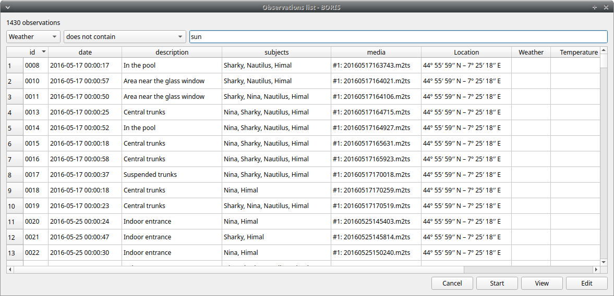
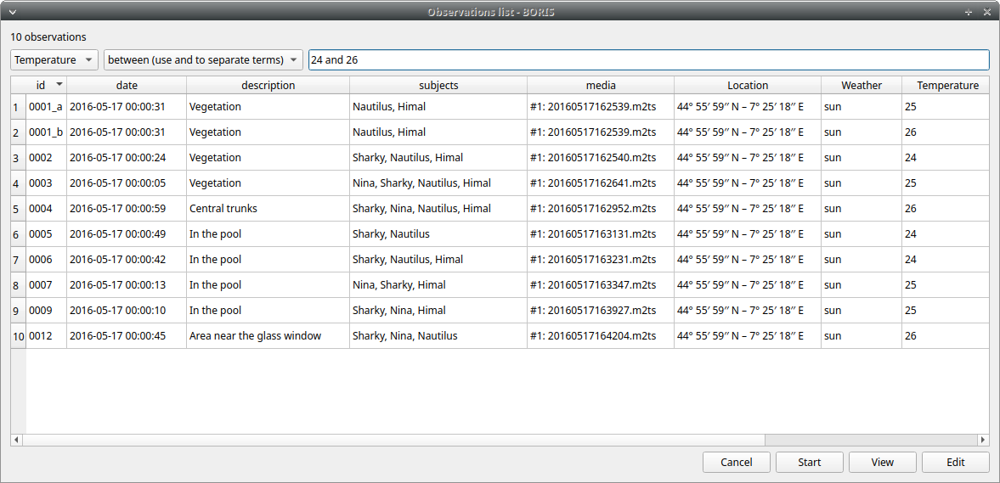
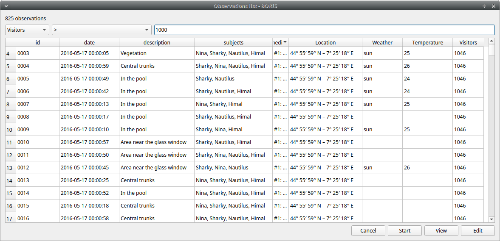

# Observations list

The **Observations** > **Observations list** will show you all the
observations contained in the current BORIS project.

The following values are displayed:

- the observation id (**id**)

- the **description** of observation

- the coded subjects (**subjects**)

- the **observation duration** (as the difference between the last recorded event and the first one)

- the percent of **exhaustivity** of the coding (as the sum of the length of the coded events divided by the observation duration)

- the **media** file path, **LIVE** in case of live observation, the pictures directory path in case of observation from pictures

- the values of the independent variables (if defined)

The observations can be sorted by clicking in the desired column header
(alphabetic order ascending or descending).

## Checking the observations

The status of observation is displayed in the first column (**id**).
If the background of this column is **red** the observations has one or more UNPAIRED state events.
These UNPAIRED observations will not be analyzed. See [Fix unpaired state events](coding.md#fix-unpaired-state) for details.

{width="100.0%"}

## Filtering the observations

The observations list can be filtered selecting a field and a condition in the drop-list boxes.

In the following example observations are filtered: only observations
with **description** containing the **In the pool** subject are shown:

<figure markdown>
  
  <figcaption>Observations list</figcaption>
</figure>

Observations can be filtered with **Independent variables** values.

The following example displays only the observations that do not contain
"Sunny" in the **Weather** independent variable :

<figure markdown>
  
  <figcaption>Observations list</figcaption>
</figure>

Observations with a value of **Temperature** independent variable between 18 and 22:

<figure markdown>
  
  <figcaption>Observations list</figcaption>
</figure>

Observations with a value of **Visitors** independent variable greater than 1000:

<figure markdown>
  
  <figcaption>Observations list</figcaption>
</figure>

## Delete observations

The observations can be deleted from the project using the following
procedure: **File** > **Edit project** > **Observations**

Select all the observations you want to remove.

Click the **Remove selected observations** button and confirm the
deletion.

Please note that the deletion is irreversible, the deleted observations can not be restored.

## Import observations

The **Observations** > **Import observations** option allows to import observations.
Two formats are available for importing observations:

### From a BORIS project file

Choose the BORIS project file and then the observations to import. BORIS will check
if observations with same id are already existing in the current
project. BORIS will also check if behaviors and/or subjects used in the
imported observations are not defined in the current project.

### From a spreadsheet file

Observations can be imported from:
- OpenDocument (ODS)
- Microsoft-Excel (XLSX)

Choose the spreadsheet file 
