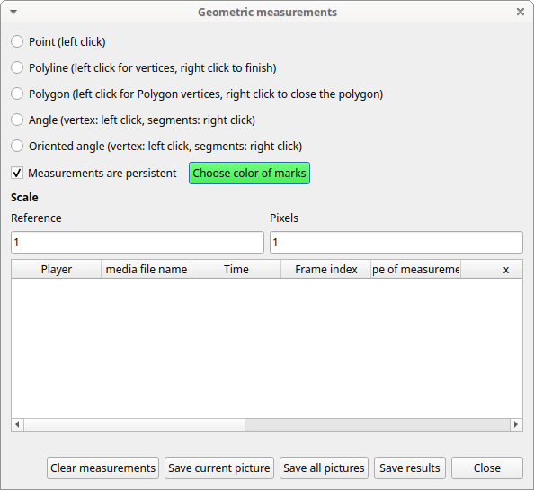
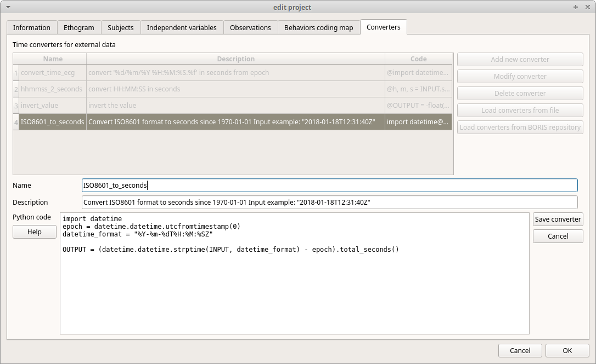
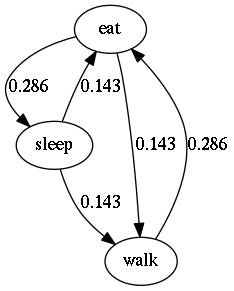
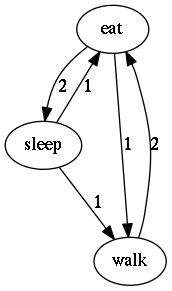

# Tools

## Plot events in real-time

This function can be activated with **Tools** \> **Plot event in real time**.

## :fontawesome-solid-compass-drafting: Geometric measurements

Some geometric measurements can be done: **distances**, **areas** and **angles** can be measured and **point positions** recorded.

Click on **Tools** \> **Geometric measurements** to activate the measurements. 

<figure markdown>
  {width="80.0%"}
  <figcaption>The geometric measurements window</figcaption>
</figure>

### Mark color

Use the **Choose color of marks** button to select a color. All marks will be drawn with the selected color.
The color transparency can be set using the **Alpha channel** vale (0 for 100% transparent, 255 for a solid color).

<figure markdown>
  {width="80.0%"}
  <figcaption>The color selection window</figcaption>
</figure>

### Setting the scale

For distance and area measurements you can set a scale in order to have
results of measurements in a real unit (like centimeters, meters etc).

<figure markdown>
  {width="80.0%"}
  <figcaption>Setting the scale</figcaption>
</figure>

1.  measure a reference object (that have a known size) on the frame
    (with the distance tool. See next chapter for details) and set the
    pixel distance in the **Pixel** text box.

2.  Set the real size of the reference object in the **Reference** text
    box (must be a number without unit).

### Point

Select the **Point** radio button. Click the left mouse button on the video/image to record the position of the clicked pixel.

### Distance measurements

Select the **Distance** radio button. Click the left mouse button on the
frame bitmap to set the start of the segment that will be measured. A
circle with a cross will be drawn. Click the right mouse button to set
the end. A red circle with a cross will be drawn. The distance between
the two selected points will be available in the text area of the
**Measurements window**.

### Area measurements

Select the **Area** radio button. Click the left mouse button on the
frame bitmap to set the area vertices. Circles with a cross will be
drawn. Click the right mouse button to close the area. The area of the
drawn polygon will be available in the text area of the **Measurements
window**.

### Angle measurements

Select the **Angle** radio button. Click the left mouse button on the
frame bitmap to set the angle vertex. A red circle with a cross will be
drawn. Click the right mouse button to set the two segments. Circles
with a cross will be drawn. The angle between the two drawn segments
will be available in the text area of the **Measurements window**.

### Persistent measurements

If the **Measurements are persistent** checkbox is checked the
measurement schemes will be available on all frames otherwise they will
be deleted between frames.

The marks selected on other frames will be drawn in red.

## Coding pad

During observation a coding pad with the available behaviors can be
displayed (**Tools** \> **Coding pad**). This **Coding pad** allows the
user to code using a touch-screen or by clicking on the buttons. When
the **Coding pad** is displayed you can continue to code using the
keyboard or the ethogram.

The button size can be increased or decreased.

The button color can be set for every behavior, for every behavioral category or to no color.

See the drop-down list in the upper-left corner of the Coding pad window.

## Subjects pad

A pad with all defined subjects (or filtered subjects) can be displayed
during the observation (**Tools** \> **Subjects pad**). This **Subjects
pad** allows the user to select the focal subject using a touch-screen
or by clicking on the buttons. When the **Subjects pad** is displayed
you can continue to select the focal subject using the keyboard or the
subjects list.

{width="50.0%"}

## Converters for external data values

Converters can be written using the Python 3 programming language.

The **INPUT** variable will be loaded with the original value of the
external data file (for example 01:22:32).

The **OUPUT** variable must contain the converted value in seconds (the
dot must be used for decimal separator).

Example of a code to convert HH.MM:SS format in seconds:

    h, m, s = INPUT.split(':')
    OUTPUT = int(h) * 3600 + int(m) * 60 + int(s)

The Python function **strptime()** from the **datetime** module can be
useful for converting time values:
<https://docs.python.org/3/library/datetime.html#strftime-strptime-behavior>

Example of a code to a date in ISO8601 format in seconds using the strptime() function:

    import datetime
    epoch = datetime.datetime.utcfromtimestamp(0)
    datetime_format = "%Y-%m-%dT%H:%M:%SZ"

    OUTPUT = (datetime.datetime.strptime(INPUT, datetime_format) - epoch).total_seconds()

**File** \> **Edit project** \> **Converters**

{width="100.0%"}

## Transitions flow diagram

BORIS can generate DOT scripts and flow diagrams from the transitions
matrices (See Observations \> Create transition matrix for obtaining the
transitions matrices).

### DOT script (Graphviz language)

**Tools \> Transitions flow diagram \> Create transitions DOT script**

Choose one ore more transitions matrix files and BORIS will create the relative DOT script file(s).

The DOT script files can then be used with
[Graphviz](http://www.graphviz.org) (Graph Visualization Software) or
[WebGraphviz](http://www.webgraphviz.com) (Graphviz in the Browser) to
generate flow diagram of transitions.

See [DOT (graph description
language)](https://en.wikipedia.org/wiki/DOT_(graph_description_language))
for details.

### Flow diagram

If [Graphviz](http://www.graphviz.org) (Graph Visualization Software) is
installed on your system (and the **dot** program available in the path)
BORIS can generate flow diagram (PNG format) from a transitions matrix
file.

**Tools \> Transitions flow diagram \> Create transitions flow diagram**

Choose one ore more transition matrix files and BORIS will create the
relative flow diagram.

### Flow diagram of frequencies of transitions

<figure markdown>
  {width="40.0%"}
  <figcaption>Frequencies of total transitions (the frequencies are plotted on the edges)</figcaption>
</figure>

### Flow diagram of frequencies of transitions after behavior

<figure markdown>
  {width="40.0%"}
  <figcaption>Frequencies of transitions after behavior (the frequencies are plotted on the edges)</figcaption>
</figure>

### Flow diagram of number of transitions

<figure markdown>
  {width="40.0%"}
  <figcaption>Number of transitions (the frequencies are plotted on the edges)</figcaption>
</figure>

### Re-encoding and resizing a video file

BORIS can re-encode and resize your video files in order to reduce the
size of the files and have a smooth coding (specially with two video
files playing together). The re-encoding and resizing operations are
done with the embedded ffmpeg program with high quality parameters
(bitrate 2000k).

Select the files you want re-encode and resize and select the horizontal
resolution in pixels (the default is 1024). The aspect ratio will be
maintained.

You can continue to use BORIS during the re-encoding/resizing operation.

The re-encoded/resized video files are renamed by adding the re-encoded.avi extension to the original files.

### Rotating a video file

BORIS can rotate your video files in order to code them using the right
view. The rotating operation is done with the embedded ffmpeg program
using the same quality parameters then the original video.

Select the files you want rotate and select the rotation angle between: **Rotate 90 clockwise**, **Rotate 90 counter clockwise** and **Rotate 180**.

The aspect ratio will be maintained.

You can continue to use BORIS during the rotation operation.

The rotated video files are renamed by adding the **rotated\<ANGLE\>**
to the original file name.
