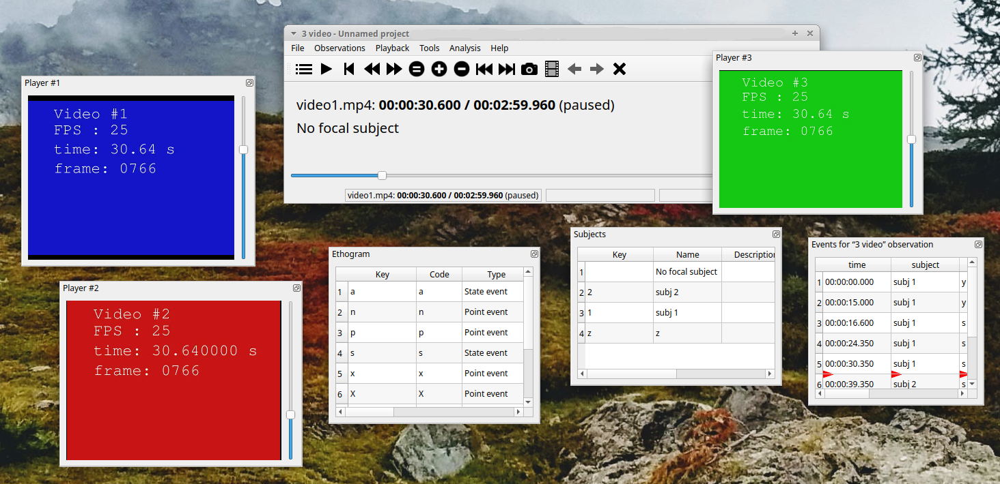
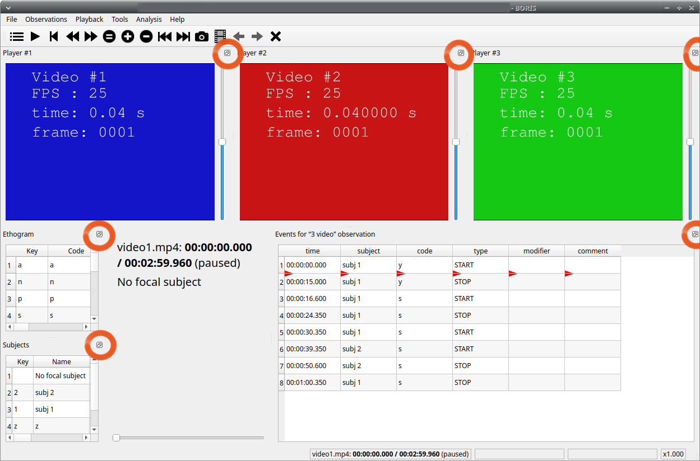
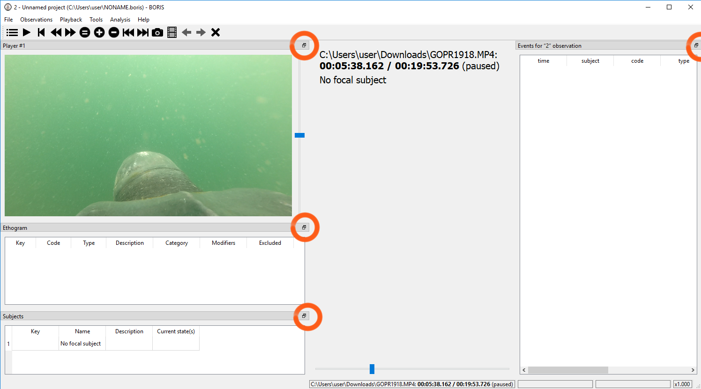
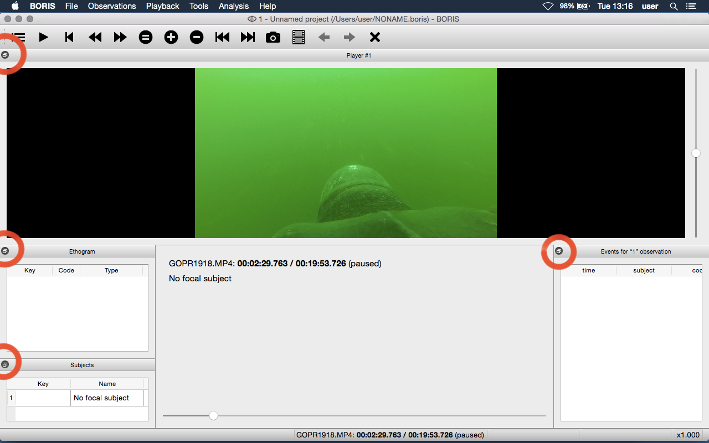

# Various

## Removing path of media files

Using BORIS you can choose to store the full path of the media/data
files into the file project (for example:
`/home/user/Video/video_n1.mp4` or
`c:\Users\user\Documents\video1.avi`).

If you want to move your project on a different computer or if you want
to move your media/data files you may want to do not store the full
path. For this you can choose to add media/data files with relative path
(See **Add media files** section). You can also remove the full path of
your media/data files from all observations of the current project
(**File** \> **Remove path from media files**. Please note that this
operation is irreversible. After remotion the full path of your media
will be lost and will not be recoverable.

**If you choose to do not store the full path of media/data files the
path of the media/data files must contain the path of your BORIS project
file.**

Example: if you BORIS project file is saved in
`/home/user/projects/test.project` your media/data files can be saved in
the `/home/user/projects/videos` directory but **NOT** in the
[/home/user/videos]{.title-ref}\` directory.

## Docking / undocking graphical elements

All elements, including all the media players can be undocked from the
main window and positioned where you prefer (e.g. they can be on the
same desktop over one or many screens).

The position of the various widgets is saved in the [configuration
file](#configuration file) at the end of the work session.

{width="1800px"}

Click the icon present at the top-right corner of the widget (for MacOS
the icon is located at the left-top corner) will undock the widgets that
can be repositioned on another docking area or moved out of the main
window. A double-click on the top bar of the widget will reposition it
on the main window.

For Linux:

{width="100.0%"}

For Microsoft-Windows:

{width="100.0%"}

For MacOS:

{width="100.0%"}

If you fill uncomfortable with the dockwidgets you can block them on the
main window by checking the **Lock dockwidgets** option (see **Tools**
\> **Lock dockwidgets**). All the dockwidgets will be docked on the main
window and locked on it except the player dockwidgets.

## Configuration files

BORIS saves the configuration (user preferences, windows position,
widgets position) in a configuration file. This file is named **.boris**
and it is saved on the home directory of the current user:

    for Linux:
    /home/USERNAME/.boris

    for Microsoft-Windows:
    C:\Users\USERNAME\.boris

    for MacOS:
    /Users/USERNAME/.boris

If you have some trouble using BORIS try to close the program, delete
this file and relaunch BORIS.

The **recent projects list** is saved on the
**.boris\_recent\_projects** file in the home directory of the current
user.

## Lock the dockwidgets

The dockwidgets (except the player dockwidgets) can be locked on the
main window (See **Tools** \> **Lock dockwidgets**).

## Valid keys for triggering behavior

BORIS makes difference between lower case and upper case characters

* keys from a to z
* keys from A to Z
* keys from 0 to 9
* function keys from F1 to F12
* à é è ù ì ç
* ! " £ $ % & / ( ) = ? ^ [ ] { } @ | § ° #

