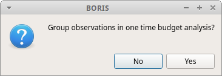
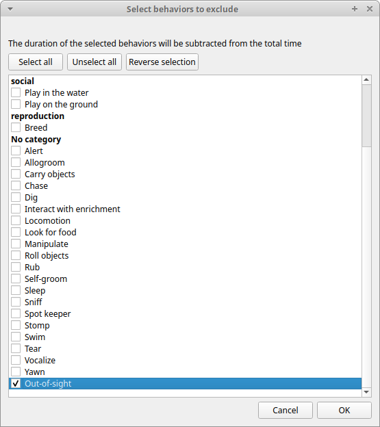
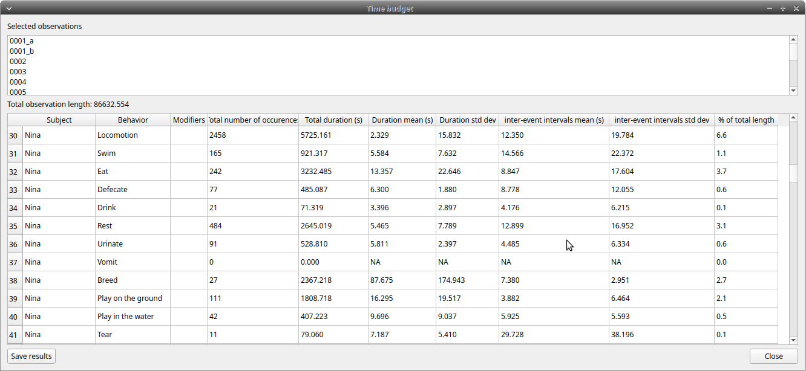
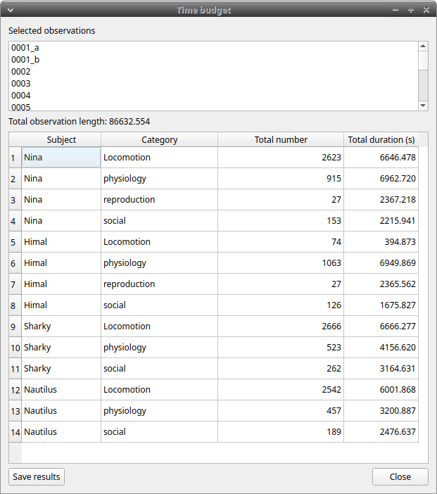
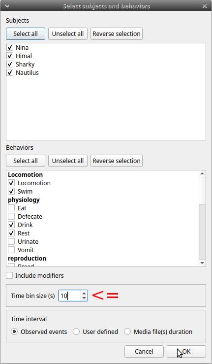
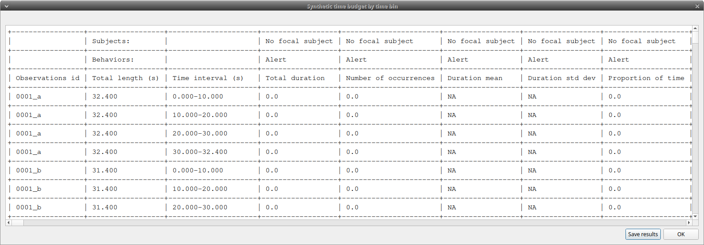
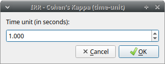
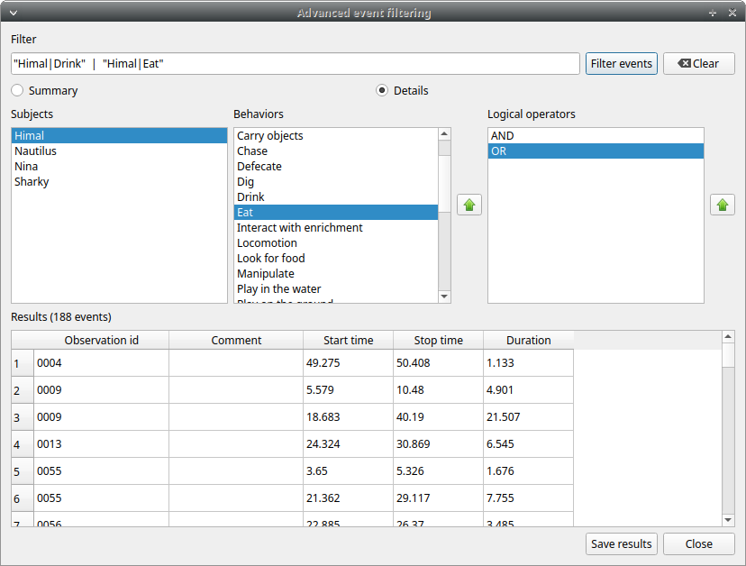

# Analysis and plot

## Time budget analysis

The **Time budget analysis** can be done by behavior (including or not
the modifiers) or by category of behaviors. Choose the option from the
**Analysis** menu.

The **Time budget analysis** can be done on one or more observations. If
you select more than one observation you must then choose for a global
time budget analysis that will contain all selected observations or a
time budget analysis for every single observation.

Choose **Yes** to group all observations in one time budget analysis

The **Analysis** \> **Time budget** menu option shows the time budget
for the events of the selected observations. Select the subjects and
behaviors you want to include in the time budget analysis:

All behaviors can be selected or unselected by clicking on the Category (bold).

You can choose to include or not the behavior modifiers in the Time
budget analysis and to exclude behaviors without coded events.

The Time budget analysis can be restricted to a part of the observation:

-   Full observation(s): the analysis will be made on the full
    observation length.
-   Limit to time interval: use the **Start time** and **End time**
    boxes to select starting time and ending time.
-   Limit to observed events: the analysis will be made from the first
    observed event to the last observed event.

The last dialog window will allow you to subtract the duration of one or
more behaviors from the total duration of the observation. This can help
you if you have defined a "out-of-sight" code in your ethogram for example:

The results contain for each subject and behavior the **total nuber of
occurrences**, the **total duration** (for the behaviors defined as
state events), The **duration mean** (for the behaviors defined as state
events), the **standard deviation of duration**, the **inter-events
intervals duration mean**, th **standard deviation of the inter-events
intervals duration** and the **percent of total duration of
observation(s)**. All duration times are expressed in seconds (s).

<figure markdown>
  
  <figcaption>Results of the time budget analysis</figcaption>
</figure>

The time budget results can be saved in various formats for further
analysis:

- Plain text in tabular format
    - **Tab Separated Values** (TSV)
    - **Comma Separated Values** (CSV)
    - **Hyper Text Markup language** (HTML)

- Spreadsheet files
    - **OpenDocument** (ODS)
    - **Microsoft Excel** (XLSX, XLS)
    
-  **Pandas dataframe** (to be loaded in Python with the [pickle
    module](https://docs.python.org/3/library/pickle.html))

-   **R dataframe** (to be loaded in R with [readRDS
    function](https://rdrr.io/r/base/readRDS.html))

!!! warning "Important"

    If a STATE behavior has an odd number of coded events, BORIS will report **UNPAIRED** instead of results.

## Time budget by behavioral category

The **Time budget by behavioral category** is similar to the [**Time budget analysis**](analysis.md#time-budget-analysis) 
except that the behaviors are grouped into **behavioral categories**.

<figure markdown>
  
  <figcaption>Results of a time budget by behavioral category analysis</figcaption>
</figure>

## Synthetic time budget

The synthetic time budget is similar to time budget but with fewer
parameters and a different organization of results. Results of all
selected observations are organized in columns on a single page. Two
parameters are provided for now: **number of occurrences** and **total
duration** (for the behaviors defined as state events)

All duration times are expressed in seconds (s).

The time budget results can be saved in various formats for further analysis:

- Plain text in tabular format
    - **Tab Separated Values** (TSV)
    - **Comma Separated Values** (CSV)
    - **Hyper Text Markup language** (HTML)

- Spreadsheet files
    - **OpenDocument** (ODS)
    - **Microsoft Excel** (XLSX, XLS)

## Synthetic time budget with time bin

The **synthetic time budget with time bin** is similar to the **Synthetic time budget** but the results are divised in time bin.

**Analysis** > **Synthetic time budget with time bin** 

Choose a time bin size (in seconds)

<figure markdown>
  
  <figcaption>Time bin size of 10 seconds</figcaption>
</figure>

<figure markdown>
  
  <figcaption>Results of a Synthetic time budget with time bin of 10 seconds</figcaption>
</figure>

The **time budget with time bin** results can be saved in various formats for further analysis:

- Plain text in tabular format
    - **Tab Separated Values** (TSV)
    - **Comma Separated Values** (CSV)
    - **Hyper Text Markup language** (HTML)

- Spreadsheet files
    - **OpenDocument** (ODS)
    - **Microsoft Excel** (XLSX, XLS)

## Inter-rater reliability

The Cohen's kappa coefficient can be calculated (**Analysis** > **Inter-rater reliability** > **Cohen\'s kappa**).

[Cohen's kappa on Wikipedia](https://en.wikipedia.org/wiki/Cohen%27s_kappa)

After selecting 2 observations and a time window (in seconds) for the
analysis (the default value is 10 seconds) the Cohen's kappa will be
displayed in the results window.

### Implementation of IRR Cohen's Kappa in BORIS

If a time window of n seconds is set the 2 selected observations will be
checked every n seconds for agreement/disagreement from the first event
to the last event of the 2 observations . In case of a point event the
presence of a corresponding event in the other observation will be
verified using a time window of n seconds centered on the point event.

A IRR Cohen's Kappa analysis is available in the GSEQ program
(<http://www2.gsu.edu/~psyrab/gseq>). For this the coded events can be
exported as aggregated events in SDIS format.
See [export aggregated events](export_events.md#export-aggregated-events).

## Similarities

Needleman-Wunsch similarity

## Co-occurence

This function allow to determine the co-occurence of 2 behaviors.

## Advanced event filtering

This function allows to filter events from one or more observations by
selecting subjects, behaviors and logical operators.

To use the filter, select a subject, select a behavior and click on the
button with the green arrow on the side of the behaviors list. The tuple
subject/behavior will be added in the **filter text edit**. A complex
filter query can be constructed by adding parenthesis and logical
operator **&** (AND) or **|** (OR) for combining various subjects and behaviors.

Example of a summarized output showing the occurences of Himal resting
while Nautilus in alert:

Example of a detailed output showing the overlaping intervals while
Himal rests and Nautilus is in alert:

The same subject can be used many times in the query with OR or AND (in case of non exclusive behaviors):

An unlimited number of conditions can be used:

Parenthesis can be used to group logical conditions into block(s):

The results can be saved in a Tab Separted Values (TSV) file using the
**Save results** button. Other formats will be added in future.

## Latency

The latency will analyze the time between one or more markers (arbitrary behaviors(s)) and other behaviors.
