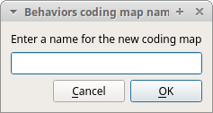
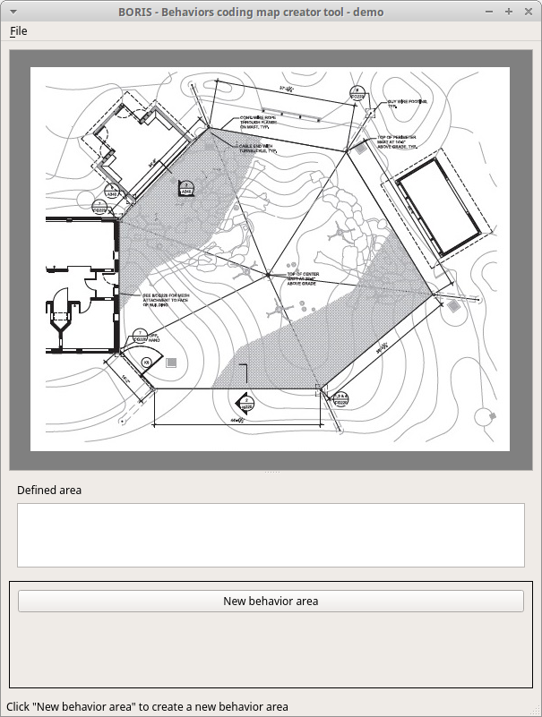
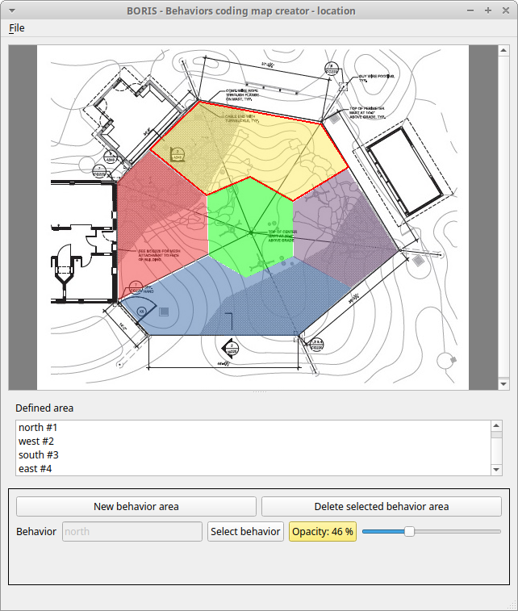

# Coding map

A coding map is a bitmap image with user-defined clickable areas that
will help to code for behaviors or modifiers for a behavior.

2 types of coding maps are available:

-   Behaviors coding map
-   Modifiers coding map

## The Behaviors coding map

BORIS allows creating a **Behaviors coding map** using the **Map
creator** tool (**Tools** \> **Create a coding map** \> **for
behaviors).**

A **Behaviors coding map** can be created only if you have defined
behaviors in your ethogram.

### Creating a Behaviors coding map

To create a new **Behaviors coding map** launch the **Behaviors coding
map creator**

**Tools** \> **Create a coding map** \> **for behaviors).**

A new window will open

{width="50.0%"}

**File** \> **New behaviors coding map**

Enter a name for the new **Behaviors coding map**

{width="30.0%"}

### Loading a bitmap for a behaviors coding map

Click the **Load bitmap** button in the bottom of the window and select
a bitmap image (PNG and JPEG formats are accepted).

If the size of your bitmap image is bigger than 640 x 640 pixels BORIS
will resize it to 640 x 640 pixels keeping the aspect ratio and store
the resized version in the coding map file.

The bitmap will be displayed

{width="70.0%"}

### Adding areas corresponding the behaviors

Click the **New behavior area** button in the bottom of the window and
select a behavior by clicking on the **Select behavior** button.

{width="70.0%"}

The available behaviors are taken from the ethogram of the current
project.

Click on the bitmap to define the vertex on the area that will code the
selected behavior. Close the area by clicking again on the first point.

The color of the new area can be changed using the **Opacity** button.
The opacity can be changed (from 0 to 100%) using the slider.

Save the behavior area by clicking on the **Save the behavior area**
button

The area will be added to the **Defined area** list

You can add more area and also add more than one area for a same
behavior. Two or more areas can overlap. In this case all corresponding
behaviors will be triggered.

{width="70.0%"}

### Add the Behaviors coding map to the current project

**File** \> **Add coding map to project**

The coding map will be added to the current project

You can add a **Behaviors coding map** to the current project from a
file containing the coding map:

(**File** \> **Edit project** \> **Behaviors coding map** \> **Add a
behaviors coding map** )

### Saving the Behaviors coding map

Saving the **Behaviors coding map** will create a file containing the
**Behaviors coding map** including the bitmap image.

**File** \> **Save the current Behaviors coding map**

The file containing the **Behaviors coding map** can be then reloaded in
the **Behaviors coding map creator** or added to a BORIS project
(**File** \> **Edit project** \> **Behaviors coding map** \> **Add a
behaviors coding map** )

## The Modifiers coding map

BORIS allows creating a modifiers coding map using the **Modifiers Map
creator** tool (**Tools** \> **Create a coding map** \> **for
modifiers**.) Clickable areas may correspond to specific modifiers that
can be meaningful for the behavioral coding. Facial expression is the
case we thought to when developing this function.

### Creating a modifiers coding map

### Loading a bitmap for a modifiers coding map

To create a new **Modifiers coding map**, launch the **Modifiers Map
creator** tool (**Tools** \> **Create a coding map** \> **for
modifiers).** The BORIS main window will be replaced by the **Modifiers
Map creator** window. Click on **Modifiers Map creator** \> **New
Modifiers map** and enter a name for the new map in the edit box. You
have to load a bitmap image (JPEG or PNG) using the **Load bitmap**
button. The loaded image will be displayed.

{width="70.0%"}

If the size of your bitmap image is bigger than 640 x 640 pixels BORIS
will resize it to 640 x 640 pixels keeping the aspect ratio and store
the resized version in the coding map file.

### Adding areas corresponding to the modifiers

To create clickable areas on a coding map, you have to click on the
**New area** button and enter an **Area code** in the edit box. The new
area can now be defined by clicking on the image. The drawing tool
allows defining a irregular polygon (a plane shape with straight sides,
which does not have all sides equal and all angles equal) by clicking to
determine subsequent vertices. It can be convex or concave. Straight
sides must not cross each other. Once selected an area can be deleted
using the **Delete area** button. When an area is closed and its name
has been defined in the **Area code** field, it can be saved by using
the **Save area** button. The areas can partially overlap each other.
See the **Using a Coding map** section for more details. Once all areas
are added the entire map can be saved using the **Save map** option menu
(**Map creator** \> **Save map**). The map is now saved in its own file
(.boris\_map) which is NOT part of the BORIS project. A map can be
edited at anytime by opening the map file from the **Open map** menu
option (**Map creator** \> **Open map**).

### Adding a modifiers coding map to your project

Creating a Coding map is not automatically adding the map to your
project. The Coding map have to be added to your project by selecting
the corresponding **Behavior type** (**Point event with coding map**,
**State event with coding map**). BORIS will ask to select the file name
containing the coding map (.boris\_map) and load the coding map in the
project. The coding map name will appear in the **Coding map** column
and will be saved in the BORIS project file.

!!! warning "Important"

    If you later modify your coding map you must reload the new version in your BORIS project.

