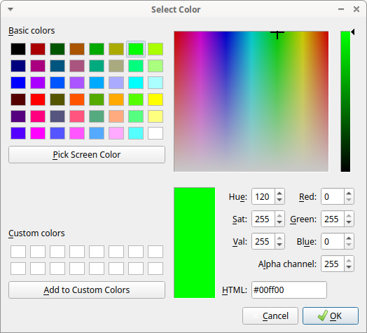
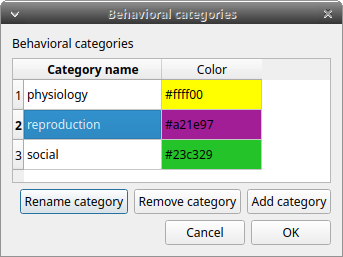
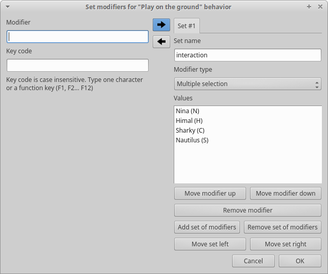
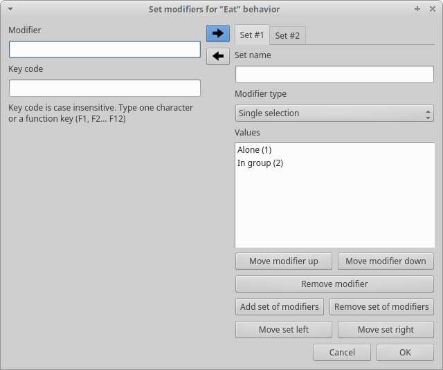
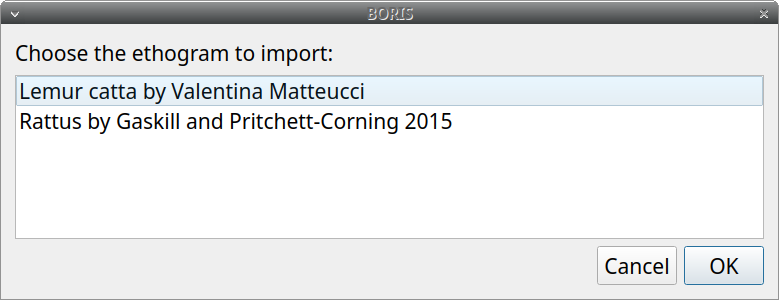
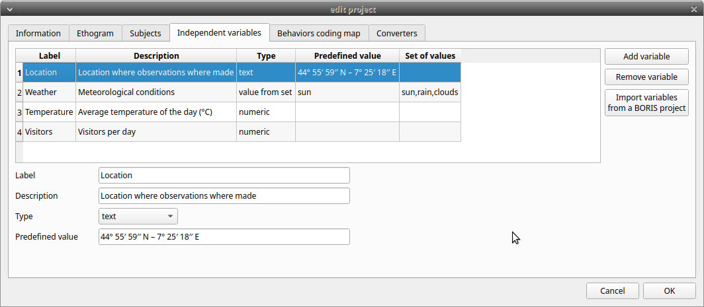
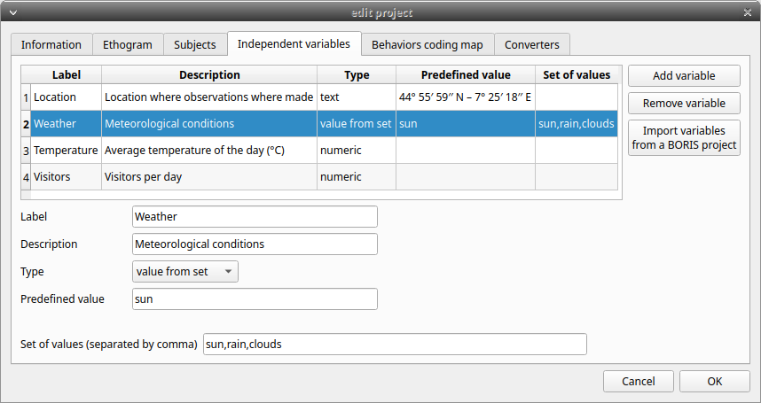

# Create a project

The BORIS project file serves as a container for all project-related information, excluding media files.
It encompasses the **ethogram**, **independent variables**, **subjects' definition**, **behavioral coding maps**, **converters**, and **observation** data.
To save the project on your local file system, use the "**File**" > **Save Project** or **Save Project As \...** options.

Additionally, you can activate the automatic backup feature in the [Preferences](./preferences.md) section.

!!! warning "Very important"

    It is **EXTREMELY IMPORTANT** to perform regular backups of your project files to prevent the loss of data. While software can be reinstalled, your data might be irretrievably lost.
    Consider using an external drive and/or a cloud service for secure backup.

BORIS allows the creation of an unlimited number of projects, but only one project can be opened at a time.

A video tutorial about creating a project is available at [this link](https://www.youtube.com/watch?v=I97Dny5hFOE).

To create a new project, under the menu **File** , select **New project**.

You can determine your project name by writing in the **Project name**
field in the **Information** tab. Once the project will be saved, the
**Project file path** will show the full path to your project file.

**Date** will automatically set on the current date and time, but you
can alternatively set this info on your media date and time, or whatever
you prefer.

**Description** can host all the relevant information about your
project, can be also left empty.

**Time format** can be alternatively set to **seconds** or to **hh:mm:ss.mss**.
This choice can be changed at anytime under **File** > **Preferences**.

<figure markdown>
  
  <figcaption>BORIS main window</figcaption>
</figure>

## Set an ethogram

See the [Wikipedia ethogram definition](https://en.wikipedia.org/wiki/Ethogram).

Switching to the **Ethogram tab**, you can alternatively:

- set your ethogram from scratch;

- import an existing ethogram from another BORIS project;

- import an ethogram from a JWatcher global definition file (.gdf).

- import an ethogram from a plain text file or a spreadsheet file (XLSX or ODS)

<figure markdown>
  
</figure>

<figure markdown>
  
</figure>

### Set your ethogram from scratch

By clicking on the **Behavior > Add behavior** button, you can add a new row in the **Ethogram** table,
and the behavior type will be automatically set to **Point event**.

The cells with gray background can not be directly edited.
You must double-click on them and then select a value.

### Behavior types

**2 types** of behaviors can be defined. Double-click on the cell and select the type of behavior:

- **Point event** behavior when the behavior has **no duration**.

    :   The behavior will be coded by pressing the defined keyboard key
        (see below) or by double-clicking to the corresponding row in
        the Ethogram table.

- **State event** behavior when the behavior has a **duration**.

    :   The behavior start and stop will be coded by pressing the
        defined keyboard key (see below) or by double-clicking to the
        corresponding row in the Ethogram table. These behaviors
        **must** have a start event and a stop event otherwise an
        **UNPAIRED events** warning will be reported when you will close
        the observation or during an analysis.

- **Point event with a coding map**

    : a **Point event** that can be coded uusing a **coding map**.

- **State event with a coding map**

    : a **State event** that can be coded using a **coding map**.

You can switch between the types of behavior at your convenience with a double-click on the **Behavior type** cell.
You can also add a **Coding map** to either a **State event** (**State event with coding map**) or a **Point event** (**Point event with coding map**).
See the **Coding map** section for details.

An existing behavior can be duplicated using the **Clone behavior**
button. Its code have then to be changed. On a selected behavior, click
on the **Remove behavior** button to remove. The **Remove all
behaviors** button will clear the **Ethogram** table. Both the
above-mentioned operations must be confirmed when prompted.

The behavior can be sorted by clicking on the Ethogram table header.
They cannot be sorted manually.

### Set keys and codes

For each behavior you have to set a keyboard key (**Key** column) that
will be then used to code the behavioral events. You can choose whether
you want to set a unique key for each behavior or use the same key for
more than one behavior. In the case you set the same key for more than a
behavior, BORIS will pause your coding and ask which of the behavior you
want to record. The keys are **case-sensitive**.

If your project was created with an old version of BORIS (< v.7)
you can use the **Convert keys to lower case** to convert all keys to
lower case otherwise you will have to code your observation using upper
case key.

> If you open a project file created with a version older than v.7 BORIS will ask you to convert the upper case behavior and subject keys to lower case.

!!! warning "Important"

    **Do not use the / and \* keys! They are reserved for the frame-by-frame mode.**

In the **Code** column, you have to add a unique code for each behavior.
Duplicated codes are not accepted and BORIS will warn in red about
duplicates on the bottom left of the **Ethogram** tab. The code can be an
alphanumeric string (which must not include the pipe character **\|** ).

The **Description** of your behavior is optional. The **Description**
column can be useful to add information about a specific behavior, its
characteristics (e.g. to standardise observation between different
users) or to refer to external information (e.g. reference to a previous
ethogram).

The columns with a grey background (**Behavior type**, **Color**, **Category**, **Modifiers**, **Exclusion**,
**Modifiers coding map**) cannot be edited directly. 

The **Color** column allow to select a color for the behavior. This color will be used for plotting events.
Double-click on the cell and select the color you want to associate to the behavior.

<figure markdown>
  
  <figcaption>Select the color to associate to the behavior</figcaption>
</figure>

#### Categories of behaviors

Defining categories of behaviors can be usefull for the analysis of
coded events (for example the [time budget analysis](analysis.md#time-budget-by-behavioral-category)).

The **Category** column allow you to include the behavior to a predefined behavioral category.

Double-click on the cell and select the behavioral category for the behavior.

<figure markdown>
  
  <figcaption>Choose a behavioral category for the behavior</figcaption>
</figure>

To add, remove or rename a behavioral category, click the **Behavioral categories** button.
A color can also be associated to a behavioral category.

<figure markdown>
  
  <figcaption>Behavioral categories manager</figcaption>
</figure>

### Set the modifiers

Modifiers can be used to add attributes to a behavior. A single behavior
can have two or more modifiers attached (e.g. the behavior **play** may have
**solitary** or **social** as modifiers). The use of modifiers can be
convenient to significantly reduce the number of keys and simplify the
behavioral coding.

**4 types of modifiers** are available: **Single selection**, **Multiple
selection**, **Numeric** and **Value from external data file**:

-   the **Single selection** type will allow the observer to select only
    **one** modifier for the current behavior.
-   the **Multiple selection** type will allow the observer to select
    one or more modifiers for the current behavior.
-   the **Numeric** type will allow the observer to input a number. For
    example a distance of interaction.
-   the **Value from external data file** type will save the value of a
    variable from an external data file.

In BORIS modifiers can also be added in different modifier sets (e.g.
**play** **social** may have a modifier set (#1) for **brothers** and
another (#2) for **sisters**). In the case of using sets of modifiers,
you can select one/more modifier for each set.

To add modifiers to a behavior, you need to double-click the
**Modifiers** cell corresponding to the behavior you want to add the
modifiers to. The following window will show up:

<figure markdown>
  {width="80.0%"}
  <figcaption>Modifiers configuration</figcaption>
</figure>

Click the **Add a set of modifiers** button:

<figure markdown>
  {width="80.0%"}
  <figcaption>Modifiers configuration</figcaption>
</figure>

Select the modifier type using the **Modifier type** combo box. You have
to choose between **Single selection**, **Multiple selection**
**Numeric** and **Value from external data file**.

#### **Single selection** and **Multiple selection** modifiers

Set a name for the new modifiers set by typing it in the **Set name**
edit box. Setting a modifiers\' set name is not mandatory.

Within a set of modifiers, you can add a modifier by writing the
modifier in the **Modifier** edit box. You can choose a shortcut (one
character - case sensitive) to this modifier (optional). Then press the
**right-arrow** button to add the new modifiers to the set.

<figure markdown>
  {width="80.0%"}
  <figcaption>Modifiers configuration</figcaption>
</figure>

To modify a modifier, select it and press the **left-arrow** button,
edit the modifier and press the **right-arrow** button.

A modifier can be removed by pressing the **Remove modifier** button.

After adding all modifiers the window will appear like this:

<figure markdown>
  {width="80.0%"}
  <figcaption>Modifiers configuration</figcaption>
</figure>

All defined subjects can be added as modifiers using the **Add subjects
as modifiers** button. This can help in case of coding the interactions
between subjects for example.

The modifiers can be loaded from a plain text file Use the **Load
modifiers from file** button.

The modifier position into the modifiers\' set can be manually set using
the **Move modifier up** and **Move modifier down** buttons. The
modifiers can be sorted alphabetically (use the **Sort modifiers**
button).

You can add and/or remove sets using the buttons **Add set of
modifiers** and **Remove set of modifiers**.

The position of a modifiers\' set can be customized (using the **Move
set left** and **Move set right** buttons)

Modifiers can not contain the following characters: **(\|),\`\~!**

Example of a **multiple selection** modifiers set:

<figure markdown>
  {width="80.0%"}
  <figcaption>Modifiers configuration</figcaption>
</figure>

Many values can be selected together.

Example of 2 sets of modifiers:

<figure markdown>
  {width="80.0%"}
  <figcaption>Modifiers configuration</figcaption>
</figure>

<figure markdown>
  {width="80.0%"}
  <figcaption>Modifiers configuration</figcaption>
</figure>

#### **Numeric** modifier

Set a name for the new set by typing it in the **Set name** edit box.
Setting a modifiers' set name is not mandatory.

When a **Numeric** modifier will trigger, BORIS will ask the observer
for a numeric value.

#### **Value from external data file** modifier

This modifier can be used to record the value of a variable coming from
an external data file (defined during the creation of the observation).

You have to define the variable name in the **Variable name** edit box.
This is mandatory and the name of the variable **must** be the same than
the variable defined in the observation.

See [External data files]()

<figure markdown>
  {width="80.0%"}
  <figcaption>modifier value from external data file</figcaption>
</figure>

Click **OK** to save modifiers in the **Ethogram** table.

### Set the exclusion matrix

The occurrence of an event (State or Point) can exclude the occurrence
of a state event. This can be set using the **Exclusion matrix** window, which can be opened clicking on the **Exclusion
matrix** button. BORIS will ask for including **Point events** or not
and a new **Exclusion matrix** window will open.

Exclusive behavior may be selected by checking on the corresponding
checkbox in the automatically-generated matrix. We suggest to work on
the **Exclusion matrix** when all the behaviors have been added to your
ethogram.

All behaviors can be excluded by a particular behavior by selecting the
corresponding entire row (click on the row header of the behavior) and
by clicking on the **Check selected** button. You can also uncheck all
behaviors by selecting the **Uncheck selected** button.

<figure markdown>
  {width="100.0%"}
  <figcaption>Example of an exclusion matrix</figcaption>
</figure>

For example in the previous figure, the **Alert** behavior will exclude
the following behaviors: **Allogroom**, **Breed**, **Carry objects**,
**Chase** \...

During the observation, the excluding event will stop all the current
excluded state events one millisecond before the occurence of the event.

### Set the **Modifiers coding map**

If the behavior is defined as a **Point event with coding map** or a **State event with codinf map** you can associate a
**Modifiers coding map** to select the modifiers from a map.

### Import an ethogram from an existing project

Behaviors within an ethogram can be imported from an existing BORIS
project (.boris) using the **Import ethogram > from a BORIS project**
button. BORIS will ask to select a BORIS project file and whether
imported behaviors should replace or be appended to the **Ethogram**
table. Imported behaviors will retain all the previously defined
behavior parameters (namely Behavior type, Key, Code, Description,
Modifiers and Exclusion information).

### Import an ethogram from a spreadsheet file

Behaviors can be imported from a spreadsheet file using the **Import
ethogram > from spreadsheet file (XLSX/ODS)** button. 

The first row of your spreadsheet (header) must contain the following labels.
The order is not mandatory:

-   Behavior code
-   Behavior type
-   Description
-   Key
-   Behavioral category
-   Excluded behaviors

**Behavior code** is mandatory, the others fields can be empty.

Optional fields can be added:

- Color
- Modifiers (JSON)

BORIS will ask to select a spreadsheet file (by default: *.xlsx or *.ods) and whether imported behaviors should replace or be appended to the **Ethogram** table. The missing information for the imported behaviours
have to be redefined.

### Import an ethogram from a plain text file

Behaviors can be imported from a plain text file using the **Import
ethogram > from text file** button. The fields must be separated by
TAB, comma (,) or semicolomn (;). All rows must contain the same number
of fields.

The first row of your plain text file must contain the following labels.
The order is not mandatory but respect the case:

-   Behavior code
-   Behavior type
-   Description
-   Key
-   Behavioral category
-   Excluded behaviors

**Behavior code** is mandatory, the others fields can be empty.

Example of a plain text ethogram definition:

    Behavior type,Behavior code,Key,Behavioral category,Description,Excluded behaviors
    state event,Play,p,,Play on the garden,s
    point event,Sleep,s,,Subject is sleeping,p

BORIS will ask to select a plain text file (by default: \*.txt \*.csv
\*.tsv) and whether imported behaviors should replace or be appended to
the **Ethogram** table. The missing information for the behaviours
imported from text file have to be redefined.

### Import an ethogram from a JWatcher global definition file (.gdf)

Behaviors can be imported from a JWatcher global definition file (.gdf)
using the **Import ethogram > from JWatcher** button. BORIS will ask to
select a JWatcher file (.gdf) and whether imported behaviors should
replace or be appended to the **Ethogram** table. Behavior type and
exclusion information for the behaviours imported from JWatcher have to
be redefined.

### Access to the BORIS ethogram repository

This function can be activated by clicking the **Import ethogram \> from
the BORIS repository** button.

A list of available ethograms will open and an ethogram can be loaded in
the current project.

<figure markdown>
  { width="50%"}
  <figcaption>BORIS ethogram repository</figcaption>
</figure>

### Export the ethogram

The entire ethogram can be exported in various formats (TSV, CSV, XLSX,
ODS, HTML). See **File** \> **Edit project** \> **Ethogram tab** \>
**Export ethogram**

## Define the subjects

<figure markdown>
  { width="80%"}
  <figcaption>Subjects definition</figcaption>
</figure>

BORIS allows coding behaviors for different subjects within a single observation.
The **Subject** table allows the specification of subjects using a **Key** 
(e.g., the **k** on your keyboard), **Subject name** (e.g., **Kanzi**), and
 **Description** (e.g., male, born on October 28, 1980).

With the subjects defined in the previous figure, pressing **n** will set **Nina** as the focal subject
for behavioral coding. Pressing **n** again will deselect **Nina** and set the focal subject to **No focal subject**.

The key definition is not mandatory. In this case, you will have to
select the current subject from the subjects list with a double-click.

The keys are **case-sensitive** and the same key can be used to select more than one subject.
In this case a dialog will show up and will allow to select 

<figure markdown>
  
  <figcaption>Choose a subject</figcaption>
</figure>

The definition of one or more subjects is not mandatory. Addition,
removal and sorting of the subjects follows the same logic of the
**Ethogram** table (see [Set your ethogram from scratch](#set-your-ethogram-from-scratch) for info).

!!! note 

    If your project was created with a previous version of BORIS (< v.7)
    you can use the **Convert keys to lower case** to convert all keys to
    lower case otherwise you will have to code your observation using upper
    case key.

The subjects can also be imported from an existing BORIS project: use
the **Import Subjects from a BORIS project** button.

### Import subject from a spreadsheet

The subjects can be imported from a spreadsheet (Google spreadsheet,
Microsoft-Excel, LibreOffice Calc).

The spreadsheet must contain one subject by row and have to be organized
as above:

-   1st column: Subject key (One character - Case sensitive - Optional)
-   2nd column: Subject name (mandatory)
-   3rd column: Description of subject (optional)

Select all cells of your spreadsheet (++ctrl+a++), copy to clipboard (++ctrl+c++).
Click the **Import from clipboard** button.

!!! Note

    If you open a project file created with a version older than v.7 BORIS
    will ask you to convert the upper case behavior and subject keys to
    lower case.

## Define the Independent variables

<figure markdown>
  { width="80%"}
  <figcaption>Independent variables</figcaption>
</figure>

BORIS allows adding information about the observation using
**Independent variables**. This can be used to specify factors that may
influence the behaviors (e.g. group composition, temperature, weather
conditions) but will not change during a single observation within a
project. Each independent variable can be defined by a **Label** (e.g.
weather), a **Description** (e.g. weather conditions), a **Type**
(*text*, *numeric*, *value from set* or *timestamp*).

The values of a set are defined in the **Set of values** column
separating the available values with a comma (**,**). Please note that
the first value of the set will be selected by default. It should be
useful to define a NA value as first value of every set.

The values for the independent variables will be asked when creating a
new observation. Addition, removal and sorting of the independent
variables follows the same logic of the **Ethogram** table (see **Set
your ethogram from scratch** for info). The independent variables can
also be imported from an existing BORIS project using the **Import
Variables from a BORIS project**.

<figure markdown>
  { width="80%"}
  <figcaption>Example of an independent variable (Weather) defined as "set of values"</figcaption>
</figure>

The predefined value must be contained in the set of value.

## Converters' table

Converters are used for plotting external data when the timestamp values
are not expressed in seconds. Converters can be written by the user,
loaded from file or loaded from the repository of the BORIS web site
(<http://www.boris.unito.it/static/converters.json>).

<figure markdown>
  { width="80%"}
  <figcaption>Converters tab</figcaption>
</figure>

### Load converters from BORIS web site

Click **Load converters from BORIS repository** and select the
converters to be added to your project.

<figure markdown>
  { width="80%"}
  <figcaption>Converters selection from repository</figcaption>
</figure>

<figure markdown>
  { width="80%"}
  <figcaption>Converters tab with 2 converters defined</figcaption>
</figure>

### Writing a converter

See "[Converters for external data values]()"

The converters loaded in your project can be then selected for
converting timestamp (or other values) in external data file

See [Converters]()
