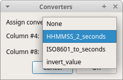
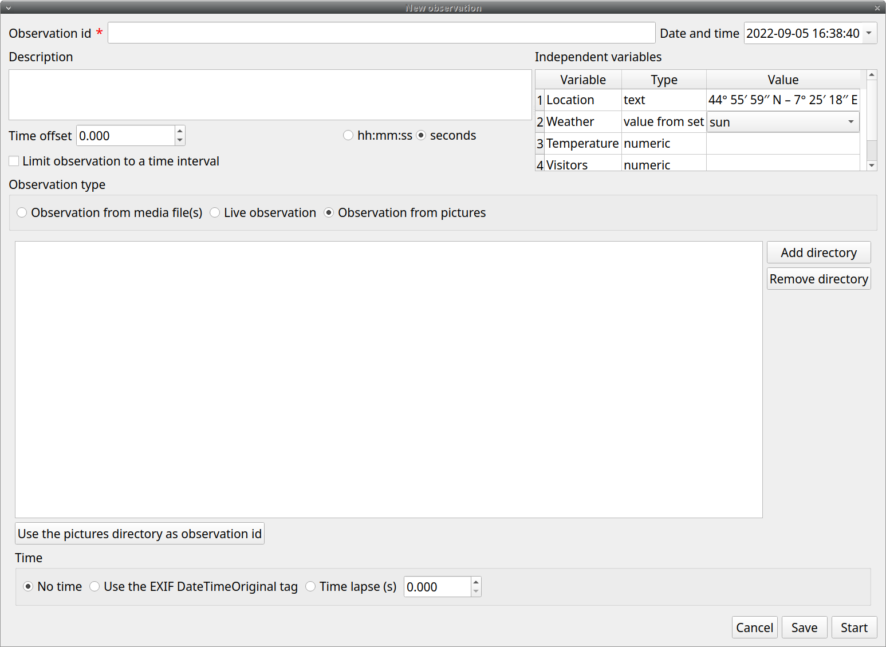

# Create a new observation

A video tutorial about making an observation is available at [this link](<https://www.youtube.com/watch?v=CKeBITCICXc>).

To create a new observation you must first [Create a new project with BORIS](create_project.md#create-a-project) or [Open an existing project with BORIS]().

Clicking on **Observations** > **New observation** will show the **New
observation** window.

<figure markdown>
  {width="80.0%"}
  <figcaption>New observation window</figcaption>
</figure>

This window allow adding various observation data:

-   a mandatory **Observation id** (must be unique across all
    observations in the open project);

-   **Date**, which will be automatically set on the current date and
    time, but you can alternatively set this info on your media date and
    time, or whatever you prefer.

-   **Description**, which can host all the relevant information about
    your observation, but can be also left empty.

-   **Independent variables** (e.g. to specify factors that may
    influence the behaviors but will not change during the observation
    within a project).See the [independent variables]() section for
    details.

-   **Time offset**. BORIS allow specifying a time offset that can be
    added or subtracted from the media timecode.

-   The **Limit observation to a time interval** option can be used to
    limit the observation to an arbitrary time interval.

You must then indicate if you want to make an observation based on
**pre-recorded media (audio / video)** or a **live observation**.

## Live observation

During the live observation BORIS will show you a timer that will be
used for recording time for coded events.

Click on the **Live observation** radio button to create a live
observation.

<figure markdown>
  {width="80.0%"}
  <figcaption>New live observation</figcaption>
</figure>

### Scan sampling

In the above tab you can select a time for **Scan sampling**
observation. In this case the timer will stop at every time offset you
indicated and all the coded events will have the same time value.

### Start from current time

If you want that the time starts from the current time you can check the
**Start from current time** checkbox.

<figure markdown>
  {width="80.0%"}
  <figcaption>Set a live observation to start from current time</figcaption>
</figure>

If the **Day time** option is checked the start time will be the
computer current time when you will press the **Start** button.

If the **Epoch time** is checked the start time will be the number of
seconds since the Jan 1st, 1970 (1970-01-01). See [Unix
time](https://en.wikipedia.org/wiki/Unix_time) for details. This option
is usefull for long observations (few days) or observations that start
before midnight and end after.

### Start the observation

Click the **Start** button to begin the live observation or **Save** to
save it in the [Observations list](#observations-list).

The main window during a live observation will look like this:

<figure markdown>
  
  <figcaption>The main window during a live observation</figcaption>
</figure>

See the [Live observations]() section to start coding.

## Observation from media file(s)

Click on the **Observation from media file(s)** radio button to create
an observation based on one or more media files.

<figure markdown>
  {width="80.0%"}
  <figcaption>Media files tab</figcaption>
</figure>

The **Observation from media file(s)** tab contains 2 tabs: **Media
files** and **Data files**.

Click the **Media files** tab and add one or more media files using the
**Add media** button. You have 3 options:

-   **with absolute path**: the whole media file path will be recorded
    in the project
-   **with relative path**: the media file path will be recorded
    relatively to the position of the BORIS project file (the directory
    of the BORIS project file must be included). This option is useful
    if you have to have to move your BORIS project file on another
    computer.
-   **from directory with absolute path**: all the media file found in
    the directory will be added to the playlist (the whole media file
    path will be recorded in the project)
-   **from directory with relative path**: all the media file found in
    the directory will be added to the playlist (the relative media file
    path will be recorded in the project)

Information about the selected media file will be extracted and
displayed in the media list: media file path, media duration, number of
frames by second (FPS), the presence of a video stream, the presence of
an audio stream .

<figure markdown>
  {width="80.0%"}
  <figcaption>Media files tab</figcaption>
</figure>

The dropdown list in the first column allow you to choose a player (for
a maximum of 8). If you want to observer more media files simultaneously
you must use consecutive players (starting from 1). See example below:

<figure markdown>
  {width="80.0%"}
  <figcaption>Media files tab</figcaption>
</figure>

If you have to synchronize 2 (or more) videos you can use the **Offset
column** to indicate when the 2nd player should start. For example if
the video loaded in the second player starts 15 seconds after the first
video you have to input **15** in the **Offset** cell. If the second
video starts before the first player you can set a negative value in the
**Offset** cell

If you have to play sequentially many videos you have to select the same
player (#1) for all video you have loaded. This means that an event
occurring at time t~x~ in the media file queued as second (e.g.
second\_video.mp4) in the playlist will be scored as happening at time
t~1~ + t~x~ (where t~1~ is the duration of the first media file, e.g.
first_video.mp4).

The **Remove selected media** button can be used to remove all the
selected media files.

All the media types that can be played by the MPV player can be played in BORIS.

The **Use media file name as observation id** button will set the first
media file name as **observation id**

### Spectrogram visualization

BORIS allow you to visualize the sound spectrogram during the media
observation. Activate the **Visualize spectrogram** check box. BORIS
will ask you to generate the spectrograms for all media files loaded in
the first player.

<figure markdown>
  {width="80.0%"}
  <figcaption>Spectrogram generation</figcaption>
</figure>

The spectrogram visualization will be synchonized to the media position
during the observation.

<figure markdown>
  {width="80.0%"}
  <figcaption>Spectrogram visualization</figcaption>
</figure>

### Close current behavior between videos

This option is disabled for now.

### External data files

!!! note

    **At this time only 2 external data can be plotted with your media file**

You can select one or more external data files to be plotted
synchronously with your media. Click the **Data files** tab and use the
**Add data file** button to select a data file.

<figure markdown>
  
  <figcaption>External data file table</figcaption>
</figure>

The data files must be plain text files with at least **2 columns**
separated by a comma or a TAB character. One column must contain a timestamp that will
be used to synchronize the plot with the media. The sampling rate can be variable.

Example of a plain text data file with 5 columns separated by comma
(**,**):

    Display,X Pos,Y Pos,Start Time (secs),Pupil Diameter
    1,864,509,549.233,0.00295773451216519
    1,863,505,549.25,0.00281810853630304
    1,863,503,549.266,0.00287826382555068
    1,861,502,549.283,0.0030536837875843
    1,858,501,549.3,0.00308083021081984
    1,856,499,549.316,0.00306266942061484
    1,854,499,549.333,0.00305776367895305
    [...]

In the above example the 4th column contains the timestamp and the 5th
the value to be plotted.

Input the index of the column containing the timestamp and the index of
the column containing the value to be plotted. The two indices must be
separated by a comma (,). Click **OK** to close the window.

<figure markdown>
  {width="80.0%"}
  <figcaption>Selection of columns (time, value)</figcaption>
</figure>

A new row will be added in the data files table.

<figure markdown>
  {width="80.0%"}
  <figcaption>Data file table</figcaption>
</figure>

You can modify/complete the following parameters by directly typing in
the table cells:

-   Columns to plot
-   Plot title: the title of the plot
-   Variable name
-   Converters: Used if the timestamp is not expressed in seconds (see
    below for details)
-   Time interval: The time interval that will be plotted (in seconds)
-   Start position: the start position of data for synchronisation with
    the media (in seconds)
-   Substract first value: if the timestamp does not start with a 0
    value you can choose to substract the first value to all timestamp
    values.
-   Color: the color of the color

**NOTE** : if you want to record the value of the plotted variable in a
modifier of a behavior (see [Value from external data file modifier](create_project.md#value-from-external-data-file-modifier))
the modifier must have the same **variable name**.

You can check if the data from file can be correctly plotted by using
the **Show plot** button. If the data are compatible you will see a plot
otherwise you will obtain a message with an explanation.

For now only 2 values can be plotted synchronously with your media file.
The values can come from the same file or from two different files.

During the observation tha values you have selected in external data
files will be plotted synchronously with your media file.

<figure markdown>
  {width="100.0%"}
  <figcaption>Observation with 2 values plotted from external data files: Temperature and salinity</figcaption>
</figure>

#### Converters

If the values in the timestamp column are not expessed in seconds (like
12.45) but in another format (HH:MM:SS, MM:SS, ISO8601
2018-01-18T12:31:40Z ...) you must use a converter that will convert
the current format in seconds.

See the [Converters' table](create_project.md#converters-table) in the project configuration.

A **double-click** on the converters cell will allow you to select a
converter for each column to be plotted

<figure markdown>
  
  <figcaption></figcaption>
</figure>

<figure markdown>
  
  <figcaption></figcaption>
</figure>

Use the **Show plot** button to verify if your external data can be
plotted without problem. The **Close plot** button will close the plot
window.

Converters can also be used to convert values that are not time value.

Example of a converter for inverting value:

    OUTPUT = - float(INPUT)

### Start the observation

Click the **Start** button to start coding. The **Observation** window
will be closed and you'll be transferred to the main **BORIS** window.
If you do not want to start the observation click the **Save** button.
The observation will be saved in the [observations list](observations_list.md).

The main window during the observation of a single media file will look
like this:

<figure markdown>
  
  <figcaption>The main window during the observation of one video</figcaption>
</figure>

See the [media coding]() section to start coding.

## Observation from pictures

Click on the **Observation from pictures** radio button to create an
observation based on pictures.

<figure markdown>
  {width="80.0%"}
  <figcaption>Observation from pictures tab</figcaption>
</figure>

Use the **Add directory** to select a directory containing the pictures
you want to code. You can select many directories, in this case the
pictures will be browsed in the order of the directories were added.

The **Use the pictures directory as observation id** button will set the
directory name as **observation id**

### Time

You have 3 option for the coding time:

-   No time: no time will be recorded. The image index (the position of
    image in the directory) and the image file path will be recorded.
-   Use the EXIF DateTimeOriginal tag: the time will be extracted from
    the EXIF tag of the picture file (if any).
-   Time lapse: this option will let you define the time interval
    between the pictures.

### Start the observation

Click the **Start** button to start coding. The **Observation** window
will be closed and you\'ll be transferred to the main **BORIS** window.
If you do not want to start the observation click the **Save** button.
The observation will be saved in the [observations
list](#observations-list).

<figure markdown>
  {width="80.0%"}
  <figcaption>The main window during the coding of a picture directory</figcaption>
</figure>

See the [media coding]() section to start coding.

## Various options

### Limit observation to a time interval

This option can be used to limit the observation to a time interval for
live or media based observations.

{width="80.0%"}

