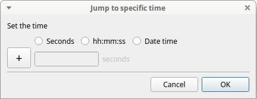
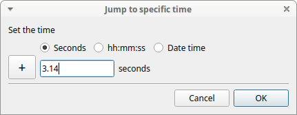
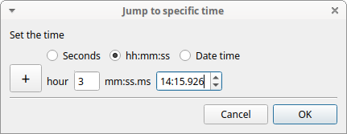
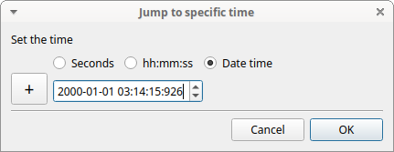
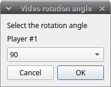
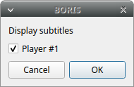

# Playback menu

## Jump

### Jump forward

:   Allow to jump forward in the current media file. See **File** \> **Preferences** for setting the jump value.

### Jump backward

:   Allow to jump backward in the current media file. See **File** \> **Preferences** for setting the jump value.

### Jump to specific time

:   Allow to go to a specific time in the current media file.

The time selection widget will pop-up:

3 formats are available to select the time:

- Decimal seconds:

- HH:MM:SS:ZZZ format (ZZZ indicates the milliseconds):

- A date-time format (YYYY-MM-DD hh\:mm\:ss.zzz):

## Zoom level

Click the media player you want to set the zoom level.

### Using the keyboard

**Zoom in**  ++ctrl+plus++ or ++ctrl++ + Mouse wheel up 

**Zoom out**  ++ctrl+minus++ or ++ctrl++ + Mouse wheel down

**Reset zoom level** ++ctrl+0++ or by clicking the mouse right button on the video.

### Using the mouse

**Zoom in**  Double click on left mouse button

**Zoom out**  Double click on right mouse button

## Pan video

Click the media player you want to pan.

### Using the keyboard

**Pan Left** ++ctrl+arrow-left++ 

**Pan Right** ++ctrl+arrow-right++ 

**Pan Down** ++ctrl+arrow-up++ 

**Pan Up** ++ctrl+arrow-down++ 

### Using the mouse

**Pan Up**: **Mouse Wheel up** (the video moves down)

**Pan Down**: **Mouse Wheel down** (the video moves up)

**Pan Left**: ++shift++ + **Mouse Wheel Up** (the video moves to the right)

**Pan Right**: ++shift++ + **Mouse Wheel Down** (the video moves to the left)

**Reset Pan and zoom**: ++shift++ + **Left mouse button**

The zoom level can also be set using the menu **Playback** > **Zoom level**

## Rotate video

Select the video rotation angle for each player using the menu **Playback** > **Rotate video**.
The available rotation angles are: 0, 90, 180 and 270.

## Display subtitles

Select to display or hide the subtitles using the menu **Playback** > **Display subtitles**. The subtitles file must have
exactly the same name of the video file except for the extension and be
placed in the same directory.

## Image overlay on video

Select an image overlay to be displayed on the video **Playback** > **Image overlay on video** > **Add**.
If the selected image does not have a transparent background the transparency can be set
from 0 (full transparency) to 255 (no transparency).

The image must be in PNG format, if the image is smaller than the video
resolution the image position can be set from the top-left corner (x:
horizontally, y: vertically).

Select **\> Playback \> Image overlay on video \> Remove** to remove the image overlay.

## Video equalizer

**Playback** > **Video equalizer**

Using this function the **brightness**, the **contrast**, the **saturation**, the **gamma** and the **Hue** can be set for each player.

