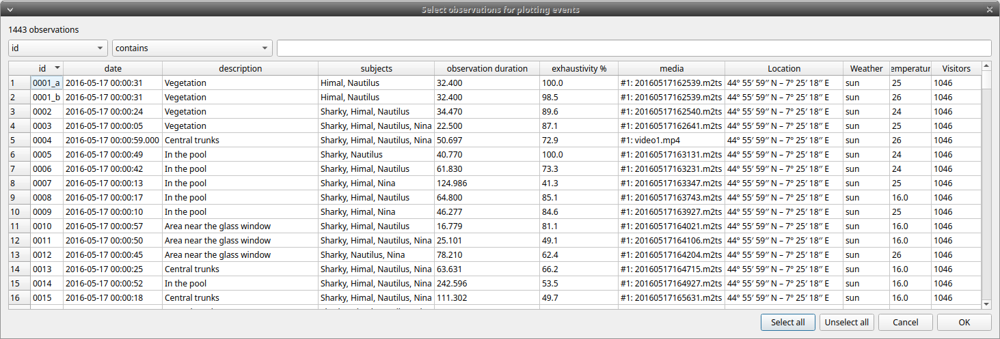
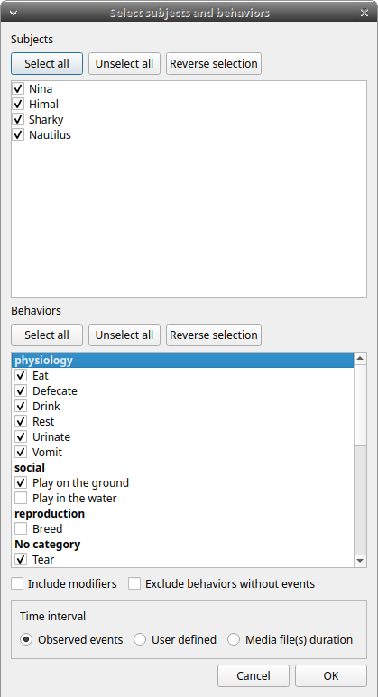
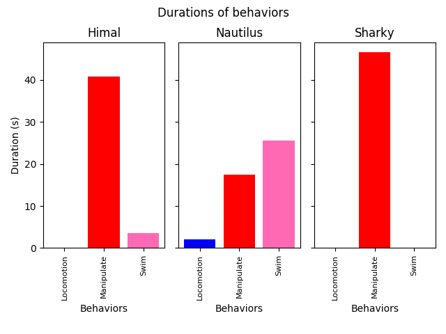
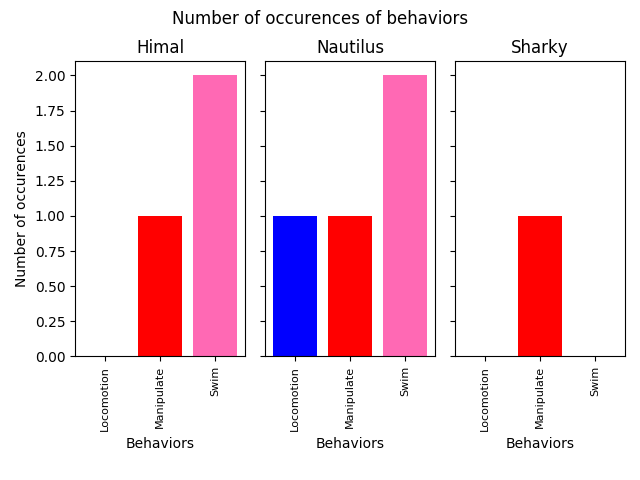

# Plot

## Plot events

The recorded events can be plotted along a time axis.

**Analysis** > **Plot** > **Plot events**

Select the **observations** you want to plot.
If more than one observation are selected BORIS will ask you for a directory where to save the plots.

<figure markdown>
  
  <figcaption>Select the observations to plot</figcaption>
</figure>

The **subjects** and **behaviors** you want to include in the plot can be selected in the following window:

You can choose to include or not the behavior modifiers (if any) and to
exclude behaviors without coded events.

The time interval can be selected (See time budget)

The plot can be exported in various formats like bitmap (PNG, JPG, TIFF)
or vectorial graphic (SVG, PDF, EPS, PS). The SVG format can be further
edited with the [Inkscape vector graphics editor](https://inkscape.org).

!!! warning "Important"

    If a STATE behavior has an odd number of coded events, you will see this error message:
    "The STATE behavior XXX is not paired"

This function creates one plot by subject on one figure.

The color of behaviors can be customized. See [plot colors]()

## Plot time budget

The duration and number of occurences can be plotted for each subject
and behavior.

**Analysis** \> **Plot** \> **Plot time budget**

The subjects and behaviors you want to include in the plot can be selected in the following window:

{width="60.0%"}

The behavior modifiers can not be included in the plot for now.

The time interval can be selected (See time budget)

The plot can be exported in various formats like bitmap (PNG, JPG, TIFF)
or vectorial graphic (SVG, PDF, EPS, PS). The SVG format can be further
edited with the [Inkscape vector graphics editor](https://inkscape.org).

!!! warning "Important"

    If a STATE behavior has an odd number of coded events, you will see this error message:
    "The STATE behavior XXX is not paired"

This function creates 2 plots with all subjects for each observation:

-   a plot of the behavior durations for the behaviors defined as STATE
    event.
-   a plot of the number of occurences for all the behaviors.

The color of behaviors can be customized. See [plot colors]()

{width="70.0%"}

{width="70.0%"}

