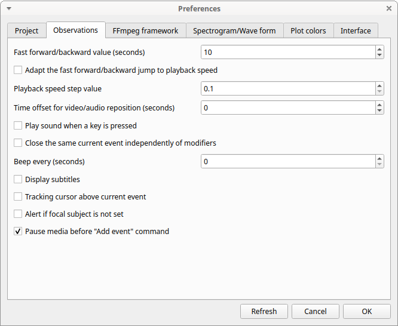
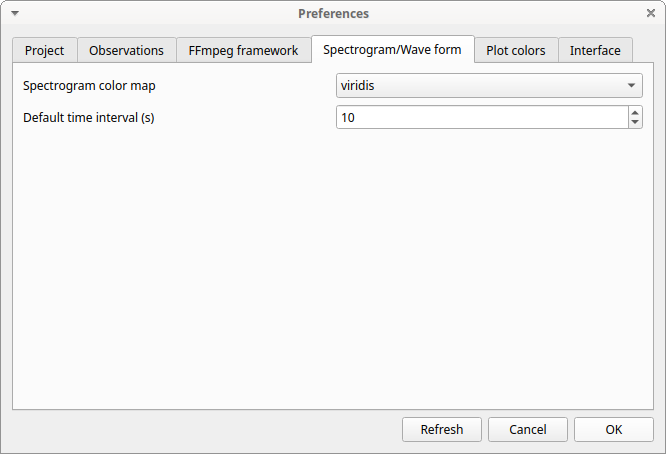

# Preferences

You can customize BORIS using the Preferences window (**File** \>
**Preferences**)

## Project preferences

### **Refresh** button

:   Option to reinitialize the configuration to default. BORIS will be
    closed.

### **Default project time format**

:   This option allows the user to choose the format for displaying time
    in the project. Please note that time is internally always saved in
    seconds with a precision of 3 decimal digits

### **Auto-save project every (minutes)**

:   if set BORIS will save your project automatically every n minutes. 0
    indicate no automatic backup. The project will be saved if the
    project is already saved and an observation is open.

### **Separator for behavioural strings**

:   Character (or string) used to separate behaviors when exporting
    events as behavioural strings. See also Behatrix

### **Check for new version**

:   Check for new version on BORIS web site every 15 days (internet
    access required)

## Observations

### **Fast forward/backward value (seconds)**

:   This option allows the user to customize the amount of time for "jumping" forward or backward in media.

### **Adapt the fast for/backward jump to playback speed**

:   The jump value will be adapted to the playback speed.

### **Playback speed step value**

:   This value indicate how much the speed will be increased or
    decreased after pressing the *change playback speed* buttons.

### **Time offset for media reposition (seconds)**

:   This value indicates the time offset for repositioning the media
    after double-click on a row event of the *Events* table. 'for
    example -4 seconds indicates that after a double-click the media
    will be repositioned 4 seconds before the recorded event.'

### **Play sound when a key is pressed**

:   Activate a sound signal after every keypress event

### **Close the same current event independently of modifiers**

:   Option used to STOP the current behavior without regarding the
    modifiers

### **Display subtitles**

:   Option to display or hide the visualization of subtitles. In case of
    separate file, the file containing subtitles must have the same base
    name than the video files with a .srt extension.

### **Tracking cursor above current event**

:   Check this box to position the tracking cursor above the current
    event in events list table.

### **Alert if focal subject is not set**

:   If this option is activated BORIS will show an alert box if no focal
    subject is selected

### **Pause media before "Add event" command**

:   Option to pause the media before manually adding an event.

## FFmpeg framework

The path for the ffmpeg executable program is displayed. The FFmpeg
executable is included with BORIS for Windows.
The FFmpeg framework is required to run BORIS.

### **FFmpeg cache directory**

:   This indicates the directory that will be used as image cache for
    frame-by-frame mode and spectrogram visualization. If you do not
    specify a path, BORIS will use the default temporary directory of
    your system.

## Spectrogram / wave form

### Spectrogram height

Select the height of generated spectrogram (in pixels). You will need to
restart the current observation to apply changes.

### Color map

Select the color map for displaying the generated spectrogram. See
[Matplotlib colormaps](http://matplotlib.org/users/colormaps.html) for
details.

## Plot colors 
The color of behaviors in the plot events functions can be customized.
The first color will be associated to the first behavior in your
ethogram, the second color to the second behavior and so on. Various
color formats can be used to specify a color: **named color** or **hex
RGB** (like \#0F0F0F). See <https://matplotlib.org/api/colors_api.html>
and <https://matplotlib.org/examples/color/named_colors.html> for
details

The **reset colors to default** button will reload the default colors.

## Interface

### Toolbar icon size

Set the height of the toolbar

