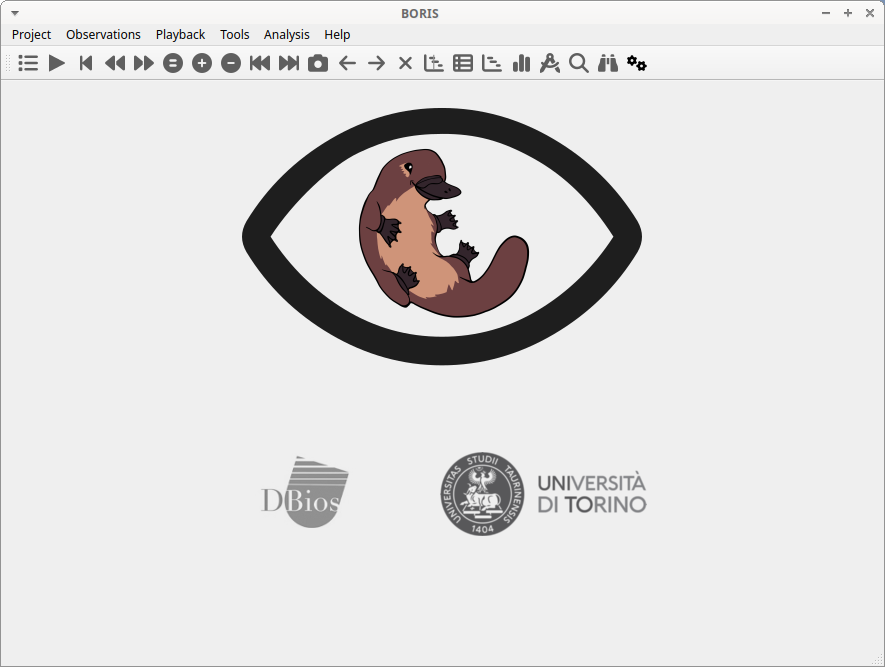

# Starting BORIS

Once BORIS is installed, it can be launched by clicking on its icon.

If you want to launch BORIS from the source code, refer to the [Run BORIS from source code](https://www.boris.unito.it/pages/run_from_source_code.html) section.

!!! note "First launch"

    The initial launch of BORIS may take some time to display. Please be patient!

The main window of BORIS will appear. Currently, all commands on the toolbar are disabled, except for the Preferences button.

<figure markdown>
  
  <figcaption>The BORIS main window</figcaption>
</figure>

