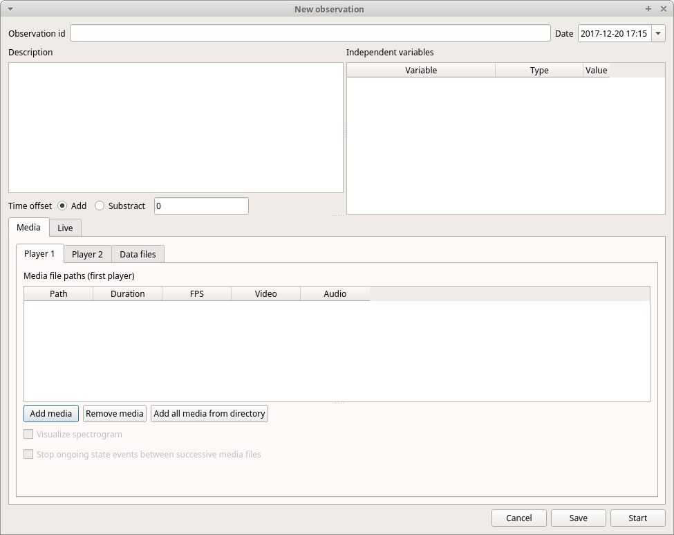
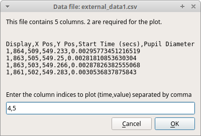
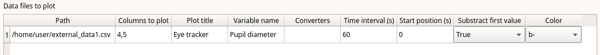

.. observations

Create a new observation
--------------------------------------------------------------------------------------------------------------------------------------------

A video tutorial about making an observation is available at `<https://www.youtube.com/watch?v=CKeBITCICXc>`_

To create a new observation you must first `Create a new project with BORIS`_
or `Open an existing project with BORIS`_.

Clicking on **Observations** > **New observation** will show the **New observation** window.

This window allow adding various observation data:

* a mandatory **Observation id** (must be unique across all observations in the open project);
* **Date**, which will be automatically set on the current date and time, but you can alternatively set this info on your media date and time, or whatever you prefer.
* **Description**, which can host all the relevant information about your observation, but can be also left empty.
* **Independent variables** (e.g. to specify factors that may influence the behaviors but will not change during the observation within a project). See the  `independent variables`_ section for details.
* **Time offset**. BORIS allow specifying a time offset that can be added or subtracted from the media timecode.

You must then indicate if you want to make an observation based on pre-recorded media (audio / video) or a live observation.

Live observation
............................................................................................................................................

During the live observation BORIS will show you a timer that will be used for recording time for coded events.

Choose the **Live tab** to make a live observation.

.. image:: images/live_observation.png
   :alt: New live observation
   :width: 80%

In the above tab you can select a time for **Scan sampling** observation. In this case the timer will stop at every time offset 
you indicated and all the coded events will have the same time value.

Media based observation
............................................................................................................................................

Click on the **Media** tab to make an observation based on one or more media files.

.. image:: images/media_files_tab_empty.png
   :alt: Media files tab
   :width: 80%

The **Media** tab contains 2 tabs: **Media files** and **Data files**.

Click the **Media files** tab and add one or more media files using the **Add media** or **Add media without path** button.
The **Add media without path** button allow you to not store the path of your media file(s) in the BORIS project file.
In this case the media file(s) must be in the same directory than the BORIS project file to be found. This option is useful
if you are working with various computers on the same project file(s).

If you want to remove the media file paths of an entire project see `Removing path of media files`_.

The **Add all media from directory** and **Add all media from dir without path** allow to add all media files found in a directory to 
the playlist.

Information about the selected media file will be extracted and displayed in the media list: media file path, media duration, 
number of frames by second (FPS), the presence of a video stream, the presence of an audio stream  .

The dropdown list in the first column allow you to choose a player (for a maximum of 8). If you want to observer more media files
simultaneously you must use consecutive players (starting from 1). See example below:

.. image:: images/media_files_tab_2.png
   :alt: Media files tab
   :width: 80%

The **Remove media** button can be used to remove the selected media files.

All the media types reported at http://www.videolan.org/vlc/features.html can be played in BORIS.
The media queued in the *Media file paths* will be played sequentially.
This means that an event occurring at time t\ :sub:`x`\  in the media file queued as second (e.g. second_video.mp4)
in the playlist will be scored as happening at time t\ :sub:`1`\  + t\ :sub:`x`\  (where t\ :sub:`1`\  is the duration of the first media 
file, e.g. first_video.mp4).

Spectrogram visualization
~~~~~~~~~~~~~~~~~~~~~~~~~~~~~~~~~~~~~~~~~~~~~~~~~~~~~~~~~~~~~~~~~~~~~~~~~~~~~~~~~~~~~~~~~~~~~~~~~~~~~~~~~~~~~~~~~~~~~~~~~~~~~~~~~~~~~~~~~~~~

BORIS allow you to visualize the sound spectrogram during the media observation.
Activate the *Visualize spectrogram* check box. BORIS will ask you to generate the spectrograms for all media files loaded in the first player.

.. image:: spectro1.png
   :alt: spectrogram generation
   :width: 50%

The spectrogram visualization will be synchonized to the media position during the observation.

.. image:: spectro2.png
   :alt: spectrogram visualization

Close current behavior between videos
~~~~~~~~~~~~~~~~~~~~~~~~~~~~~~~~~~~~~~~~~~~~~~~~~~~~~~~~~~~~~~~~~~~~~~~~~~~~~~~~~~~~~~~~~~~~~~~~~~~~~~~~~~~~~~~~~~~~~~~~~~~~~~~~~~~~~~~~~~~~

If this option is selected BORIS will close all ongoing State events between successive media files.

This option can be usefull if you have to code various short media files enqueued in the first player (for example the output of a Camera trap).

External data files
~~~~~~~~~~~~~~~~~~~~~~~~~~~~~~~~~~~~~~~~~~~~~~~~~~~~~~~~~~~~~~~~~~~~~~~~~~~~~~~~~~~~~~~~~~~~~~~~~~~~~~~~~~~~~~~~~~~~~~~~~~~~~~~~~~~~~~~~~~~~

.. warning:: **At this time only 2 external data can be plotted with your media file**

You can select one or more external data files to be plotted synchronously with your media.
Click the **Data files** tab and use the **Add data file** button to select a data file.

.. image:: external_data_file_1.png
   :alt: Data file tab
   :width: 100%

The data files must be plain text files with at least **2 columns** separated by comma or TAB.
One column must contain a timestamp that will be used to synchronize the plot with the media. The sampling rate can be variable.

Example of a plain text data file with 5 columns separated by comma (**,**)::

   Display,X Pos,Y Pos,Start Time (secs),Pupil Diameter
   1,864,509,549.233,0.00295773451216519
   1,863,505,549.25,0.00281810853630304
   1,863,503,549.266,0.00287826382555068
   1,861,502,549.283,0.0030536837875843
   1,858,501,549.3,0.00308083021081984
   1,856,499,549.316,0.00306266942061484
   1,854,499,549.333,0.00305776367895305
   [...]

In the above example the 4th column contains the timestamp and the 5th the value to be plotted.

Input the index of the column containing the timestamp and the index of the column containing the value to be plotted.
The two indices must be separated by a comma (,). Click **OK** to close the window.

A new row will be added in the data files table.

You can modify/complete the following parameters by directly typing in the table cells:

* Columns to plot
* Plot title: the title of the plot
* Variable name
* Converters: Used if the timestamp is not expressed in seconds (see below for details)
* Time interval: The time interval that will be plotted (in seconds)
* Start position: the start position of data for synchronisation with the media (in seconds)
* Substract first value: if the timestamp does not start with a 0 value you can choose to substract the first value to all timestamp values.
* Color: the color of the color

You can check if the data from file can be correctly plotted by using the **Show plot** button.
If the data are compatible you will see a plot otherwise you will obtain a message with an explanation.

For now only 2 values can be plotted synchronously with your media file. The values can come from the same file or from two different files.

During the observation tha values you have selected in external data files will be plotted synchronously with your media file.

.. image:: observation_with_external_data.png
    :alt: Observation with 2 values plotted from external data files: Temperature and salinity 

.. _converters:

Converters
~~~~~~~~~~~~~~~~~~~~~~~~~~~~~~~~~~~~~~~~~~~~~~~~~~~~~~~~~~~~~~~~~~~~~~~~~~~~~~~~~~~~~~~~~~~~~~~~~~~~~~~~~~~~~~~~~~~~~~~~~~~~~~~~~~~~~~~~~~~~

If the values in the timestamp column are not expessed in seconds (like 12.45) but in another format (HH:MM:SS, MM:SS, ISO8601 2018-01-18T12:31:40Z ...)
you must use a converter that will convert the current format in seconds.

See the Converters' tab in the project configuration: `converters tab`_ 

A **double-click** on the converters cell will allow you to select a converter for each column to be plotted

.. image:: converter_selection.png
   :width: 40%

.. image:: converter_selected.png
   :width: 80%

Use the **Show plot** button to verify if your external data can be plotted without problem.
The **Close plot** button will close the plot window.

.. image:: external_data_show_plot.png
   :width: 80%

Converters can also be used to convert values that are not time value.

Example of a converter for inverting value::

   OUTPUT = - float(INPUT)

Start the observation
~~~~~~~~~~~~~~~~~~~~~~~~~~~~~~~~~~~~~~~~~~~~~~~~~~~~~~~~~~~~~~~~~~~~~~~~~~~~~~~~~~~~~~~~~~~~~~~~~~~~~~~~~~~~~~~~~~~~~~~~~~~~~~~~~~~~~~~~~~~~

Click the **Start** button to start coding. The **Observation** window will be closed and you'll be transferred to the main **BORIS** window.
If you do not want to start the observation click the **Save** button. The observation will be saved in the `observations list`_.

.. _observations list:

Observations list
--------------------------------------------------------------------------------------------------------------------------------------------

The **Observations** > **Observations list** will show you all the observations contained in the current BORIS project.

The observations can be sorted by clicking in the desired column header (alphabetic order ascending or descending).

.. image:: observations_list2.png
   :alt: Observations list
   :width: 100%

The observations list can be filtered selecting a field and a condition in the drop-list boxes.

In the following example observations are filtered: only observations with **description** containing the **In the pool** subject are shown:

.. image:: observations_list2_filtered.png
   :alt: Observations list
   :width: 100%

Observations can be filtered with **Independent variables** values.

The following example displays only the observations that do not contain "Sunny"
in the **Weather** independent variable :

.. image:: observations_list2_filtered1.png
   :alt: Observations list
   :width: 100%

Observations with a value of **Temperature** independent variable between 18 and 22:

.. image:: observations_list2_filtered2.png
   :alt: Observations list
   :width: 100%

Observations with a value of **Visitors** independent variable greater than 1000:

.. image:: observations_list2_filtered3.png
   :alt: Observations list
   :width: 100%

Delete observations
--------------------------------------------------------------------------------------------------------------------------------------------

The observations can be deleted from the project using the following procedure:
**File** > **Edit project** > **Observation's tab**

Select all observations to remove

Click the **Remove selected observations** button and confirm the deletion.

Please note that the deletion is irreversible.

Import observations from a project file
--------------------------------------------------------------------------------------------------------------------------------------------

The **Observations** > **Import observations** option allows to import observations from a BORIS project file into the current project.
Choose the project file and then the observations to import. BORIS will check if observations with same id are already existing in the current project.
BORIS will also check if behaviors and/or subjects used in the imported observations are not defined in the current project.

