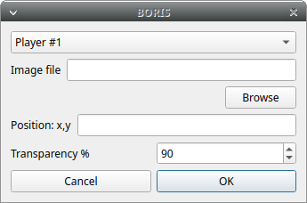

Jump
------------------------------------------------------------------------------------------------------------------------

Jump forward
........................................................................................................................

Allow to jump forward in the current media file. See **File** > **Preferences**  for setting the jump value.

Jump backward
........................................................................................................................

Allow to jump backward in the current media file. See **File** > **Preferences**  for setting the jump value.

Jump to specific time
........................................................................................................................

Allow to go to a specific time in the current media file.

Zoom level
------------------------------------------------------------------------------------------------------------------------

Select the zoom level for each player. The available zoom values are: 2, 1, 0.5 and 0.25.
In case of simultaneous playing you can set different values of zoom for each player.

Rotate video
------------------------------------------------------------------------------------------------------------------------

Select the video rotation for each player. The available rotation values are: 0, 90, 180 and 270.

.. image:: images/rotate_displayed_video.png
   :alt: Rotate video
   :width: 4cm

Display subtitles
------------------------------------------------------------------------------------------------------------------------

Select to display or hide the subtitles. The subtitles file must have exactly the same name of the video file except for the extension and be placed in the same directory.

.. image:: images/display_subtitles.png
   :alt: Display subtitles
   :width: 4cm

Image overlay on video
------------------------------------------------------------------------------------------------------------------------

Select an image overlay to be displayed on the video.
If the selected image does not have a transparent background the transparency can be set from 0 (full transparency) to 255 (no transparency).

The image must be in PNG format, if the image is smaller than the video resolution the image position can be set from the
top-left corner (x: horizontally, y: vertically).

Select **> Playback > Image overlay on video > Remove** to remove the image overlay.

Video equalizer
------------------------------------------------------------------------------------------------------------------------

Using this function the **brightness**, the **contrast**, the **saturation**, the **gamma** and the **Hue** can be set for each player.

.. image:: images/video_equalizer.jpg
   :alt: Video equalizer
   :width: 15cm
