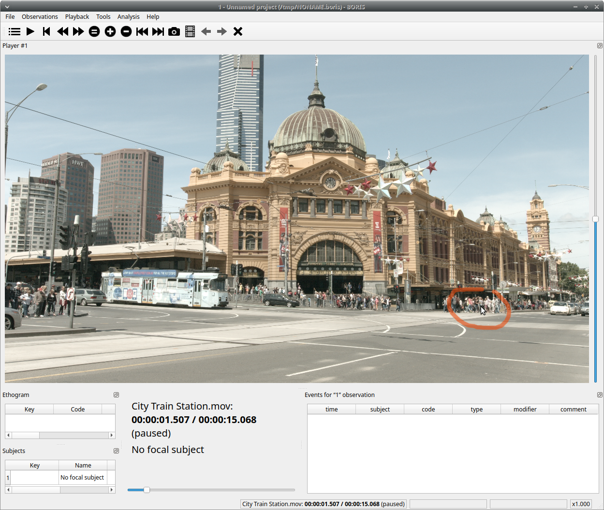
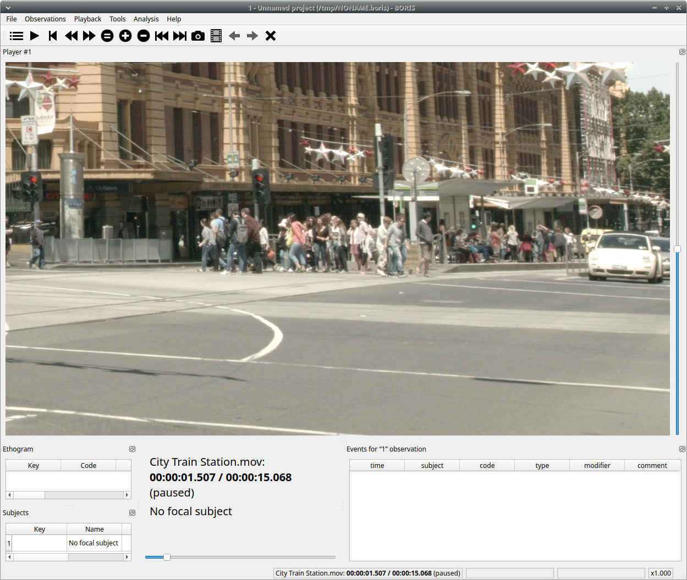
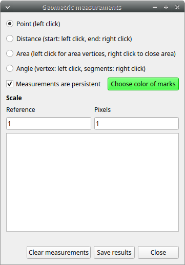
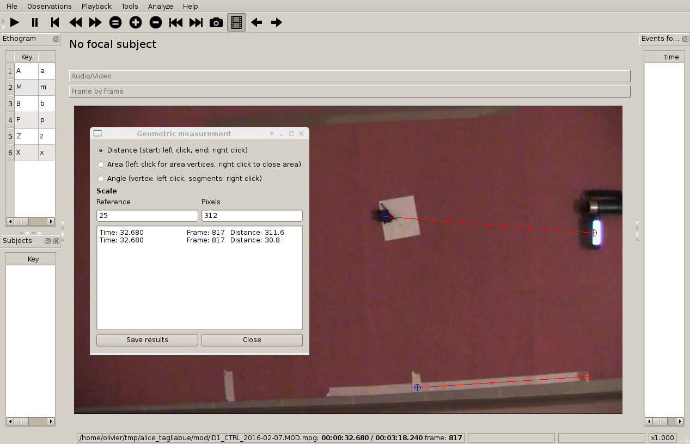
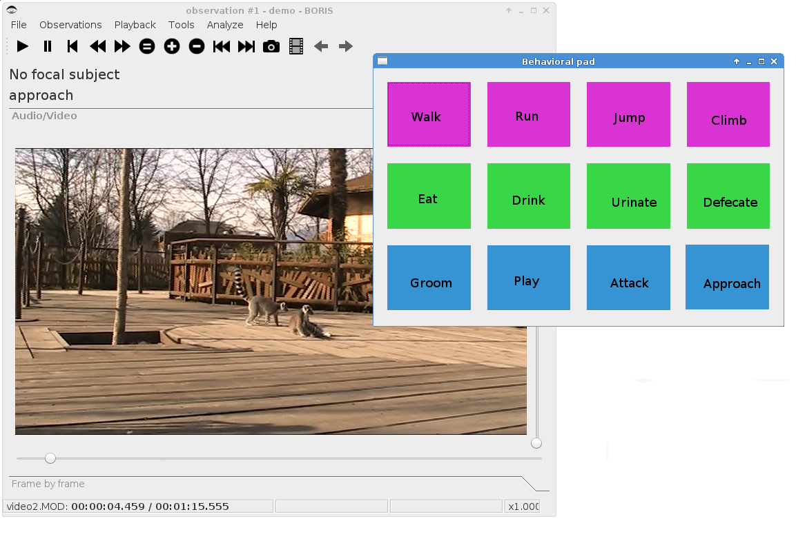
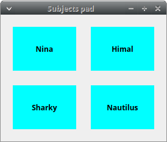
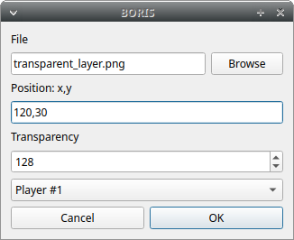
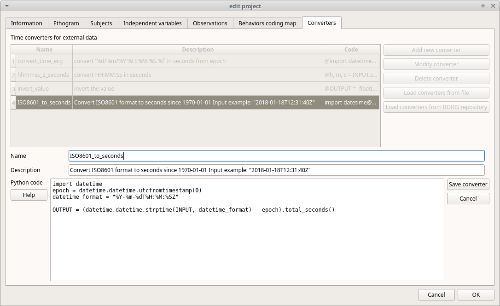
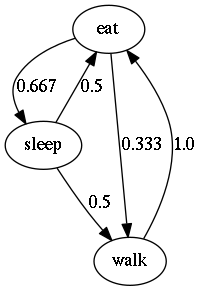
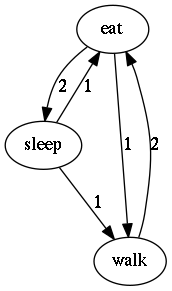

.. Tools

Focus a video area
--------------------------------------------------------------------------------------------------------------------------------------------

It is possible to focus an area of the video. Click on the center of the area you want to focus.
The video will be displayed at its native resolution (not shrinked) and centered on the clicked point.
Another click on the video will restore the previous visualization.

The focused area can also be zoomed (only on the first player for now).

.. note:: This function is not yet available in frame-by-frame mode.

The visualization can be focused on a particular region of the video by clicking on the video (with the left button).
See the mouse cursor on the screenshot above.

Now the video is displayed with its real resolution allowing to see details. Another click on the video will restore the previous
visualization without focus.

Geometric measurements
--------------------------------------------------------------------------------------------------------------------------------------------

Geometric measurements can only be made in frame-by-frame mode. Distances, areas and angles can be measured.
Click on **Tools** > **Geometric measurements** to activate the measurements. The **Measurements window** will be shown:

Setting the scale
............................................................................................................................................

For distance and area measurements you can set a scale in order to have results of measurements in a real unit (like centimeters, meters etc).

1) measure a reference object (that have a known size) on the frame (with the distance tool. See next chapter for details)
   and set the pixel distance in the **Pixel** text box.

2) Set the real size of the reference object in the **Reference** text box (must be a number without unit).

Distance measurements
............................................................................................................................................

Select the **Distance** radio button. Click the left mouse button on the frame bitmap to set the start of the segment that will be measured.
A blue circle with a cross will be drawn.
Click the right mouse button to set the end. A red circle with a cross will be drawn.
The distance between the two selected points will be available in the text area of the **Measurements window**.

Area measurements
............................................................................................................................................

Select the **Area** radio button. Click the left mouse button on the frame bitmap to set the area vertices.
Blue circles with a cross will be drawn.
Click the right mouse button to close the area.
The area of the drawn polygon will be available in the text area of the **Measurements window**.

Angle measurements
............................................................................................................................................

Select the **Angle** radio button. Click the left mouse button on the frame bitmap to set the angle vertex.
A red circle with a cross will be drawn.
Click the right mouse button to set the two segments. Blue circles with a cross will be drawn.
The angle between the two drawn segments will be available in the text area of the **Measurements window**.

Persistent measurements
............................................................................................................................................

If the **Measurements are persistent** checkbox is checked the measurement schemes will be available on all
frames otherwise they will be deleted between frames.

.. _coding pad:

Coding pad
--------------------------------------------------------------------------------------------------------------------------------------------

During observation a coding pad with the available behaviors can be displayed (**Tools** > **Coding pad**).
This **Coding pad** allows the user to code using a touch-screen or by clicking on the buttons.
When the **Coding pad** is displayed you can continue to code using the keyboard or the ethogram.

Subjects pad
--------------------------------------------------------------------------------------------------------------------------------------------

A pad with all defined subjects (or filtered subjects) can be displayed during the observation (**Tools** > **Subjects pad**).
This **Subjects pad** allows the user to select the focal subject using a touch-screen or by clicking on the buttons.
When the **Subjects pad** is displayed you can continue to select the focal subject using the keyboard or the subjects list.

Image overlay on video
--------------------------------------------------------------------------------------------------------------------------------------------

An image can be overlayed on the video (**Tools** > **Image overlay on video** > **Add an image overlay**).

The image must be in PNG format, if the image is smaller than the video resolution the image position can be set from the top-left corner.
The transparency of image can be set from 0 (full transparency) to 255 (no transparency).

The remove the image overlay click **Tools** > **Image overlay on video** > **Remove**

Converters for external data values
--------------------------------------------------------------------------------------------------------------------------------------------

Converters can be written using the Python 3 programming language.

The **INPUT** variable will be loaded with the original value of the external data file (for example 01:22:32).

The **OUPUT** variable must contain the converted value in seconds (the dot must be used for decimal separator).

Example of a converter for converting HH.MM:SS format in seconds::

   h, m, s = INPUT.split(':')
   OUTPUT = int(h) * 3600 + int(m) * 60 + int(s)

The Python function **strptime()** from the **datetime** module can be useful for converting time values:
https://docs.python.org/3/library/datetime.html#strftime-strptime-behavior

Example of a converter for converting ISO8601 format in seconds using the strptime() function::

   import datetime
   epoch = datetime.datetime.utcfromtimestamp(0)
   datetime_format = "%Y-%m-%dT%H:%M:%SZ"

   OUTPUT = (datetime.datetime.strptime(INPUT, datetime_format) - epoch).total_seconds()

**File** > **Edit project** > **Converters tab**

Transitions flow diagram
--------------------------------------------------------------------------------------------------------------------------------------------

BORIS can generate DOT scripts and flow diagrams from the transitions matrices (See Observations > Create transition matrix for obtaining
the transitions matrices).

DOT script (Graphviz language)
............................................................................................................................................

**Tools > Transitions flow diagram > Create transitions DOT script**

Choose one ore more transitions matrix files and BORIS will create the relative DOT script file(s).

The DOT script files can then be used with `Graphviz <http://www.graphviz.org>`_ (Graph Visualization Software) or
`WebGraphviz <http://www.webgraphviz.com>`_ (Graphviz in the Browser) to generate flow diagram of transitions.

See `DOT (graph description language) <https://en.wikipedia.org/wiki/DOT_(graph_description_language)>`_ for details.

Flow diagram
............................................................................................................................................

If `Graphviz <http://www.graphviz.org>`_ (Graph Visualization Software) is installed on your system
(and the **dot** program available in the path) BORIS can generate flow diagram (PNG format)
from a transitions matrix file.

**Tools > Transitions flow diagram > Create transitions flow diagram**

Choose one ore more transition matrix files and BORIS will create the relative flow diagram.

.. In the following example of transitions flow diagram, the fractions of the total number of
   transitions are displayed on the edges of the graph:

    .. image:: images/flow_diagram_graphviz.png
       :alt: Transitions flow diagram produced by Graphviz
       :width: 50%

Flow diagram of frequencies of transitions
............................................................................................................................................

.. image:: images/transitions_frequency.png
       :alt: Frequencies of transitions
       :width: 25%

Flow diagram of frequencies of transitions after behavior
............................................................................................................................................

Flow diagram of number of transitions
............................................................................................................................................

Re-encoding and resizing a video file
--------------------------------------------------------------------------------------------------------------------------------------------

BORIS can re-encode and resize your video files in order to reduce the size of the files and have a smooth coding
(specially with two video files playing together).
The re-encoding and resizing operations are done with the embedded ffmpeg program with high quality parameters (bitrate 2000k).

Select the files you want re-encode and resize and select the horizontal resolution in pixels (the default is 1024).
The aspect ratio will be maintained.

You can continue to use BORIS during the re-encoding/resizing operation.

The re-encoded/resized video files are renamed by adding the re-encoded.avi extension to the original files.

**warning**

**The MTS video files should be re-encoded to be used in frame-by-frame mode. Otherwise the extracted frames are not reliable.**

Rotating a video file
--------------------------------------------------------------------------------------------------------------------------------------------

BORIS can rotate your video files in order to code them using the right view.
The rotating operation is done with the embedded ffmpeg program using the same quality parameters then the original video.

Select the files you want rotate and select the rotation between: **Rotate 90 clockwise**,
**Rotate 90 counter clockwise** and **Rotate 180**.

The aspect ratio will be maintained.

You can continue to use BORIS during the rotation operation.

The rotated video files are renamed by adding the **rotated<ANGLE>** to the original file name.

Project server
--------------------------------------------------------------------------------------------------------------------------------------------

This function allow you to communicate with the `BORIS App <https://github.com/olivierfriard/BORIS-App/releases>`_ by sending project
and receiving onservations made with the **BORIS App**.
For details read the `BORIS App user guide <http://boris-app.readthedocs.io/en/latest/>`_

Starting the project server
............................................................................................................................................

* Open your project

* Select **File** > **Project server**

A window will open and show you the URL of the server that should be used on the **BORIS App**.
The project server will serve the project for 30 minutes.

Stopping the project server
............................................................................................................................................

* Select **File** > **Stop serving project**

